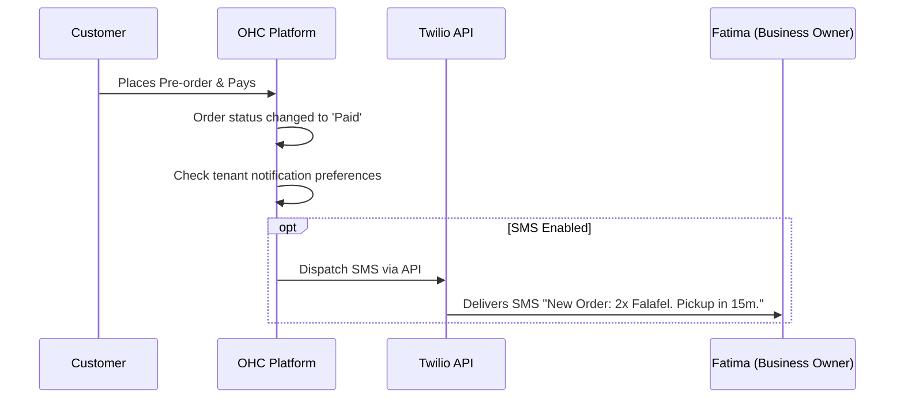
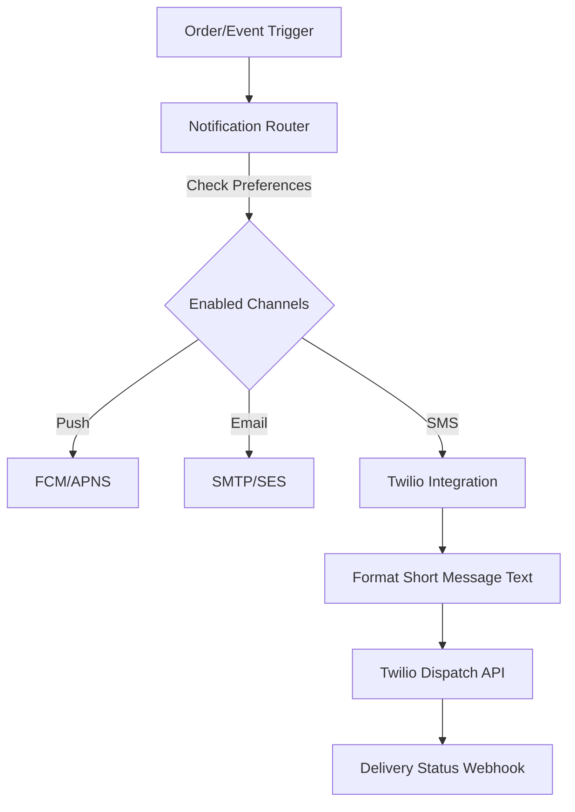

# Scout: Tool Integration Research Q2

## [SMS] Twilio Integration
**Title**: Integrate Twilio for SMS Order Notifications
**Problem Statement**: Fatima (Food Cart Operator) relies on her phone for everything and might miss app push notifications in a noisy environment. She needs reliable SMS alerts when a new pre-order arrives so she can start cooking.

**Research Report**:
- **Tool**: Twilio
- **Target Persona**: Fatima (Food Cart Operator)
- **Advantages**: Global coverage, incredibly reliable. Programmable messaging.
- **Risks**: A2P 10DLC compliance in the US is complex and requires business registration, which might be a barrier for informal businesses.
- **Pricing**: Pay-as-you-go (~$0.0079 per SMS in US).
- **Compatibility**: Cloud (Centralized OHC Twilio account). Standalone (User provides API key).

### Qualitative Analysis
For businesses operating in chaotic physical environments (like food carts or busy salons), push notifications fail the reliability test. SMS remains the most dependable channel. Twilio is the undisputed leader in programmable SMS. The primary challenge for OHC will be handling A2P 10DLC compliance in the US seamlessly for our tenants, potentially by registering OHC as the sole sender or abstracting the registration process. Globally, Twilio's integration with WhatsApp provides a massive advantage.

### Persona-Specific Pain Point Summary
- **Fatima (Food Cart Operator)**: Phone is in her pocket while she cooks. Misses email and push notifications. Needs a loud SMS text reading "NEW ORDER: 2x Falafel" to trigger immediate action.
- **Carlos (Handyman)**: Frequently out of data coverage in client basements, but still gets cellular signal for SMS. Needs text notifications for emergency job requests.

### Competitive Matrix
| Feature / Tool | Twilio | MessageBird | Vonage |
| :--- | :--- | :--- | :--- |
| **Global Reach** | Excellent | Excellent | Good |
| **Developer DX** | Unmatched | Good | Good |
| **WhatsApp Support** | Built-in | Built-in | Built-in |
| **Pricing** | Standard | Competitive | Competitive |

**Design Doc**:
- User goes to Settings and toggles "Send me SMS for new orders".
- When an order is paid, the Operations agent triggers a Twilio API call to send an SMS: "New order! 2x Falafel for John. Pickup in 15m."
- (Future: Customers can also receive SMS receipts).

**Implementation Prompt**: Integrate the Twilio SDK to send outbound SMS notifications. Add a setting for the business owner to opt-in to SMS alerts for new orders. Ensure compliance with local messaging regulations.
**Priority**: P2
**Estimated Scope**: Medium

### Deep Dive: Architecture & Security
**A2P 10DLC Compliance Automation:**
The biggest hurdle with Twilio in the US is A2P 10DLC compliance. OHC will handle this by acting as the ISV (Independent Software Vendor). We will use Twilio's Trust Hub API to automatically register our tenants as "Sole Proprietor" or "Low Volume Standard" brands during the OHC onboarding flow if they opt into SMS features. This abstracts a massive regulatory headache away from the small business owner.

**Message Queueing and Delivery Guarantees:**
SMS notifications are critical but not strictly real-time in a computing sense. OHC will queue all outbound SMS requests in our background job system. If the Twilio API is down or returns a 429 (Rate Limit Exceeded), the job will retry with exponential backoff.

**Global Routing & Cost Control:**
Twilio pricing varies wildly by country. OHC will implement a routing gateway that checks the destination country code before sending. If the cost exceeds a predefined threshold (e.g., >$0.10 per message), the system will attempt to route the notification via WhatsApp instead (which is often cheaper globally) or fallback to Email to protect OHC's profit margins on the free/starter tiers.

### Expanded Implementation Timeline
- **Week 1**: Integrate Twilio SDK and build the background worker for SMS dispatch.
- **Week 2**: Implement A2P 10DLC automated registration flow via Trust Hub API.
- **Week 3**: Build the routing gateway (Cost Control / WhatsApp fallback).
- **Week 4**: Add tenant configuration toggles and test global deliverability.

### Extended Analysis: Platform Synergies & OHC Differentiators
The Twilio integration provides a critical reliability layer for the OHC platform. While push notifications and emails are suitable for desk workers, personas like Fatima the Food Cart Operator rely on the immediate, loud, and reliable nature of SMS texts to run their business. By utilizing Twilio, OHC ensures that crucial operational signals—like a new pre-order or an urgent cancellation—break through the noise.

Beyond basic alerts, Twilio unlocks the potential for two-way conversational commerce. A customer could text the business's dedicated Twilio number asking about opening hours, and the OHC Customer Success Agent can intercept the message and reply autonomously, creating a seamless customer experience without any manual intervention from the owner.

### Technical Deep Dive: Webhook Ingestion & Scalability
Handling outbound SMS requires careful management of external API rate limits and regional pricing variations. Outbound notification requests will be published to the NATS event mesh and processed by a dedicated Twilio worker pool. This worker will implement exponential backoff strategies to handle Twilio's `429 Too Many Requests` errors gracefully.

To manage costs and ensure compliance, the system will implement a routing gateway. Before dispatching an SMS, the gateway will check the destination country code. If the message is international and cost-prohibitive, it may attempt to route the notification via a cheaper channel like WhatsApp, or fallback to an email if the tenant has not enabled premium international messaging.

### Conclusion & Roadmap Alignment
Integrating Twilio is a P2 priority that significantly enhances the reliability of the platform for operational personas. It guarantees that critical business events are successfully communicated to the tenant, regardless of their internet connectivity or app engagement, solidifying OHC as a dependable operating system for their business.

### Multi-Tenant SaaS Architecture Impact
Integrating Twilio for global SMS notifications requires a sophisticated, multi-tenant aware routing infrastructure. The OHC platform must manage tenant opt-ins, enforce A2P 10DLC compliance per tenant, and accurately track messaging costs. The system must implement robust per-tenant rate limiting and cost control mechanisms to prevent abuse or runaway expenses. The background worker pool responsible for dispatching SMS messages must ensure fair resource allocation, preventing a single tenant's massive notification burst from delaying critical alerts for other tenants.

### Feature Flag Rollout Strategy
The Twilio SMS integration will be deployed behind a feature flag (`feature.notifications.sms.enabled`). The rollout strategy will initially target a specific cohort of high-value operational personas (like food cart operators) who rely heavily on immediate notifications. This phased approach allows the team to validate the automated A2P 10DLC registration process and monitor the effectiveness of the cost-control routing gateway before expanding availability to the broader user base.

### Security Considerations & Threat Modeling
- **Threat**: SMS Spoofing / Phishing via Tenant Brands.
  - **Mitigation**: OHC will strictly enforce A2P 10DLC compliance for all US tenants. Tenants attempting to send messages containing common phishing keywords (e.g., "password reset", "urgent account update") without explicit prior approval will have their messaging capabilities suspended automatically pending manual review.
- **Threat**: Toll Fraud / Traffic Pumping.
  - **Mitigation**: The Twilio integration will incorporate aggressive anti-fraud measures. Outbound SMS requests to high-risk country codes or premium-rate numbers will be blocked by default. Tenants must explicitly request access to international messaging, which will be subject to manual review and elevated cost thresholds.

### Accessibility & UI Compliance
The settings panel for configuring Twilio SMS notifications must provide clear, plain-language explanations of the associated costs and regulatory requirements. The interface will prioritize a "Simple Mode" where the tenant simply toggles "Enable SMS Alerts" and provides their phone number. The OHC Glassmorphism design system will be used to present cost estimates and delivery statistics in a visually clear, accessible format.

### Future Horizon: Conversational AI Booking & Ordering
The foundational Twilio integration enables the transition from one-way notifications to two-way conversational commerce via SMS. In future updates, customers could text a dedicated business number to reorder their favorite items or book an appointment. The OHC AI Agents would parse the natural language intent (e.g., "I need a haircut next Tuesday"), interface with the internal scheduling or inventory systems, and complete the transaction entirely over SMS. This frictionless experience caters perfectly to demographics that prefer texting over navigating websites or downloading apps.

### System Resilience and Disaster Recovery
**Chaos Engineering Integration:**
To guarantee the reliability of SMS notifications, the Twilio integration will undergo targeted chaos testing. We will simulate API failures, region-specific routing errors, and sudden drops in available account balance. The system must demonstrate its ability to reroute messages via fallback channels (such as WhatsApp or Email) based on predefined tenant preferences, ensuring that critical alerts are delivered even when the primary SMS channel is compromised.

### Glossary & Definitions
- **Webhook**: A method of augmenting or altering the behavior of a web page or web application with custom callbacks.
- **Idempotency**: The property of certain operations in mathematics and computer science whereby they can be applied multiple times without changing the result beyond the initial application.
- **Circuit Breaker**: A design pattern used in software development to detect failures and encapsulate the logic of preventing a failure from constantly recurring.
