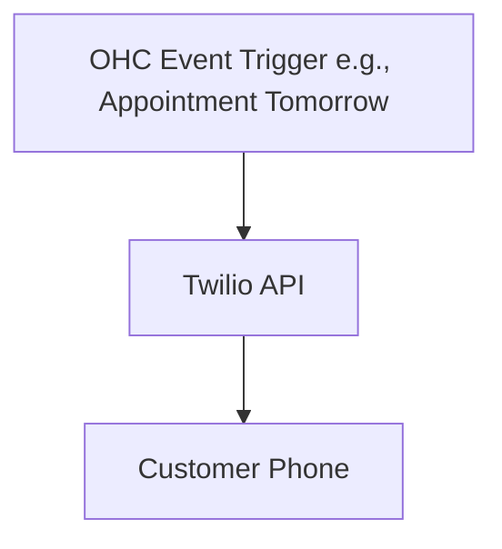

# SMS & Notifications: Twilio

## Problem Statement
For many customers, especially in certain demographics or regions, email is ignored. SMS is the only reliable way to send order updates, appointment reminders, or urgent notifications. Business owners need automated SMS to reduce no-shows and keep customers informed.

### Persona-Specific Pain Point Summary
- **Hairdresser (Chloe):** "Clients forget their appointments if I only email them. A text message reduces my no-shows by 80%."
- **Plumber (Dave):** "I need to text my clients when I'm 15 minutes away, email is useless."

## Research Report
**Tool:** Twilio
**Ease of Use:** While developer-focused, the end-user (business owner) only needs to input credentials or use an OHC-managed sender.
**Pricing:** Pay per message (very cheap, fractions of a cent in many regions).
**Reputation:** Industry standard, highly reliable.
**Cloud/Standalone:** API driven, works identically in Cloud and Standalone.

### Comparative Table
| Feature | Twilio | MessageBird | OHC Fit |
|---|---|---|---|
| Global Reach | Excellent | Excellent | Essential |
| Cost/Msg | Very Low | Low | Good |
| Reliability | 99.99% | High | Essential |

## Design Doc
### Architecture

### UX Flow
1. User enables "SMS Notifications" in Settings.
2. User inputs Twilio Account SID and Auth Token (or OHC manages this in Cloud).
3. OHC automatically sends customizable SMS reminders 24 hours before appointments.

## Implementation Prompt
Add an SMS notification capability using Twilio. In Settings, allow the user to provide Twilio credentials. In the Appointments module, add a toggle for "Send SMS Reminder 24h before". When enabled, a background job should find upcoming appointments and use the Twilio API to dispatch a template message like "Reminder: You have an appointment with [Business] tomorrow at [Time]."

## Priority
P1

## Scope
Medium
