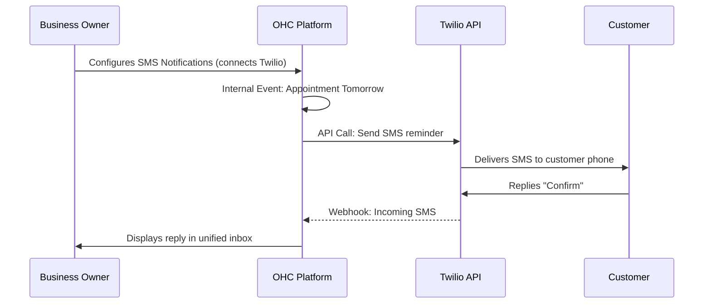

## SMS & Notifications: Twilio

**Title**: Implement Twilio Integration for Reliable SMS Notifications

**Problem Statement**: While email is effective, some messages (like appointment reminders, critical updates, or OTPs) require immediate attention. Many small business owners, especially those catering to non-technical demographics (like Fatima), find that their customers prefer or exclusively use SMS.

**Research Report**: Twilio is the foundational API for global SMS communication. While developer-focused, its core capabilities are exactly what the OHC platform needs to provide SMS features.
* *Ease of Use*: High for the developer, but the end-user (business owner) only needs to connect it once.
* *Pricing*: Pay-as-you-go pricing (e.g., ~$0.0079 per SMS sent/received in the US, plus carrier fees). Very affordable for low-volume notifications.
* *Reputation*: The global gold standard for CPaaS (Communications Platform as a Service).
* *Mode Compatibility*: Fully compatible with both Cloud and Standalone modes via API keys/Auth Tokens.

**Design Doc**:

**Implementation Prompt**: Build a Twilio integration to enable SMS capabilities. The owner should be able to connect their Twilio account and select a provisioned phone number. Once connected, OHC should allow the owner to send SMS messages directly from the unified inbox, alongside emails and DMs. OHC must also listen for incoming SMS webhooks from Twilio and route those replies into the correct customer conversation thread. Label the setup "Connect my Text Messaging."

**Priority**: P1

**Estimated Scope**: Medium
