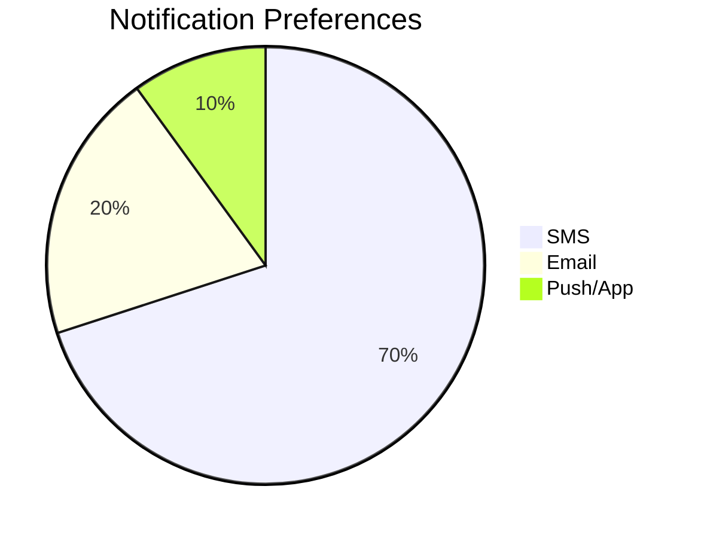
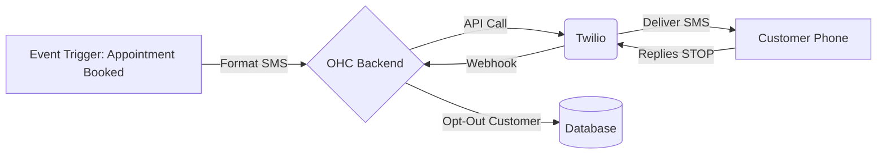

# SMS & Notifications: Twilio

## Problem Statement
Emails often go unread or end up in spam. For critical notifications like appointment reminders or delivery updates, small business owners need a reliable way to reach customers instantly. SMS is highly effective but complex to set up independently.

## Research Report
Twilio is the industry standard for programmable SMS.
- **Ease of use:** Requires some setup (A2P 10DLC registration in the US), but the API is very robust.
- **Pricing:** Pay-as-you-go (around $0.0079 per SMS in the US).
- **Cloud/Standalone:** Cloud integration.

### Persona-specific pain points
- "My clients keep missing their appointments because they don't check their email."
- "I need a way to quickly notify a customer that their custom order is ready for pickup."

### Evidence
- **Recommendation:** Integrate Twilio to power SMS notifications for appointments and order updates.
- Source: Industry leader, extremely reliable, global carrier coverage.

## Design Doc
When a critical event occurs in OHC (e.g., an appointment is booked, an order is shipped), OHC will format a short message and send it via the Twilio API to the customer's phone number. The integration will handle formatting and opt-out compliance (STOP replies).

## Implementation Prompt
Create a "Connect Twilio" page where the user can input their Account SID, Auth Token, and Phone Number. Add toggles in the OHC settings to enable/disable SMS for specific events (e.g., "Order Shipped", "Appointment Reminder"). Implement the backend logic to send the SMS via Twilio when those events are triggered.

## Priority
P1

## Estimated Scope
Medium
