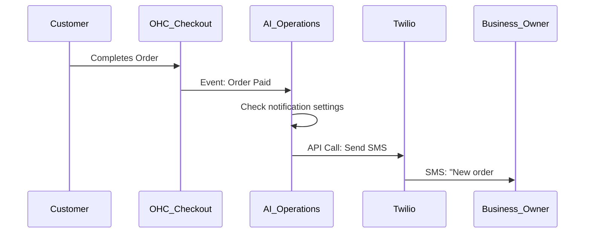

# Native SMS Order Notifications via Twilio

## Problem Statement
Fatima (Food Cart Operator) misses app push notifications because she works in a noisy, fast-paced environment and relies primarily on basic SMS. She needs reliable native SMS alerts when a new pre-order arrives so she can start cooking, without having to sign up for a third-party notification service.

## Research Report
- **Strategy**: Direct integration with the Twilio SDK for native outbound SMS notifications.
- **Target Persona**: Food/Beverage operators, field service workers.
- **Advantages**: Completely invisible to the user. They simply toggle a setting. Highly reliable delivery in low-data environments.
- **Risks**: US A2P 10DLC compliance requires formal business registration, which is a major barrier for informal/unregistered businesses.
- **Pricing**: Pay-per-message. OHC will need to implement a quota system or SMS credit purchasing to manage costs.
- **Compatibility**:
  - Cloud: Centralized OHC Twilio account.
  - Standalone: User provides their own Twilio API key.

## Design Doc
- **User Experience Flow**:
  1. Business owner navigates to Settings > Notifications.
  2. Toggles "Send me SMS for new orders".
  3. Enters and verifies their mobile phone number.
  4. When a customer places a paid order, an SMS is immediately dispatched to the owner.
- **AI Integration**: The Operations Agent intelligently throttles messages (e.g., aggregating 5 orders placed within 2 minutes into a single SMS to save credits and reduce noise).

### Mobile UX Flow
| Screen | Description |
|---|---|
| Notification Settings | Toggles for "Push Notifications", "Email", and "SMS". |
| SMS Verification | Input field for phone number. OTP verification step to confirm the number. |
| Dashboard Widget | Display of remaining "SMS Credits" if a quota system is used. |

## Implementation Prompt
Integrate Twilio to enable the platform to send outbound SMS notifications. Add a settings panel for merchants to opt-in to SMS alerts for new orders. Ensure robust phone number validation and formatting (E.164) globally.

- **Acceptance Criteria**: Merchant can enable SMS notifications and verify their number. Upon a successful order, the system dispatches an SMS via Twilio to the verified number.
- **Priority**: P2
- **Estimated Scope**: Medium
