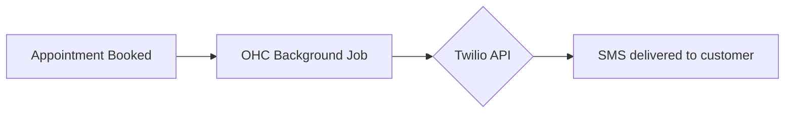

# [SMS] Twilio SMS Notifications
## Problem Statement
Many customers (and business owners with low English proficiency or limited data plans) rely on SMS rather than email for critical notifications like appointment confirmations or order updates.

## Research Report
- **Tool Evaluated**: Twilio Programmable Messaging (SMS)
- **Ease of Use**: Simple API. Requires some regulatory setup (A2P 10DLC in US) which OHC can help abstract.
- **Pricing**: ~$0.0079 per message in the US.
- **Reputation**: Gold standard for SMS delivery.
- **Cloud & Standalone**: Yes, via API keys.

### Pain Points Solved
- High open rate for critical alerts (often 98%+ compared to 20% for email).
- Reaches users without smartphones or reliable internet.

| SMS Provider | Reliability | Global Reach |
| :--- | :--- | :--- |
| Twilio | Very High | Excellent |
| MessageBird | High | Good |
| Plivo | Medium | Good |

## Design Doc
- **Integration**: OHC manages a central Twilio account (Cloud) or allows user API keys (Standalone).
- **Triggers**: Appointment booked, order shipped.
- **User Flow**: Owner toggles "Send SMS Reminders" in settings. Customers receive standard text messages.

## Implementation Prompt
Create an SMS notification system for critical alerts (e.g., appointment reminders). Provide a simple toggle for the business owner to enable this feature, abstracting away the carrier complexity.

## Priority
P1

## Estimated Scope
Medium
