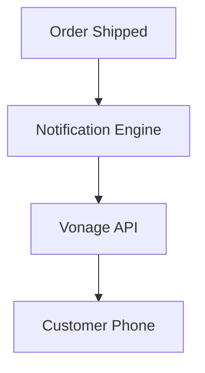

## [SMS] Issue Brief: Vonage SMS Notifications

**Title**: Scout 🔍: Vonage SMS for Global Notifications
**Problem Statement**:
Business owners need to send appointment reminders via SMS to reduce no-shows and keep customers informed.
**Research Report**:
- **Tool**: Vonage SMS API.
- **Evaluation**: Vonage provides competitive global pricing for transactional SMS.
- **Ease of Use**: Users simply toggle "Send SMS Updates" in their settings.
- **Pricing**: Per-message cost.
- **Cloud vs. Standalone**: Works in both environments.
**Design Doc**:
- "Marketing" -> "Notifications".
- User enables SMS notifications for Orders or Appointments.
- When an event occurs, OHC calls the Vonage API.

**Implementation Prompt**:
Integrate the Vonage SMS API to send outbound text messages. Add UI toggles for enabling SMS notifications.
**Priority**: P2
**Estimated Scope**: Medium
