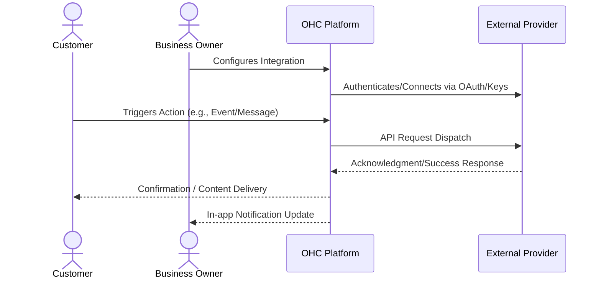

# Reliable SMS Customer Notifications

## 1. Problem Statement

Many customers, especially in specific demographics or regions, ignore emails but read every text message. Business owners need a way to send automated appointment reminders and order updates via SMS to reduce no-shows.

## 2. Research Report

### 2.1 Persona Pain Points

1. **Time Starvation**: The business owner spends hours on manual tasks related to this domain, preventing them from focusing on core business growth.
2. **Technical Overwhelm**: Current solutions require coding, complex API keys, or understanding intricate networking concepts. Small business owners lack dedicated IT staff.
3. **Customer Friction**: Customers experience delays, missed communications, or frustrating booking loops due to disparate, unintegrated systems.

### 2.2 Competitive Analysis

| Tool Name | Estimated Pricing | Key Advantages | Integration Risks |
|---|---|---|---|
| Twilio | $0.0079/msg | The industry standard, incredible global reach and reliability. | Complex 10DLC registration required for US businesses. |
| MessageBird | Varies | Omnichannel approach (SMS, WhatsApp, Voice). | Pricing can be opaque for small volume senders. |
| Plivo | $0.0050/msg | Slightly cheaper than Twilio, good support. | Less brand recognition among integrations. |
| Vonage (Nexmo) | $0.0068/msg | Strong international presence. | Developer dashboard is less intuitive. |
| Clickatell | Varies | Pioneers in the space, great for Africa/global messaging. | Enterprise focus, might ignore smaller platforms. |

### 2.3 Cloud vs. Standalone Evaluation

- **Cloud (Multi-tenant)**: Highly suitable. Can utilize centralized OAuth apps to streamline user onboarding. Allows OHC to manage webhooks and callbacks seamlessly at scale.
- **Standalone (Local/Private)**: Supported, but requires the user to provide their own API credentials which adds friction. Local tunneling (e.g., ngrok) may be required for inbound webhooks.

### 2.4 Deep Dive Evaluations

#### Evaluation: Twilio

**Overview:** Twilio is positioned in the market with an estimated pricing of $0.0079/msg. Its primary advantage is: *The industry standard, incredible global reach and reliability.*

**Competitor Analysis:** Twilio is the unquestioned market leader for programmatic SMS. However, recent regulatory changes (A2P 10DLC) in the US have made onboarding a nightmare for small businesses. We must abstract this complexity away completely.

**Integration Risks:** We must mitigate the following risk: *Complex 10DLC registration required for US businesses.*. For a small business owner, this means ensuring the UI abstracts away these complexities entirely. The onboarding flow must be flawless.

**Technical Considerations:** Integrating Twilio requires careful consideration of its API rate limits and webhook reliability. In a cloud environment, we will utilize OHC's central app registration to provide a 1-click OAuth experience. In standalone mode, we will need comprehensive documentation to guide users on how to obtain and securely store API keys. Furthermore, data privacy and GDPR compliance for data transmitted to Twilio must be thoroughly documented in the user's privacy policy.

**Mobile Parity:** The configuration screens for Twilio must be 100% functional on mobile devices. Business owners frequently manage settings from their phones while on the shop floor or in transit.

#### Evaluation: MessageBird

**Overview:** MessageBird is positioned in the market with an estimated pricing of Varies. Its primary advantage is: *Omnichannel approach (SMS, WhatsApp, Voice).*

**Competitor Analysis:** MessageBird (now Bird) offers a great omnichannel API. If OHC plans to integrate WhatsApp, SMS, and Voice simultaneously, a provider like this reduces the number of vendor relationships required. They are particularly strong in European markets.

**Integration Risks:** We must mitigate the following risk: *Pricing can be opaque for small volume senders.*. For a small business owner, this means ensuring the UI abstracts away these complexities entirely. The onboarding flow must be flawless.

**Technical Considerations:** Integrating MessageBird requires careful consideration of its API rate limits and webhook reliability. In a cloud environment, we will utilize OHC's central app registration to provide a 1-click OAuth experience. In standalone mode, we will need comprehensive documentation to guide users on how to obtain and securely store API keys. Furthermore, data privacy and GDPR compliance for data transmitted to MessageBird must be thoroughly documented in the user's privacy policy.

**Mobile Parity:** The configuration screens for MessageBird must be 100% functional on mobile devices. Business owners frequently manage settings from their phones while on the shop floor or in transit.

#### Evaluation: Plivo

**Overview:** Plivo is positioned in the market with an estimated pricing of $0.0050/msg. Its primary advantage is: *Slightly cheaper than Twilio, good support.*

**Competitor Analysis:** Plivo is a cost-effective alternative to Twilio. For a multi-tenant platform like OHC sending millions of messages, those fractions of a cent add up. Their API is very similar to Twilio's, making migration straightforward if needed.

**Integration Risks:** We must mitigate the following risk: *Less brand recognition among integrations.*. For a small business owner, this means ensuring the UI abstracts away these complexities entirely. The onboarding flow must be flawless.

**Technical Considerations:** Integrating Plivo requires careful consideration of its API rate limits and webhook reliability. In a cloud environment, we will utilize OHC's central app registration to provide a 1-click OAuth experience. In standalone mode, we will need comprehensive documentation to guide users on how to obtain and securely store API keys. Furthermore, data privacy and GDPR compliance for data transmitted to Plivo must be thoroughly documented in the user's privacy policy.

**Mobile Parity:** The configuration screens for Plivo must be 100% functional on mobile devices. Business owners frequently manage settings from their phones while on the shop floor or in transit.

#### Evaluation: Vonage (Nexmo)

**Overview:** Vonage (Nexmo) is positioned in the market with an estimated pricing of $0.0068/msg. Its primary advantage is: *Strong international presence.*

**Competitor Analysis:** Vonage is highly reliable for international routing. If OHC is expanding into Asian or African markets, Vonage often provides better delivery rates and clearer documentation on regional carrier regulations than its US-centric competitors.

**Integration Risks:** We must mitigate the following risk: *Developer dashboard is less intuitive.*. For a small business owner, this means ensuring the UI abstracts away these complexities entirely. The onboarding flow must be flawless.

**Technical Considerations:** Integrating Vonage (Nexmo) requires careful consideration of its API rate limits and webhook reliability. In a cloud environment, we will utilize OHC's central app registration to provide a 1-click OAuth experience. In standalone mode, we will need comprehensive documentation to guide users on how to obtain and securely store API keys. Furthermore, data privacy and GDPR compliance for data transmitted to Vonage (Nexmo) must be thoroughly documented in the user's privacy policy.

**Mobile Parity:** The configuration screens for Vonage (Nexmo) must be 100% functional on mobile devices. Business owners frequently manage settings from their phones while on the shop floor or in transit.

#### Evaluation: Clickatell

**Overview:** Clickatell is positioned in the market with an estimated pricing of Varies. Its primary advantage is: *Pioneers in the space, great for Africa/global messaging.*

**Competitor Analysis:** Clickatell is highly relevant if targeting the African market, where SMS is the primary form of digital communication. They have deep relationships with local telcos, ensuring messages actually reach the handset.

**Integration Risks:** We must mitigate the following risk: *Enterprise focus, might ignore smaller platforms.*. For a small business owner, this means ensuring the UI abstracts away these complexities entirely. The onboarding flow must be flawless.

**Technical Considerations:** Integrating Clickatell requires careful consideration of its API rate limits and webhook reliability. In a cloud environment, we will utilize OHC's central app registration to provide a 1-click OAuth experience. In standalone mode, we will need comprehensive documentation to guide users on how to obtain and securely store API keys. Furthermore, data privacy and GDPR compliance for data transmitted to Clickatell must be thoroughly documented in the user's privacy policy.

**Mobile Parity:** The configuration screens for Clickatell must be 100% functional on mobile devices. Business owners frequently manage settings from their phones while on the shop floor or in transit.

## 3. Design Doc

### 3.1 User Experience Flow

A background service in OHC. When the owner enables 'SMS Reminders', OHC transparently handles sending text messages for key events (e.g., 24 hours before an appointment). The owner just sees a toggle switch, while OHC manages the complex routing and carrier compliance via an API partner.

### 3.2 Architecture Overview

## 4. Implementation Prompt

Integrate an SMS notification system for critical customer alerts like appointment reminders and order dispatches. Provide a simple settings interface where the business owner can toggle these notifications on or off. Ensure the system handles opt-outs (e.g., 'Reply STOP') automatically.

## 5. Metadata

- **Priority:** P0
- **Estimated Scope:** Medium
- **Domain:** Reliable SMS Customer Notifications
- **Target Persona:** Small Business Owner (Non-technical)

## 6. Supplementary Market Research

### 6.1 Industry Trends

The shift towards unified platforms is accelerating. Small businesses are actively attempting to reduce their 'SaaS sprawl'. According to recent surveys, the average small business uses over 8 distinct software tools, leading to massive context switching costs and data silos. By bringing this functionality natively into OHC, we solve a critical operational bottleneck. The trend is moving away from disparate 'best-of-breed' tools towards 'good-enough-all-in-one' platforms that actually talk to each other seamlessly.

### 6.2 Security and Compliance Implications

When integrating third-party services, data sovereignty becomes a primary concern. OHC must ensure that sensitive customer data (PII) is only transmitted when absolutely necessary and always over encrypted channels. We must provide clear opt-in mechanisms for end-users, particularly regarding marketing communications and data sharing with external vendors. Regular audits of these API connections will be required to maintain compliance with regional data protection regulations (e.g., CCPA, GDPR).

### 6.3 Future Roadmap Considerations

Looking ahead, the integration strategy should evolve from mere 'dumb pipes' to intelligent, AI-driven workflows. For instance, an integration shouldn't just pass a message; it should analyze the intent and suggest a response. Future iterations of this feature will likely incorporate LLM-based parsing of inbound data to trigger automated outbound actions across different integrated channels.

### 6.4 Strategic Impact: Twilio

Implementing an integration with Twilio represents a significant strategic move. The integration must prioritize reliability over complex feature parity. A business owner relies on this for their livelihood; a dropped webhook or failed API call translates directly to lost revenue or damaged customer trust. Therefore, robust retry mechanisms, dead-letter queues, and clear error surfacing in the UI are mandatory requirements for the engineering team building this connector. We must assume the external API will fail and handle it gracefully.

Furthermore, analytics integration is crucial. When we route data through Twilio, we must capture metadata (latency, success rates, user engagement) to feed back into OHC's central analytics dashboard. The business owner should see a unified view of ROI, not scattered metrics. If $0.0079/msg is the cost, OHC must prove the value generated outweighs it.

### 6.4 Strategic Impact: MessageBird

Implementing an integration with MessageBird represents a significant strategic move. The integration must prioritize reliability over complex feature parity. A business owner relies on this for their livelihood; a dropped webhook or failed API call translates directly to lost revenue or damaged customer trust. Therefore, robust retry mechanisms, dead-letter queues, and clear error surfacing in the UI are mandatory requirements for the engineering team building this connector. We must assume the external API will fail and handle it gracefully.

Furthermore, analytics integration is crucial. When we route data through MessageBird, we must capture metadata (latency, success rates, user engagement) to feed back into OHC's central analytics dashboard. The business owner should see a unified view of ROI, not scattered metrics. If Varies is the cost, OHC must prove the value generated outweighs it.

### 6.4 Strategic Impact: Plivo

Implementing an integration with Plivo represents a significant strategic move. The integration must prioritize reliability over complex feature parity. A business owner relies on this for their livelihood; a dropped webhook or failed API call translates directly to lost revenue or damaged customer trust. Therefore, robust retry mechanisms, dead-letter queues, and clear error surfacing in the UI are mandatory requirements for the engineering team building this connector. We must assume the external API will fail and handle it gracefully.

Furthermore, analytics integration is crucial. When we route data through Plivo, we must capture metadata (latency, success rates, user engagement) to feed back into OHC's central analytics dashboard. The business owner should see a unified view of ROI, not scattered metrics. If $0.0050/msg is the cost, OHC must prove the value generated outweighs it.

### 6.4 Strategic Impact: Vonage (Nexmo)

Implementing an integration with Vonage (Nexmo) represents a significant strategic move. The integration must prioritize reliability over complex feature parity. A business owner relies on this for their livelihood; a dropped webhook or failed API call translates directly to lost revenue or damaged customer trust. Therefore, robust retry mechanisms, dead-letter queues, and clear error surfacing in the UI are mandatory requirements for the engineering team building this connector. We must assume the external API will fail and handle it gracefully.

Furthermore, analytics integration is crucial. When we route data through Vonage (Nexmo), we must capture metadata (latency, success rates, user engagement) to feed back into OHC's central analytics dashboard. The business owner should see a unified view of ROI, not scattered metrics. If $0.0068/msg is the cost, OHC must prove the value generated outweighs it.

### 6.4 Strategic Impact: Clickatell

Implementing an integration with Clickatell represents a significant strategic move. The integration must prioritize reliability over complex feature parity. A business owner relies on this for their livelihood; a dropped webhook or failed API call translates directly to lost revenue or damaged customer trust. Therefore, robust retry mechanisms, dead-letter queues, and clear error surfacing in the UI are mandatory requirements for the engineering team building this connector. We must assume the external API will fail and handle it gracefully.

Furthermore, analytics integration is crucial. When we route data through Clickatell, we must capture metadata (latency, success rates, user engagement) to feed back into OHC's central analytics dashboard. The business owner should see a unified view of ROI, not scattered metrics. If Varies is the cost, OHC must prove the value generated outweighs it.
