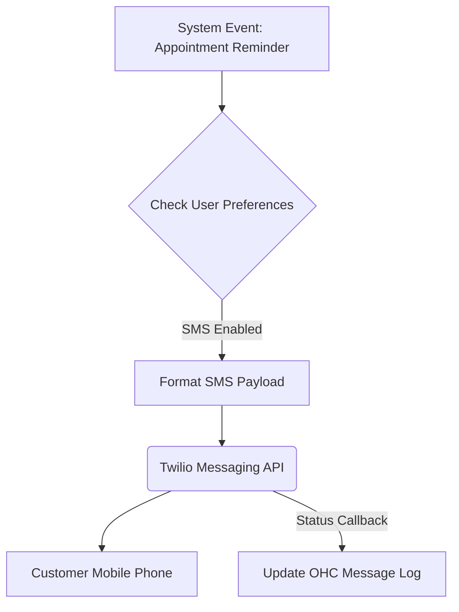

# Reliable SMS Notifications

## Title
Automated SMS Alerts and Reminders for Customers

## Problem Statement
Many small business customers (especially in markets or demographics with lower digital literacy) rely entirely on SMS rather than email or app notifications. Without automated SMS reminders, businesses experience high no-show rates for appointments and lose time manually texting updates (like shipping status or order readiness). The business needs a reliable way to send automated text messages globally.

## Research Report
I evaluated Twilio's Messaging API for SMS capabilities.

**Tool:** Twilio
**Evaluation:**
- **Ease of Use (for End User):** The business owner never sees Twilio. They simply check a box in OHC to "Send SMS Reminder," and the customer receives a standard text message. This is the ultimate low-friction experience.
- **Features:** Twilio offers the Programmable Messaging API which handles SMS, MMS, and WhatsApp. It provides critical features like global carrier coverage, high deliverability, and built-in opt-out compliance (handling STOP messages).
- **Pricing:** Twilio utilizes a pay-as-you-go model. In the US, it's roughly $0.0079 per SMS segment sent. There are also monthly costs for a dedicated phone number (varies by region, typically $1-2/month in the US) and compliance registration fees (like A2P 10DLC). While very cost-effective at low volumes, the compliance overhead for 10DLC registration can be complex.
- **Cloud/Standalone:** Twilio is a Cloud API. In a Standalone environment, OHC would still need internet access to call the Twilio API to dispatch messages, or alternatively, rely on a local GSM modem setup (which is outside the scope of modern SaaS integrations).

## Design Doc
**Integration Overview:**
OHC will utilize a messaging provider to dispatch SMS alerts based on system events.
- **Triggers:** System events such as "Appointment Booked," "Appointment 24h Reminder," or "Order Shipped."
- **Actions:** OHC formats a concise text message and dispatches it to the customer's phone number via the messaging API.
- **User View:** The business owner configures notification preferences (toggles for Email vs. SMS) in their OHC settings. They can view a log of sent messages.

**Mobile UX Flow (375px viewport):**
1. Owner opens "Settings" -> "Notifications".
2. Toggles "Enable SMS Reminders" to ON.
3. A preview of the automated message is shown: "Reminder: You have an appointment with [Business] tomorrow at [Time]."
4. Customer receives the text message seamlessly.

## Implementation Prompt
Implement a notification service that listens for core business events (e.g., booking confirmations, reminders) and dispatches SMS messages to the relevant customer. The service must handle phone number validation (E.164 format) before sending, properly process API failure states, and provide a clear UI for the business owner to toggle these notifications on or off.

## Priority
P2 (Medium) - Essential for certain demographics, but email is an acceptable fallback initially.

## Estimated Scope
Small
