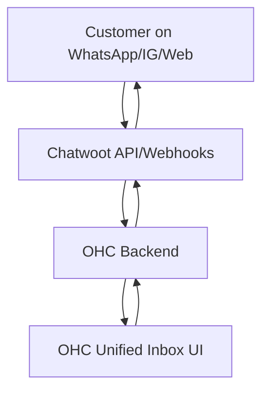

# Research: Social Media Integration with Chatwoot

## Title
Integrate Chatwoot for Unified Social Media Inbox

## Problem Statement
Small business owners often struggle to manage customer communications scattered across various platforms like Instagram DMs, Facebook comments, WhatsApp, and website live chat. Juggling multiple apps leads to delayed responses, missed sales opportunities, and poor customer service. They need a single, unified inbox to view and reply to all customer messages efficiently, without technical complexity.

## Research Report
Chatwoot is an open-source, omnichannel customer support platform designed to centralize conversations from live chat, email, Facebook, Instagram, WhatsApp, Twitter, Line, Telegram, and SMS.
- **Ease of Use**: It provides a clean, modern interface that is easy for non-technical users to navigate. The centralized dashboard is intuitive and reduces context-switching.
- **Pricing**: Chatwoot offers a generous free "Hacker" tier (up to 2 agents, 500 conversations/month) which is ideal for very small businesses. Paid plans start at $19/agent/month (Startups), providing unlimited conversations and access to all channels. They also offer self-hosted options which can be cost-effective for larger teams with IT resources.
- **Reputation**: Highly regarded in the open-source community as a solid alternative to Intercom or Zendesk, holding a 4.5+ rating on G2 and over 25k stars on GitHub.
- **Environment Support**: Chatwoot's API and webhooks make it suitable for Cloud environments. Because it is open-source and self-hostable, it is also highly compatible with Standalone (local, private) environments where data sovereignty is a priority.

## Design Doc
The integration will connect OHC's unified inbox interface with Chatwoot's platform.
1.  **Account Provisioning**: When a business owner opts into the "Unified Inbox" feature, an OHC background agent will handle the OAuth flow or API key configuration to connect their social media accounts to a Chatwoot instance.
2.  **Message Syncing**: Incoming messages from connected channels (e.g., Instagram, WhatsApp) will be received by Chatwoot and relayed to the OHC interface via webhooks or API polling.
3.  **Unified UI**: The business owner will interact with a simplified inbox within the OHC dashboard.
4.  **Outgoing Messages**: Replies sent from the OHC dashboard will be routed through Chatwoot's API to the respective social platform.

## Implementation Prompt
Implement a unified inbox experience using Chatwoot as the underlying message routing engine. The user should be able to connect their Instagram and WhatsApp accounts through a simple setup wizard in the OHC dashboard. Once connected, all incoming messages should appear in a single, chronological feed. The user must be able to read and reply to these messages directly from the OHC interface, with replies accurately appearing on the customer's native app. The integration must support both cloud deployments (connecting to Chatwoot Cloud) and standalone mode (connecting to a local/self-hosted Chatwoot instance).

## Priority
P1

## Estimated Scope
Medium
