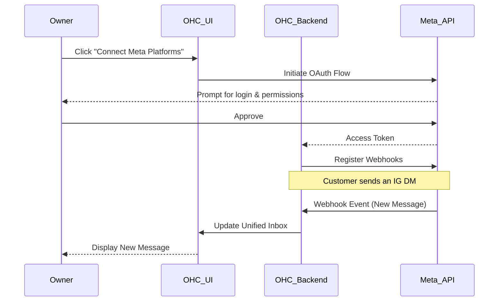

# [Social Media] Unified Inbox Integration

## Title
Connect Meta Platforms (Instagram, Facebook, WhatsApp) to Unified Inbox

## Problem Statement
As a small business owner, keeping up with customer messages across Instagram DMs, Facebook comments, and WhatsApp is overwhelming. I often miss inquiries or take too long to reply because I have to check multiple apps on my phone constantly. I need a single place where I can see and reply to all my customer messages without switching apps, so I can focus on running my business and never lose a lead.

## Research Report
**Tools Evaluated:** Meta Graph API (Direct integration), Twilio (Conversations API), ManyChat.

- **Meta Graph API (Direct):** Direct integration allows us to pull messages directly from Facebook Pages, Instagram Professional accounts, and WhatsApp Business accounts.
  - *Ease of Use for Non-Technical Users:* Requires an OAuth flow ("Log in with Facebook") which is very familiar to most users. They just click a button, log in, and select the pages they want to connect.
  - *Pricing:* Free to use for Instagram and Facebook DMs. WhatsApp Business API has per-conversation costs, but the first 1,000 service conversations are free per month, which covers most small businesses.
  - *Reputation:* Official, highly reliable.
  - *Cloud vs Standalone:* Works in both. In Cloud, we manage the OAuth app centrally. In Standalone, users might need a proxy or provide their own credentials, though a central proxy for OAuth is preferred for ease of use.
- **Twilio / ManyChat:** Act as aggregators. Twilio requires significant developer setup and phone number porting for WhatsApp. ManyChat is great but is an external tool, meaning the user still has to leave OHC.
- **Recommendation:** Integrate directly using Meta Graph API via an OAuth flow. It's the most seamless experience for the business owner.

## Design Doc
The integration will add a "Connect Channels" section in the OHC settings.
- **Trigger:** The business owner clicks "Connect my Instagram/Facebook".
- **Action:** A standard OAuth popup appears. The user authorizes the OHC app. OHC receives an access token and registers webhooks for incoming messages.
- **User View:** Incoming messages from these platforms appear in the OHC Unified Inbox, clearly badged with the source (e.g., a small Instagram icon). When the owner types a reply and hits send, the message is routed back to the correct platform natively.

## Implementation Prompt
Implement a secure OAuth flow that allows users to connect their Meta Business accounts (Facebook Pages, Instagram Professional). The outcome should be that users see a simple "Connect" button in their settings. Once connected, incoming direct messages and comments from these platforms should automatically populate the existing Unified Inbox. Replies sent from the Unified Inbox must be delivered back to the customer on the original platform. Ensure the UI clearly indicates the source of the message (e.g., IG, FB) using intuitive icons.

## Priority
P1

## Estimated Scope
Large
