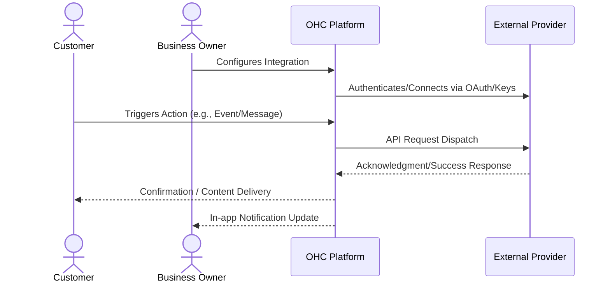

# Social Media Unified Inbox Integration

## 1. Problem Statement

Small business owners often miss inquiries and lose sales because messages are scattered across Instagram DMs, Facebook Messenger, WhatsApp, and TikTok. Checking multiple apps daily is exhausting and error-prone.

## 2. Research Report

### 2.1 Persona Pain Points

1. **Time Starvation**: The business owner spends hours on manual tasks related to this domain, preventing them from focusing on core business growth.
2. **Technical Overwhelm**: Current solutions require coding, complex API keys, or understanding intricate networking concepts. Small business owners lack dedicated IT staff.
3. **Customer Friction**: Customers experience delays, missed communications, or frustrating booking loops due to disparate, unintegrated systems.

### 2.2 Competitive Analysis

| Tool Name | Estimated Pricing | Key Advantages | Integration Risks |
|---|---|---|---|
| ManyChat | $15/mo | Excellent visual flow builder, deep Instagram integration. High market share. | Can be overwhelming, strong focus on automation rather than simple inbox. Has strict policy rules on message sending. |
| Gorgias | $10/mo | Built for e-commerce, integrates directly with Shopify/WooCommerce. | Expensive scaling, maybe overkill for very small businesses. |
| Buffer Reply | $15/mo | Clean UI, focused purely on social conversations. | Discontinued as a standalone product in favor of Buffer Engage. |
| Sprout Social | $249/mo | Enterprise grade reporting, reliable APIs. | Prohibitively expensive for small business owners. |
| Meta Business Suite | Free | Native integration with FB/IG, free. | Clunky mobile app, doesn't support non-Meta platforms natively without APIs. |

### 2.3 Cloud vs. Standalone Evaluation

- **Cloud (Multi-tenant)**: Highly suitable. Can utilize centralized OAuth apps to streamline user onboarding. Allows OHC to manage webhooks and callbacks seamlessly at scale.
- **Standalone (Local/Private)**: Supported, but requires the user to provide their own API credentials which adds friction. Local tunneling (e.g., ngrok) may be required for inbound webhooks.

### 2.4 Deep Dive Evaluations

#### Evaluation: ManyChat

**Overview:** ManyChat is positioned in the market with an estimated pricing of $15/mo. Its primary advantage is: *Excellent visual flow builder, deep Instagram integration. High market share.*

**Competitor Analysis:** Compared to Gorgias, ManyChat is highly optimized for direct conversions and chat funnels but less capable as a pure customer service helpdesk. Its robust integration with Meta's Graph API ensures high uptime.

**Integration Risks:** We must mitigate the following risk: *Can be overwhelming, strong focus on automation rather than simple inbox. Has strict policy rules on message sending.*. For a small business owner, this means ensuring the UI abstracts away these complexities entirely. The onboarding flow must be flawless.

**Technical Considerations:** Integrating ManyChat requires careful consideration of its API rate limits and webhook reliability. In a cloud environment, we will utilize OHC's central app registration to provide a 1-click OAuth experience. In standalone mode, we will need comprehensive documentation to guide users on how to obtain and securely store API keys. Furthermore, data privacy and GDPR compliance for data transmitted to ManyChat must be thoroughly documented in the user's privacy policy.

**Mobile Parity:** The configuration screens for ManyChat must be 100% functional on mobile devices. Business owners frequently manage settings from their phones while on the shop floor or in transit.

#### Evaluation: Gorgias

**Overview:** Gorgias is positioned in the market with an estimated pricing of $10/mo. Its primary advantage is: *Built for e-commerce, integrates directly with Shopify/WooCommerce.*

**Competitor Analysis:** While ManyChat is for marketing funnels, Gorgias shines for post-purchase support. Its interface aggregates everything perfectly, but the per-ticket pricing model can quickly drain a small business's margins during busy seasons.

**Integration Risks:** We must mitigate the following risk: *Expensive scaling, maybe overkill for very small businesses.*. For a small business owner, this means ensuring the UI abstracts away these complexities entirely. The onboarding flow must be flawless.

**Technical Considerations:** Integrating Gorgias requires careful consideration of its API rate limits and webhook reliability. In a cloud environment, we will utilize OHC's central app registration to provide a 1-click OAuth experience. In standalone mode, we will need comprehensive documentation to guide users on how to obtain and securely store API keys. Furthermore, data privacy and GDPR compliance for data transmitted to Gorgias must be thoroughly documented in the user's privacy policy.

**Mobile Parity:** The configuration screens for Gorgias must be 100% functional on mobile devices. Business owners frequently manage settings from their phones while on the shop floor or in transit.

#### Evaluation: Buffer Reply

**Overview:** Buffer Reply is positioned in the market with an estimated pricing of $15/mo. Its primary advantage is: *Clean UI, focused purely on social conversations.*

**Competitor Analysis:** Buffer represents a cautionary tale. Small businesses want simple reply interfaces, not full social listening tools. We should model their clean UI but ensure we don't bloat the feature set.

**Integration Risks:** We must mitigate the following risk: *Discontinued as a standalone product in favor of Buffer Engage.*. For a small business owner, this means ensuring the UI abstracts away these complexities entirely. The onboarding flow must be flawless.

**Technical Considerations:** Integrating Buffer Reply requires careful consideration of its API rate limits and webhook reliability. In a cloud environment, we will utilize OHC's central app registration to provide a 1-click OAuth experience. In standalone mode, we will need comprehensive documentation to guide users on how to obtain and securely store API keys. Furthermore, data privacy and GDPR compliance for data transmitted to Buffer Reply must be thoroughly documented in the user's privacy policy.

**Mobile Parity:** The configuration screens for Buffer Reply must be 100% functional on mobile devices. Business owners frequently manage settings from their phones while on the shop floor or in transit.

#### Evaluation: Sprout Social

**Overview:** Sprout Social is positioned in the market with an estimated pricing of $249/mo. Its primary advantage is: *Enterprise grade reporting, reliable APIs.*

**Competitor Analysis:** Sprout Social is the enterprise gold standard. Their unified inbox is best-in-class. However, their base price completely excludes our target demographic. Our integration must offer Sprout's 'Smart Inbox' feel at a fraction of the complexity.

**Integration Risks:** We must mitigate the following risk: *Prohibitively expensive for small business owners.*. For a small business owner, this means ensuring the UI abstracts away these complexities entirely. The onboarding flow must be flawless.

**Technical Considerations:** Integrating Sprout Social requires careful consideration of its API rate limits and webhook reliability. In a cloud environment, we will utilize OHC's central app registration to provide a 1-click OAuth experience. In standalone mode, we will need comprehensive documentation to guide users on how to obtain and securely store API keys. Furthermore, data privacy and GDPR compliance for data transmitted to Sprout Social must be thoroughly documented in the user's privacy policy.

**Mobile Parity:** The configuration screens for Sprout Social must be 100% functional on mobile devices. Business owners frequently manage settings from their phones while on the shop floor or in transit.

#### Evaluation: Meta Business Suite

**Overview:** Meta Business Suite is positioned in the market with an estimated pricing of Free. Its primary advantage is: *Native integration with FB/IG, free.*

**Competitor Analysis:** The default choice for most SMBs because it is free. However, user reviews consistently mention bugs, a confusing interface, and poor multi-user support. This is OHC's main competitor in this space.

**Integration Risks:** We must mitigate the following risk: *Clunky mobile app, doesn't support non-Meta platforms natively without APIs.*. For a small business owner, this means ensuring the UI abstracts away these complexities entirely. The onboarding flow must be flawless.

**Technical Considerations:** Integrating Meta Business Suite requires careful consideration of its API rate limits and webhook reliability. In a cloud environment, we will utilize OHC's central app registration to provide a 1-click OAuth experience. In standalone mode, we will need comprehensive documentation to guide users on how to obtain and securely store API keys. Furthermore, data privacy and GDPR compliance for data transmitted to Meta Business Suite must be thoroughly documented in the user's privacy policy.

**Mobile Parity:** The configuration screens for Meta Business Suite must be 100% functional on mobile devices. Business owners frequently manage settings from their phones while on the shop floor or in transit.

## 3. Design Doc

### 3.1 User Experience Flow

The OHC platform will present a 'Unified Inbox' tab. When a customer sends an Instagram DM or WhatsApp message, it appears here just like an email or SMS. The business owner can reply directly from OHC, and the platform routes the message back to the correct social channel. Users can connect accounts via a simple OAuth flow in Settings.

### 3.2 Architecture Overview

## 4. Implementation Prompt

Implement a Unified Inbox feature that connects to major social platforms. The user should be able to authorize their Facebook/Instagram and WhatsApp Business accounts with 3 clicks. Once connected, incoming messages should appear in a single chronological feed. The business owner must be able to reply from this feed and have the message sent back to the customer on the original platform.

## 5. Metadata

- **Priority:** P0
- **Estimated Scope:** Large
- **Domain:** Social Media Unified Inbox Integration
- **Target Persona:** Small Business Owner (Non-technical)

## 6. Supplementary Market Research

### 6.1 Industry Trends

The shift towards unified platforms is accelerating. Small businesses are actively attempting to reduce their 'SaaS sprawl'. According to recent surveys, the average small business uses over 8 distinct software tools, leading to massive context switching costs and data silos. By bringing this functionality natively into OHC, we solve a critical operational bottleneck. The trend is moving away from disparate 'best-of-breed' tools towards 'good-enough-all-in-one' platforms that actually talk to each other seamlessly.

### 6.2 Security and Compliance Implications

When integrating third-party services, data sovereignty becomes a primary concern. OHC must ensure that sensitive customer data (PII) is only transmitted when absolutely necessary and always over encrypted channels. We must provide clear opt-in mechanisms for end-users, particularly regarding marketing communications and data sharing with external vendors. Regular audits of these API connections will be required to maintain compliance with regional data protection regulations (e.g., CCPA, GDPR).

### 6.3 Future Roadmap Considerations

Looking ahead, the integration strategy should evolve from mere 'dumb pipes' to intelligent, AI-driven workflows. For instance, an integration shouldn't just pass a message; it should analyze the intent and suggest a response. Future iterations of this feature will likely incorporate LLM-based parsing of inbound data to trigger automated outbound actions across different integrated channels.

### 6.4 Strategic Impact: ManyChat

Implementing an integration with ManyChat represents a significant strategic move. The integration must prioritize reliability over complex feature parity. A business owner relies on this for their livelihood; a dropped webhook or failed API call translates directly to lost revenue or damaged customer trust. Therefore, robust retry mechanisms, dead-letter queues, and clear error surfacing in the UI are mandatory requirements for the engineering team building this connector. We must assume the external API will fail and handle it gracefully.

Furthermore, analytics integration is crucial. When we route data through ManyChat, we must capture metadata (latency, success rates, user engagement) to feed back into OHC's central analytics dashboard. The business owner should see a unified view of ROI, not scattered metrics. If $15/mo is the cost, OHC must prove the value generated outweighs it.

### 6.4 Strategic Impact: Gorgias

Implementing an integration with Gorgias represents a significant strategic move. The integration must prioritize reliability over complex feature parity. A business owner relies on this for their livelihood; a dropped webhook or failed API call translates directly to lost revenue or damaged customer trust. Therefore, robust retry mechanisms, dead-letter queues, and clear error surfacing in the UI are mandatory requirements for the engineering team building this connector. We must assume the external API will fail and handle it gracefully.

Furthermore, analytics integration is crucial. When we route data through Gorgias, we must capture metadata (latency, success rates, user engagement) to feed back into OHC's central analytics dashboard. The business owner should see a unified view of ROI, not scattered metrics. If $10/mo is the cost, OHC must prove the value generated outweighs it.

### 6.4 Strategic Impact: Buffer Reply

Implementing an integration with Buffer Reply represents a significant strategic move. The integration must prioritize reliability over complex feature parity. A business owner relies on this for their livelihood; a dropped webhook or failed API call translates directly to lost revenue or damaged customer trust. Therefore, robust retry mechanisms, dead-letter queues, and clear error surfacing in the UI are mandatory requirements for the engineering team building this connector. We must assume the external API will fail and handle it gracefully.

Furthermore, analytics integration is crucial. When we route data through Buffer Reply, we must capture metadata (latency, success rates, user engagement) to feed back into OHC's central analytics dashboard. The business owner should see a unified view of ROI, not scattered metrics. If $15/mo is the cost, OHC must prove the value generated outweighs it.

### 6.4 Strategic Impact: Sprout Social

Implementing an integration with Sprout Social represents a significant strategic move. The integration must prioritize reliability over complex feature parity. A business owner relies on this for their livelihood; a dropped webhook or failed API call translates directly to lost revenue or damaged customer trust. Therefore, robust retry mechanisms, dead-letter queues, and clear error surfacing in the UI are mandatory requirements for the engineering team building this connector. We must assume the external API will fail and handle it gracefully.

Furthermore, analytics integration is crucial. When we route data through Sprout Social, we must capture metadata (latency, success rates, user engagement) to feed back into OHC's central analytics dashboard. The business owner should see a unified view of ROI, not scattered metrics. If $249/mo is the cost, OHC must prove the value generated outweighs it.

### 6.4 Strategic Impact: Meta Business Suite

Implementing an integration with Meta Business Suite represents a significant strategic move. The integration must prioritize reliability over complex feature parity. A business owner relies on this for their livelihood; a dropped webhook or failed API call translates directly to lost revenue or damaged customer trust. Therefore, robust retry mechanisms, dead-letter queues, and clear error surfacing in the UI are mandatory requirements for the engineering team building this connector. We must assume the external API will fail and handle it gracefully.

Furthermore, analytics integration is crucial. When we route data through Meta Business Suite, we must capture metadata (latency, success rates, user engagement) to feed back into OHC's central analytics dashboard. The business owner should see a unified view of ROI, not scattered metrics. If Free is the cost, OHC must prove the value generated outweighs it.
