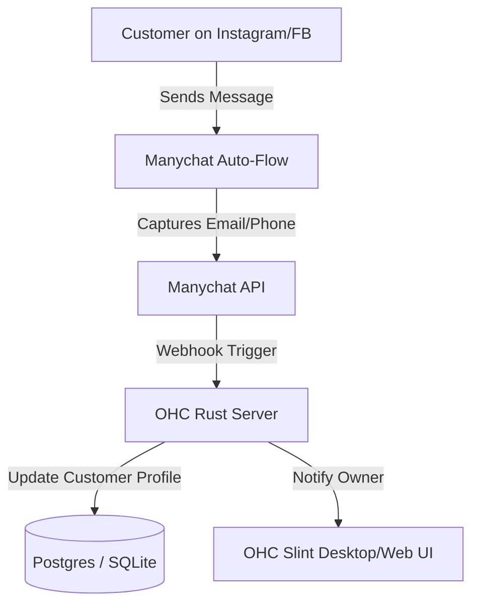

**Title**: Social Media Integration: Manychat

## Problem Statement
Small business owners often receive customer inquiries across multiple social media platforms, including Instagram DMs, Facebook Messenger, and WhatsApp. Managing these disparate channels manually is overwhelming and leads to slow response times or missed sales opportunities. They need a unified way to automate responses, capture leads, and manage conversations without needing to constantly monitor every app.

## Research Report
**Tool Evaluated:** Manychat
**Category:** Social Media Integration
**Overview:** Manychat is a prominent chat marketing platform that automates interactive conversations in Instagram Direct Messages, Facebook Messenger, and WhatsApp.

**Key Features for Small Businesses:**
*   **Visual Flow Builder:** Easy drag-and-drop interface to build automated chat flows (e.g., "Reply 'INFO' to get a link").
*   **Multi-Channel:** Connects Instagram, Facebook, and WhatsApp.
*   **Lead Capture:** Can automatically collect emails and phone numbers inside the chat.
*   **Ease of Use:** Highly optimized for non-technical users to set up basic auto-replies.

**Environment Compatibility:**
*   **Cloud Mode:** Fully supported. OHC can integrate via Manychat's API to sync leads, trigger flows, or act as a live-chat handoff.
*   **Standalone Mode:** Supported via API. Webhooks would be needed to receive real-time updates from Manychat to a local OHC instance.

**Pros:**
*   Extremely user-friendly visual builder.
*   Deep, official integrations with Meta products.
*   Excellent for driving automated sales funnels from social media.

**Cons:**
*   Primarily focused on automation rather than serving as a pure unified inbox.

## Design Doc

The integration connects Manychat's lead capture and conversation data directly into the OHC customer database.

### High-Level UX Flow:
1.  **Integration Hub:** The business owner selects "Connect Manychat" in the OHC integrations tab and provides an API token.
2.  **Configuration:** The user maps Manychat custom fields (e.g., "Captured_Email") to OHC customer fields.
3.  **Operation:** When a user interacts with a Manychat flow on Instagram and provides their email, Manychat fires a webhook to OHC.
4.  **Display:** OHC creates a new lead in the CRM and displays a notification: "New lead captured from Instagram: Jane Doe".

## Implementation Prompt
**Objective:** Integrate Manychat to sync captured leads and conversation handoffs from social media into OHC.
**Acceptance Criteria:**
- Create a UI component in Slint to manage the Manychat API connection.
- Implement a webhook receiver in the backend to handle incoming lead data from Manychat.
- Ensure incoming data correctly creates or updates customer records in the OHC database.
- Ensure the user interface passes the "Grandmother Test" (e.g., "Connect Instagram/Facebook bots").

## Priority
P2

## Estimated Scope
Medium
