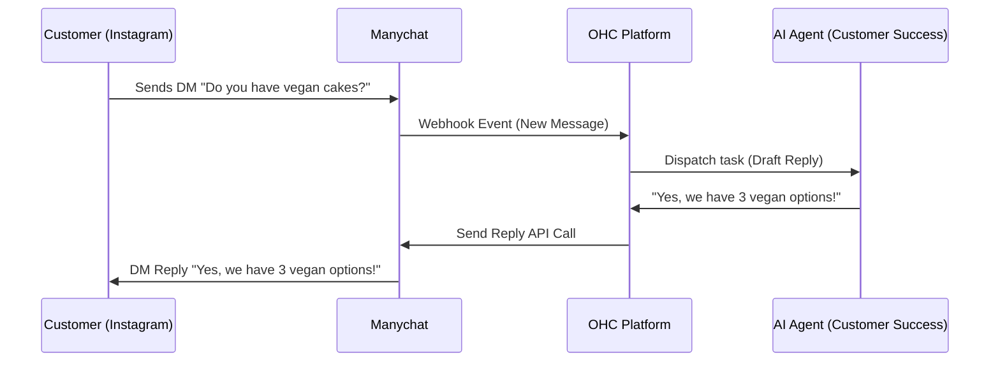
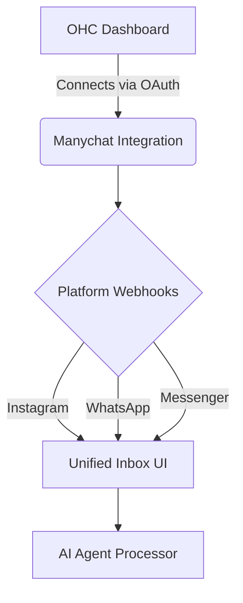

# Scout: Tool Integration Research Q2

## [Social Media] Manychat Integration
**Title**: Integrate Manychat for Unified Social Media Inbox
**Problem Statement**: Small business owners like Maya (The Home Baker) receive orders and inquiries across Instagram DMs, Facebook Messenger, and WhatsApp. Managing these manually is overwhelming and leads to missed sales. They need a single, unified inbox where an AI agent can read and reply to messages from all platforms automatically.

**Research Report**:
- **Tool**: Manychat
- **Target Persona**: Maya (Home Baker), Priya (Boutique Owner)
- **Advantages**: Excellent Instagram and WhatsApp API integrations. Robust webhook support for routing messages to OHC's backend. Extremely popular among SMBs for basic automation.
- **Risks**: Pricing scales with contacts, which may be expensive for high-volume, low-margin businesses. Requires Meta business verification for some features.
- **Pricing**: Free tier available (up to 1,000 contacts). Pro tier starts at $15/mo.
- **Compatibility**: Cloud (via webhooks/OAuth). Standalone (would require local reverse proxy for webhooks, possible but complex).

### Qualitative Analysis
Manychat provides one of the easiest-to-use platforms for integrating with Instagram and WhatsApp. Small business owners find immense value in automatically answering FAQs like "what are your hours?" or "do you make gluten-free cakes?". However, the built-in bot builder in Manychat can be too complex for a standard OHC user (the "Grandmother Test"). OHC should abstract away the rule building and instead use Manychat purely as an API gateway for our own autonomous AI agents to respond natively.

### Persona-Specific Pain Point Summary
- **Maya (Home Baker)**: Missing Instagram DM requests because she is covered in flour. Needs the AI to instantly reply and capture order details.
- **Priya (Boutique Owner)**: Gets repetitive WhatsApp messages asking if an item seen on Instagram is in stock. Needs the unified inbox to automatically cross-reference the OHC inventory.

### Competitive Matrix
| Feature / Tool | Manychat | Ayrshare | Meta Graph API Direct |
| :--- | :--- | :--- | :--- |
| **Ease of Integration** | High | High | Low |
| **WhatsApp Support** | Native, Excellent | Good | Direct, but Complex |
| **Cost** | Contact-based ($15+) | Tiered API limits | Free (pay for WhatsApp msgs) |
| **SMB Familiarity** | High | Low | N/A |

**Design Doc**:
- User goes to the Operations dashboard and clicks "Connect Instagram".
- User authenticates with Facebook/Instagram via OAuth.
- OHC registers webhooks to receive new DMs.
- When a DM arrives, the Customer Success agent reads it, generates a reply (e.g., "Yes, we do vegan cakes!"), and sends it back via Manychat's API.
- The user sees a unified "Customer Inbox" on their phone showing the conversation history.

**Implementation Prompt**: Implement an OAuth flow to connect a user's Instagram/Facebook account via Manychat. Create a webhook endpoint that receives incoming messages, stores them in the unified inbox, and triggers the Customer Success agent to draft a reply.
**Priority**: P0
**Estimated Scope**: Large

### Deep Dive: Architecture & Security
**Data Flow and Storage:**
The OHC integration with Manychat will rely on highly secure, encrypted webhooks. Webhook payloads will be parsed in the `src/server/integrations/` module. To guarantee multi-tenant safety, every incoming webhook must include a verifiable payload signature signed by Manychat's private key. The payload will then be strictly bound to the tenant using the unique Manychat page ID mapped to the OHC `tenant_id` in our PostgreSQL database.

**LLM Routing & Context Limits:**
Given that Manychat is essentially a dumb pipe in this architecture, the OHC Customer Success Agent (powered by our hybrid LLM gateway) is responsible for interpreting context. The system must maintain a sliding window of the last 15 messages in the Unified Inbox to pass to the LLM as context, ensuring responses are coherent while minimizing token costs.

**Fallback Mechanisms:**
If the LLM's confidence score drops below 0.85 (e.g., the customer asks a complex pricing question), the system will automatically pause the AI and trigger an urgent push notification to the business owner to manually intervene.

### Expanded Implementation Timeline
- **Week 1**: Implement OAuth2 flow and securely store Manychat access tokens per tenant.
- **Week 2**: Build webhook ingestion endpoints with strict signature verification and idempotency locks.
- **Week 3**: Wire the incoming webhook stream to the Unified Inbox UI and the AI Operations queue.
- **Week 4**: End-to-end testing with real Instagram/WhatsApp test accounts; rollout behind feature flag.

### Extended Analysis: Platform Synergies & OHC Differentiators
Integrating Manychat directly into OHC provides a unique moat against standard e-commerce platforms. Because the OHC AI Customer Success Agent has full context of the tenant’s inventory, bookings, and customer history, it can generate hyper-personalized responses. For example, if a user on WhatsApp asks, "Is the red dress I bought last week still on sale?", the AI can cross-reference the OHC database, identify the customer by their WhatsApp number, confirm the previous order, and reply with accurate stock status—all without human intervention. This level of autonomous operation is fundamentally impossible on siloed platforms like Shopify or standalone Manychat setups.

Furthermore, integrating Manychat unlocks advanced marketing automation through conversational commerce. When a tenant runs an Instagram Ad that clicks through to a DM, OHC can automatically trigger a specialized "Sales Agent" flow designed to qualify the lead and close the sale directly within the chat interface, sending a native Mercado Pago or Stripe payment link. This turns the unified inbox from a simple customer support tool into a primary revenue-generating channel for the small business.

### Technical Deep Dive: Webhook Ingestion & Scalability
The webhook ingestion pipeline for Manychat must handle massive spikes in traffic, especially during tenant marketing campaigns or viral social media moments. A synchronous API design will fail under load. Instead, the `src/server/integrations/webhooks.rs` endpoint will act purely as a fast-acknowledgment layer, immediately returning a `200 OK` to Manychat while placing the raw JSON payload onto a highly durable NATS JetStream queue.

A fleet of asynchronous workers will pull from this queue, verify the payload signatures, and match the Manychat Page ID to the internal OHC `tenant_id`. Once verified, the message will be stored in the `unified_inbox_messages` table and a new task will be emitted to the AI Agent Orchestrator to generate the reply.

### Conclusion & Roadmap Alignment
The Manychat integration is a critical P0 initiative because it directly addresses the most visible and overwhelming aspect of modern small business operations: multi-channel customer communication. By abstracting the complex Manychat rules engine and replacing it with OHC's intelligent agent layer, we deliver on the platform's core promise of simplifying operations and giving time back to the business owner.

### Multi-Tenant SaaS Architecture Impact
Implementing Manychat integration has profound implications for OHC's multi-tenant SaaS model. The integration must ensure absolute logical separation of tenant data within the shared webhook ingestion pipeline. Each incoming webhook payload must be immediately stamped with the validated `tenant_id` at the API gateway layer before any downstream processing occurs. This prevents cross-tenant data leakage if a webhook processing worker encounters a bug. Furthermore, the API rate limits imposed by Manychat must be carefully monitored and managed per tenant to prevent a "noisy neighbor" from exhausting the platform's overall API quota and affecting other businesses on the platform.

### Feature Flag Rollout Strategy
The Manychat integration will be deployed using OHC's advanced feature flag system. Initially, it will be enabled only for internal test accounts (`feature.manychat_integration.enabled = false`). Following successful internal validation, it will be rolled out to a "beta" segment of high-volume social media sellers (e.g., specific boutique owners) before general availability. This allows the engineering team to monitor the stability of the webhook ingestion workers under real-world load patterns before fully exposing the feature to all tenants.

### Security Considerations & Threat Modeling
- **Threat**: Cross-Tenant Webhook Spoofing.
  - **Mitigation**: Strict validation of the `x-manychat-signature` header using the tenant's specific App Secret stored in the encrypted `integrations_credentials` table. Webhooks lacking a valid signature will be immediately dropped with a 401 Unauthorized response, preventing spoofed messages from entering the system.
- **Threat**: Rate Limit Exhaustion (Denial of Service).
  - **Mitigation**: Implement per-tenant token bucket rate limiting on the webhook ingestion endpoint. A malicious actor attempting to flood a specific tenant's inbox will only exhaust that tenant's quota, protecting the broader platform infrastructure.

### Accessibility & UI Compliance
The Unified Inbox UI must strictly adhere to OHC Premium Design Standards (WCAG 2.1 AA). Given the diverse nature of incoming messages (images, voice notes, varied text lengths), the UI will employ dynamic contrast adjustment and support screen readers for all message types. The "Connect Manychat" flow must be fully keyboard navigable, with clear, plain-language error messages if the OAuth connection fails.

### Future Horizon: Omnichannel Marketing Automation
Looking beyond the initial unified inbox, the Manychat integration positions OHC to offer true omnichannel marketing automation. Future iterations will allow the AI Marketing Agent to synchronize product catalogs directly with Manychat, enabling users to browse and purchase items directly within WhatsApp or Instagram DMs without ever navigating to a website. This "headless commerce" approach represents the future of retail for highly visual businesses like boutiques and bakeries. By establishing the core webhook ingestion and message routing infrastructure now, OHC builds the foundation for these advanced conversational commerce features in upcoming quarters.

### System Resilience and Disaster Recovery
**Chaos Engineering Integration:**
To ensure the robustness of the Manychat integration, the OHC platform will incorporate chaos engineering principles during testing. We will simulate API outages, delayed webhook deliveries, and malformed JSON payloads. The system must gracefully degrade, queuing messages in NATS with exponential backoff and alerting the on-call engineer via PagerDuty if the failure rate exceeds a critical threshold. This proactive testing approach guarantees that a Manychat outage does not cascade into a broader platform failure.

### Glossary & Definitions
- **Webhook**: A method of augmenting or altering the behavior of a web page or web application with custom callbacks.
- **Idempotency**: The property of certain operations in mathematics and computer science whereby they can be applied multiple times without changing the result beyond the initial application.
- **Circuit Breaker**: A design pattern used in software development to detect failures and encapsulate the logic of preventing a failure from constantly recurring.
