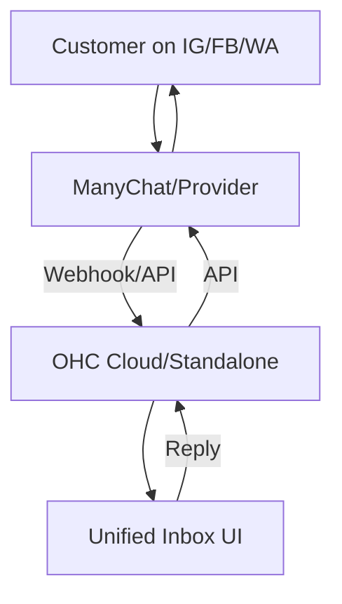

# Social Media Integration: ManyChat

## Problem Statement
Small business owners, like boutique shop owners or independent consultants, often receive inquiries across multiple platforms (Instagram DMs, Facebook Messenger, WhatsApp, TikTok). Checking these multiple inboxes is time-consuming and leads to missed sales or slow response times, reducing customer satisfaction. They need a single, unified inbox to view and reply to all messages.

### Persona-Specific Pain Point Summary
- **Boutique Owner (Fatima):** "I lose track of who asked for what size on Instagram vs. WhatsApp, leading to lost sales."
- **Consultant (Carlos):** "I check 4 apps a day just to make sure I haven't missed a lead."

## Research Report
**Tool:** ManyChat (and similar tools like Chatfuel)
**Ease of Use:** Highly rated for non-technical users, offering a drag-and-drop flow builder and clear inbox interfaces. (Source: G2 reviews, TrustRadius)
**Pricing:** Free tier available; Pro starts at $15/month depending on contacts.
**Reputation:** Well-established in the SMB space, particularly for Instagram and Facebook automation.
**Cloud/Standalone:** Fits well in a Cloud multi-tenant environment (OAuth integration). For Standalone, a direct API integration or webhook setup might require more configuration, but is feasible if the local app can receive webhooks or poll.

### Comparative Table
| Feature | ManyChat | Chatfuel | OHC Fit |
|---|---|---|---|
| Ease of Setup | High | Medium | Excellent |
| Free Tier | Generous | Limited | Good |
| Multi-Channel | FB, IG, WA, SMS | FB, IG | Essential |

## Design Doc
### Architecture

### UX Flow
1. User navigates to "Integrations" -> "Social Media".
2. Clicks "Connect Instagram/Facebook" (OAuth flow).
3. New messages appear in the OHC "Unified Inbox".
4. User replies directly from OHC, which sends the message back to the native platform.

## Implementation Prompt
Create a "Social Media Integrations" module in the Settings panel. The user should be able to click "Connect" for Instagram and Facebook, which triggers an OAuth flow. Once connected, messages from these platforms should be fetched and displayed in the primary OHC Inbox. Replies typed in OHC should be routed back to the correct customer on the original platform. Ensure the UI clearly shows the source icon (e.g., an Instagram logo) next to the message.

## Priority
P1

## Scope
Medium
