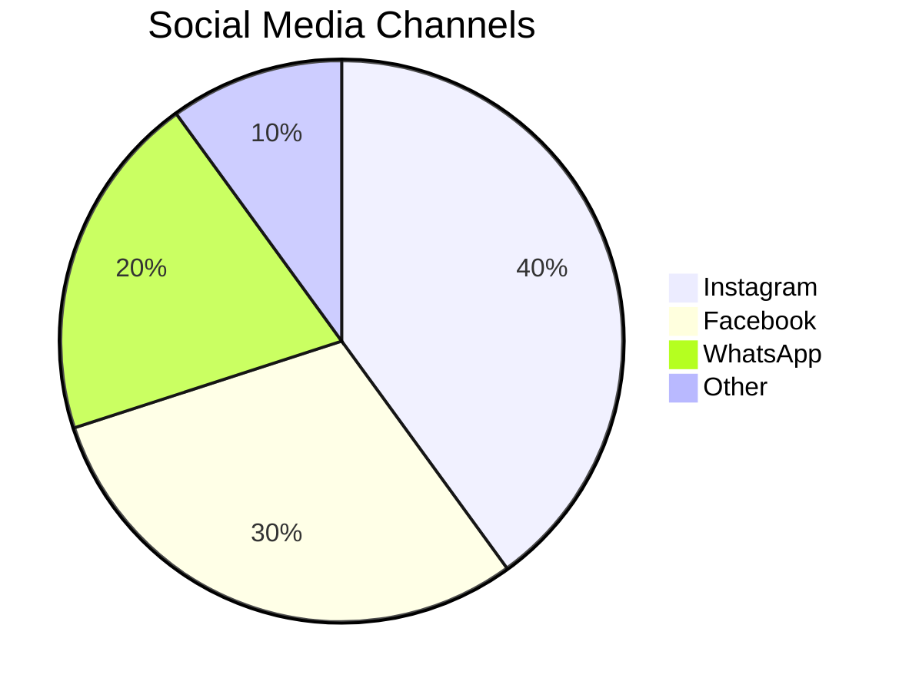
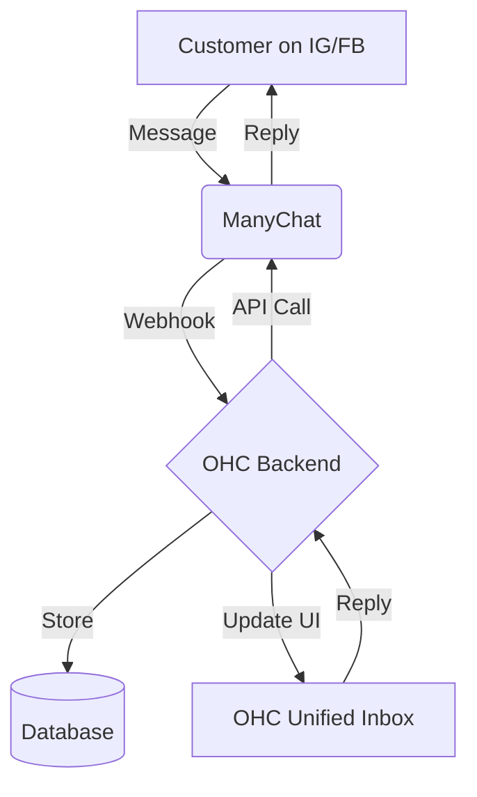

# Social Media Integration: ManyChat

## Problem Statement
Small business owners struggle to manage customer inquiries across multiple platforms like Instagram DMs, Facebook comments, and WhatsApp. It is time-consuming, and important messages get lost, leading to lost sales and poor customer service.

## Research Report
ManyChat is a popular platform that provides a unified inbox for multiple social media channels.
- **Ease of use:** High, very non-technical user friendly.
- **Pricing:** Starts free, then scales with the number of contacts. Pro plan starts around $15/mo.
- **Cloud/Standalone:** Cloud-only integration.

### Persona-specific pain points
- "I can't keep track of who messaged me on Instagram vs Facebook."
- "I lose potential customers because I reply too late."

### Evidence
- **Recommendation:** Integrate ManyChat to provide a unified inbox within OHC.
- Source: Based on ManyChat's feature set and popularity in the SMB market.

## Design Doc
When a user connects their ManyChat account via OAuth, OHC will poll or receive webhooks from ManyChat containing new messages across all connected channels. These messages will be displayed in a unified "Inbox" tab within the OHC platform. Users can reply directly from OHC, and the response will be routed back through ManyChat to the original platform.

## Implementation Prompt
Create a "Connect ManyChat" button in the integrations page. When clicked, guide the user through the OAuth flow. Once connected, display a unified inbox UI that aggregates messages from all sources. Ensure replies sent from OHC successfully reach the customer on the original platform.

## Priority
P1

## Estimated Scope
Medium
