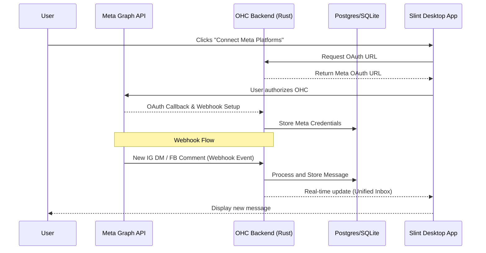

# Meta Business Suite Integration

## Problem Statement
Managing Instagram DMs, Facebook comments, and WhatsApp messages in separate apps is overwhelming for small business owners. They waste valuable time switching contexts, often missing important inquiries from potential customers.

## Research Report
The Meta Business Suite (via the Meta Graph API) is the official solution to unify messaging across Meta platforms.
* **Problem Addressed**: Unifies communication across the three dominant social platforms into one inbox.
* **User Benefit**: "A single unified inbox that routes all your social media messages directly into your OHC dashboard, allowing you or an AI agent to respond from one place without juggling apps."
* **Ease of Use (for non-technical users)**: Connecting the account will require a standard OAuth flow. Once connected, it operates seamlessly within the OHC platform.
* **Risks & Trade-offs**: The Meta API has a complex OAuth approval process, requires strict adherence to their webhook requirements (e.g., verifying tokens, responding quickly), and imposes API rate limits.
* **Pricing Estimate**: Basic API usage is generally free, but the WhatsApp Business API utilizes a per-conversation pricing model.
* **Compatibility**: Cloud & Standalone. However, standalone requires a publicly accessible webhook endpoint (e.g., using Ngrok or an OHC webhook relay service) to receive incoming messages from Meta.

## Design Doc
Integrating Meta Business Suite requires connecting the Meta Graph API to the OHC core backend and reflecting those messages in the Slint UI.

## Implementation Prompt
**Outcome**: Implement the Meta Business Suite integration so that users can connect their Meta accounts and manage Facebook, Instagram, and WhatsApp messages from a unified inbox within the OHC dashboard.
**Acceptance Criteria**:
1. Users must be able to authenticate with Meta via a standard OAuth flow from the OHC Integrations UI.
2. The system must reliably receive and parse incoming webhooks for new messages across the three platforms.
3. The OHC Unified Inbox UI must display these messages and allow the user to reply, routing the response back through the Meta API.
4. The integration must gracefully handle API rate limits and token expirations.
5. Provide a robust solution for webhook routing in Standalone mode.

## Priority
P0 (Critical)

## Estimated Scope
Large
