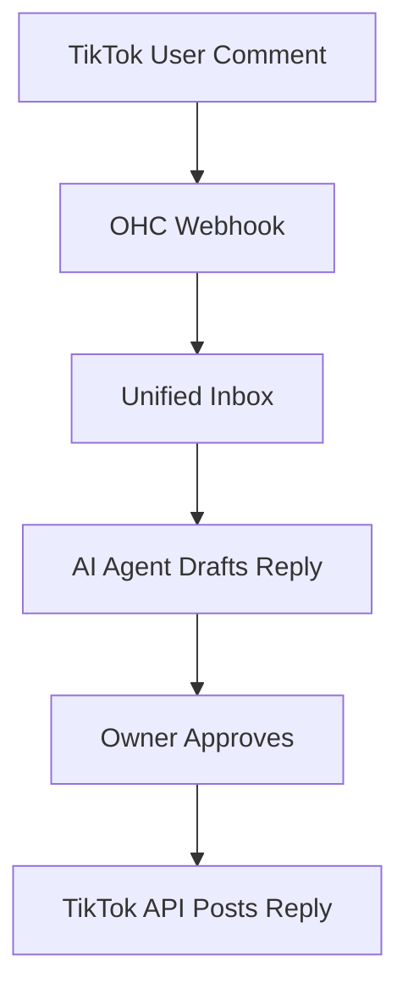

## [Social Media] Issue Brief: TikTok Comments Integration

**Title**: Scout 🔍: Integrate TikTok Comments for Unified Inbox
**Problem Statement**:
Small business owners are going viral on TikTok but missing sales because they cannot keep up with comments. They need a way to manage these comments from the same unified inbox they use for everything else.
**Research Report**:
- **Tool**: TikTok for Business API.
- **Evaluation**: TikTok is a massive driver of organic growth for small businesses. Integrating it helps capture high-intent leads.
- **Ease of Use**: Users connect their TikTok Business account via OAuth.
- **Pricing**: Free API usage.
- **Cloud vs. Standalone**: Works in both Cloud and Standalone.
**Design Doc**:
- User goes to "Operations" -> "Social Media".
- Clicks "Connect TikTok" and authorizes the app.
- Incoming comments are routed to the OHC Unified Inbox.
- The user (or AI agent) can reply.

**Implementation Prompt**:
Implement the TikTok API integration to fetch and reply to video comments. Add TikTok to the Social Media integrations page with an OAuth flow. Update the Unified Inbox to support comments.
**Priority**: P1
**Estimated Scope**: Medium
