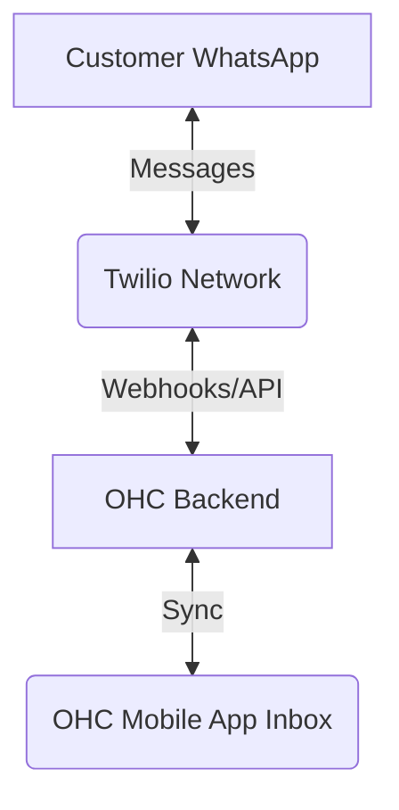

# [Social Media] Twilio WhatsApp Integration

## Problem Statement
Many small business owners, especially those outside the US or those with a global clientele, rely heavily on WhatsApp for customer communication. Managing these conversations on a personal phone is disorganized, leads to missed messages, and makes it impossible to track order history or customer context. Business owners need a unified inbox that brings WhatsApp messages directly into their OHC workflow, allowing them to respond professionally without juggling devices.

## Research Report
### Market Evaluation
- **Twilio**: The industry standard for communication APIs. It provides robust access to the WhatsApp Business API.
- **MessageBird**: A strong competitor, particularly in Europe, but Twilio's developer ecosystem and reliability are superior.
- **Native Meta API**: Direct integration is possible but often requires complex business verification and infrastructure management that Twilio simplifies.

### Findings
Twilio is the optimal choice for WhatsApp integration because:
1. **Global Reach**: Unparalleled reliability and delivery rates globally.
2. **Pricing**: Pay-per-conversation pricing (~1-3 cents depending on region) is scalable for small businesses. They only pay for what they use.
3. **Omnichannel Potential**: Integrating Twilio opens the door to SMS and Voice using the same fundamental architecture later on.

### Comparison Table
| Feature | Twilio | Meta Direct API | Importance for OHC Users |
| :--- | :--- | :--- | :--- |
| **Ease of Integration** | High | Low | High - Faster time to market |
| **Reliability** | Excellent | Variable | High - Lost messages = lost sales |
| **Pricing** | Scalable (Usage based) | Complex | High - Predictable costs |
| **Developer Ecosystem** | Massive | Moderate | Medium - Easier maintenance |

## Design Doc

### Mobile UX Flow
1. **Trigger**: User navigates to "Settings" > "Inbox Channels".
2. **Action**: User selects "Connect WhatsApp".
3. **View**: User is guided through a simple wizard explaining the Twilio connection process (providing Account SID, Auth Token, and WhatsApp Sender Number).
4. **Result**: A success screen confirming the number is active.
5. **Daily Use**: New incoming WhatsApp messages appear in the primary OHC Inbox, badged with a WhatsApp icon. The user can reply directly from OHC, and the message is routed back through Twilio to the customer.

### Architecture (High-Level)

### Integration Points
- **Settings**: Channel connection wizard.
- **Unified Inbox**: Aggregation of WhatsApp messages alongside standard DMs.
- **Contact Profiles**: Linking a WhatsApp number to an existing CRM contact automatically based on phone number matching.

## Implementation Prompt
**Outcome**: A seamless connection between a user's Twilio WhatsApp number and their OHC unified inbox. Business owners can read and reply to WhatsApp messages directly from the OHC app without opening the WhatsApp app on their phone.
**Acceptance Criteria**:
- "Connect WhatsApp" option available in Settings.
- Secure storage of Twilio credentials.
- Webhook listener implemented to receive incoming messages in real-time.
- Outbound message API call implemented to send replies.
- Messages are visually distinct in the unified inbox (e.g., WhatsApp icon).
- The chat interface must feel native and fluid on mobile (375px width), utilizing Glassmorphism and clean spacing.

## Priority
`P0` (Critical) - Communication is the lifeblood of small businesses; unifying it is a massive value-add.

## Estimated Scope
Large
