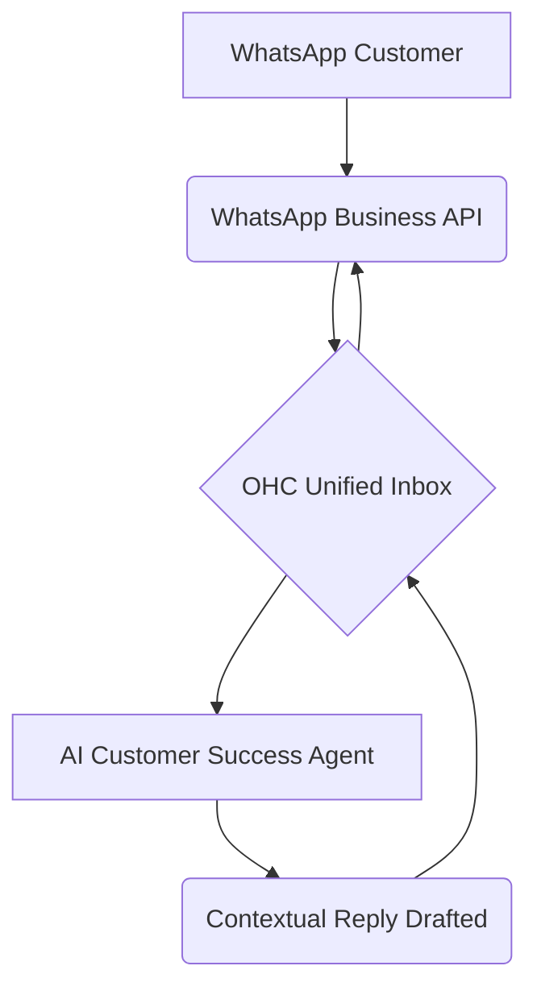

## [Social Media] Issue Brief: WhatsApp Business Integration

**Title**: Scout 🔍: Integrate WhatsApp Business for Automated Unified Inbox
**Problem Statement**:
Small business owners like Fatima (Local Grocer) rely heavily on WhatsApp for receiving orders, customer inquiries, and managing daily operations. Managing these messages manually across multiple numbers or devices leads to missed orders and slow responses. They need an automated system to consolidate WhatsApp messages into a unified inbox, allowing the AI to handle routine questions automatically without technical configuration.
**Research Report**:
- **Tool**: WhatsApp Business API (Cloud API).
- **Evaluation**: The WhatsApp Business API provides programmatic access to send and receive messages. By integrating it, OHC's "Customer Success" AI agent can monitor incoming inquiries and generate contextual replies (e.g., store hours, order status).
- **Ease of Use**: Easy for the user to connect via Facebook Developer portal or embedded signup flow.
- **Pricing**: Conversation-based pricing (first 1,000 user-initiated conversations free per month, then tiered).
- **Cloud vs. Standalone**: Ideal for Cloud mode. In Standalone mode, requires user to register a developer app, creating friction.
**Design Doc**:

- A user goes to the "Integrations" page and links their WhatsApp Business number.
- OHC registers the webhook to receive messages.
- Incoming messages show up in the OHC unified inbox.
- The AI agent processes inquiries and drafts responses.
**Implementation Prompt**:
Develop a seamless WhatsApp Business API integration. Implement an embedded signup/connection flow for users to link their WhatsApp Business numbers. Set up robust webhook endpoints to ingest messages into the OHC unified inbox. Ensure the AI agent can read these messages and formulate replies based on business context. Add a configuration toggle for users to review AI replies before sending or allow auto-reply.
**Priority**: P0
**Estimated Scope**: Large
