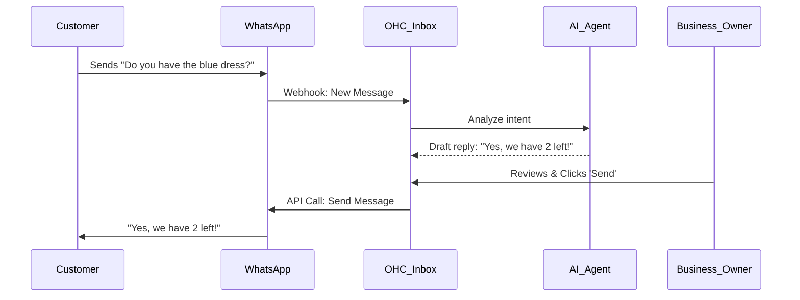

# Native Unified Inbox with WhatsApp Business

## Problem Statement
Fatima (Food Cart Operator) and Priya (Boutique Owner) frequently miss orders because they are juggling DMs across WhatsApp, Instagram, and SMS. They need a single, unified inbox within OHC to manage all customer communications without constantly switching apps. For many emerging market users, WhatsApp is the primary business channel.

## Research Report
- **Strategy**: Integrate the WhatsApp Business API natively into the OHC Communications tab.
- **Target Persona**: Small business owners in regions where WhatsApp is dominant (LATAM, India, Africa) or those who rely heavily on text-based ordering.
- **Advantages**: Consolidates communication, prevents missed orders, and enables AI agents to draft replies or process orders directly from the chat.
- **Risks**: Meta's business verification is notoriously difficult for informal businesses. Strict 24-hour customer service window rules and template approval requirements for business-initiated messages.
- **Pricing**: Pay-per-conversation. Platform needs a way to pass costs or offer a quota system.
- **Compatibility**:
  - Cloud: Centralized Webhooks and API management.
  - Standalone: User provides their own API token.

## Design Doc
- **User Experience Flow**:
  1. User navigates to the "Communications" tab in OHC.
  2. Clicks "Connect WhatsApp Business" and goes through the Meta embedded signup flow.
  3. Once connected, all incoming WhatsApp messages appear in the OHC unified inbox.
  4. User can reply directly from OHC, and the message is sent back via WhatsApp.
- **AI Integration**: The "Customer Success Agent" can read incoming messages, suggest replies (e.g., "Yes, we are open until 8 PM"), or extract order details to draft an invoice automatically.

### Mobile UX Flow
| Screen | Description |
|---|---|
| Connect | "Connect your WhatsApp Business number to reply to customers directly from OHC." -> [Connect Button] |
| Inbox List | Unified list of messages, showing WhatsApp icon next to the sender name. Unread badges. |
| Chat View | Standard chat interface. AI suggested replies appear above the keyboard as chips. |

## Implementation Prompt
Implement a unified inbox experience that allows merchants to connect their WhatsApp Business account and reply to customers directly from within the OHC platform. Ensure the UI clearly indicates the source of the message. The AI agent should be able to analyze incoming text and suggest contextual replies.

- **Acceptance Criteria**: Merchant can connect WhatsApp Business. Incoming messages appear in the OHC inbox. Merchant can reply from OHC. AI suggests relevant replies.
- **Priority**: P1
- **Estimated Scope**: Large
