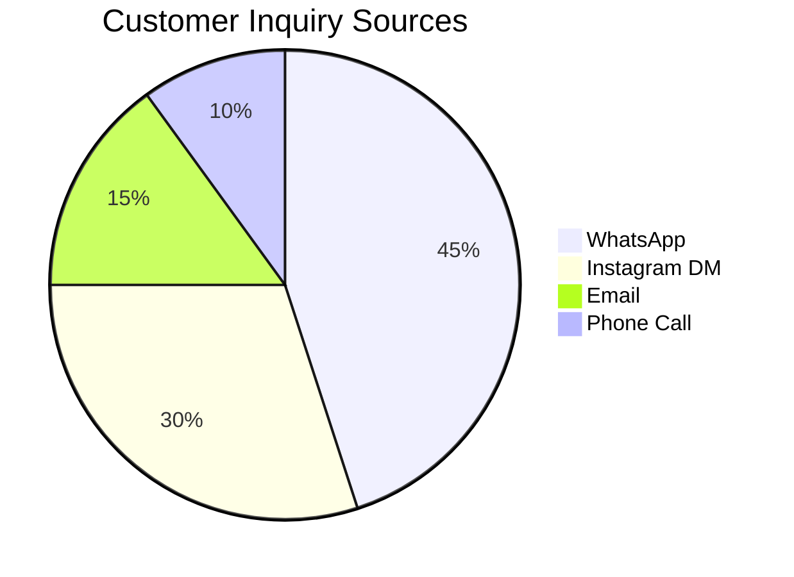

# [Social Media] WhatsApp Business API via Twilio
## Problem Statement
Small business owners (like bakers or consultants) receive customer inquiries across multiple platforms including WhatsApp, but struggle to keep track of them in a unified way. They need a single inbox to view and respond to messages, otherwise they risk losing sales and looking unprofessional.

## Research Report
- **Tool Evaluated**: Twilio Programmable Messaging (WhatsApp Integration)
- **Ease of Use**: Once integrated, it allows a seamless "unified inbox" feel for the business owner.
- **Pricing**: $0.005 per message + WhatsApp conversation fees. Very affordable for small scale.
- **Reputation**: Industry standard, highly reliable webhook system.
- **Cloud & Standalone**: Can be integrated into Cloud (via webhooks to central DB) and Standalone (using a polling or websocket relay mechanism).

### Pain Points Solved
- Reduces time switching apps.
- Prevents lost customer conversations.

| Feature | Twilio | Native WhatsApp API |
| :--- | :--- | :--- |
| Ease of Setup | High | Low |
| Omni-channel | Yes (SMS, WhatsApp, FB) | No |
| Price | Slight markup | Direct |

## Design Doc
- **Integration**: OHC connects to Twilio via OAuth/API keys.
- **Triggers**: Incoming webhook from Twilio triggers a new message in the OHC unified inbox UI.
- **User Flow**: Business owner sees a "WhatsApp" icon next to the message and can reply directly from the OHC dashboard.

## Implementation Prompt
Create a feature that allows a small business owner to connect their WhatsApp Business number. They should be able to see incoming messages in a single inbox screen and reply directly. Ensure the setup requires minimal technical input from the user.

## Priority
P1

## Estimated Scope
Medium
