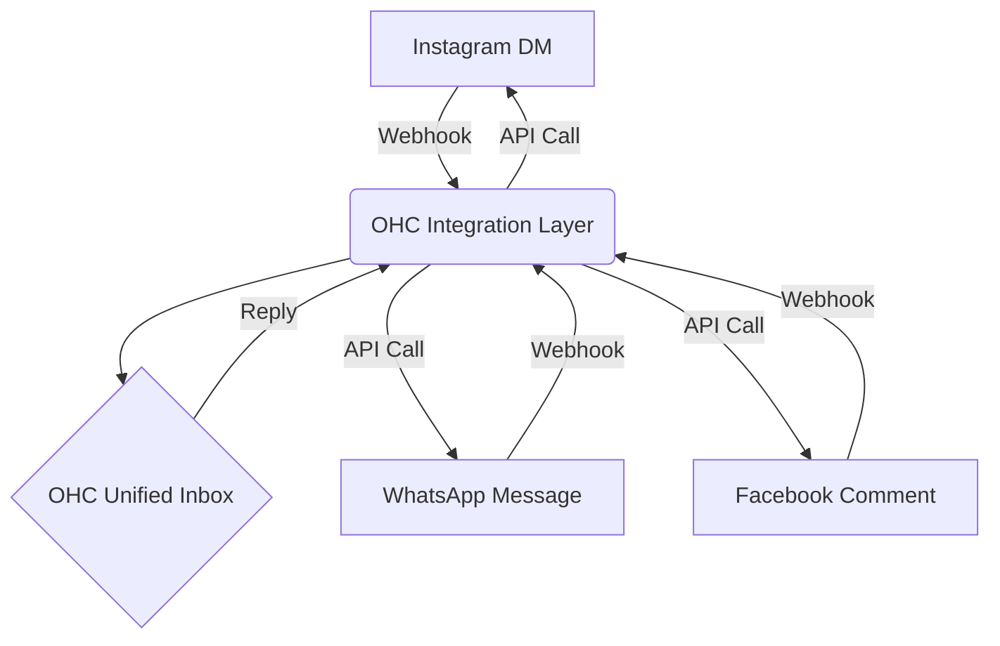

# Social Omnichannel Inbox Integration

## Title
Unified Social Media Inbox for Small Businesses

## Problem Statement
Small business owners struggle to manage customer inquiries across multiple platforms (Instagram DMs, Facebook comments, WhatsApp, TikTok). Checking multiple apps is time-consuming, leads to missed messages, and creates a fragmented customer experience. Non-technical owners need a single, easy-to-use inbox to view and respond to all social interactions without constantly switching contexts.

## Research Report
I evaluated tools like Front to address the omnichannel inbox need.

**Tool:** Front (front.com)
**Evaluation:**
- **Ease of Use:** Front provides a collaborative, email-like interface that is intuitive for non-technical users. It acts as a single pane of glass for all communications.
- **Features:** It supports true omnichannel capabilities (email, SMS, social media, WhatsApp) and shared inboxes. Features like "Autopilot" (AI agent) and "Copilot" (AI assistant) are available for higher tiers, but basic routing and shared inboxes are available at the Starter level.
- **Pricing:** Starter plan is $25/seat/month (up to 10 seats). Professional is $65/seat/month. While powerful, the per-seat pricing might become expensive for very small businesses as they grow, but the base tier is accessible.
- **Cloud/Standalone:** Front is a SaaS (Cloud) product. A Standalone implementation would require either building a custom lightweight unified inbox leveraging standard APIs (Meta Graph API, WhatsApp Business API) or finding a self-hostable alternative.

**Alternative Considerations:** ManyChat is popular for Instagram/WhatsApp automation but leans heavily into complex chatbot builders rather than a simple unified inbox for human operators.

## Design Doc
**Integration Overview:**
The integration will connect the business owner's social media accounts to OHC.
- **Triggers:** New messages on connected platforms (e.g., Instagram DM, WhatsApp message) trigger webhooks.
- **Actions:** The webhook payload is parsed and routed to a unified "Messages" view within the OHC platform. When the owner replies from OHC, the message is sent back via the respective platform's API.
- **User View:** A simple, consolidated inbox interface showing the platform icon next to the message, allowing seamless replies without leaving OHC.

**Mobile UX Flow (375px viewport):**
1. User taps "Messages" icon in bottom nav.
2. List view displays threads sorted by recency. Badges indicate the source (e.g., WhatsApp icon).
3. User taps a thread. Chat view opens.
4. Input field at bottom. User types and hits "Send".
5. Message appears in thread as sent via the original channel.

## Implementation Prompt
Implement a unified messaging view that aggregates incoming messages from at least two major social channels (e.g., Instagram and WhatsApp). Ensure the business owner can reply directly from this unified view, and the reply is successfully delivered to the customer on their original platform. The UI must prioritize mobile responsiveness and clearly indicate the source platform for each message.

## Priority
P1 (High)

## Estimated Scope
Medium
