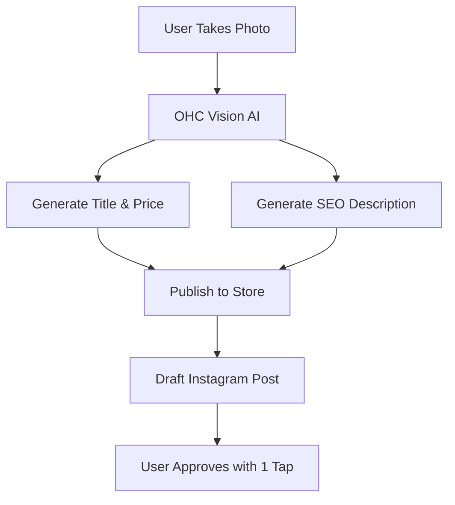

# [strategy] OHC AI Differentiation Manifesto

## Core Philosophy
AI should be an **invisible operational partner**, not just a chat interface. Unlike Shopify Sidekick (which requires prompting) or Wix ADI (which is a one-time setup tool), OHC's AI agents work autonomously in the background to run the business.

## The 5 AI Automations OHC Will Implement First

### 1. Unified Inbox with AI Auto-Replies (The Time Saver)
- **The Problem**: 58% of Instagram sellers lose orders because they miss DMs or take too long to reply.
- **The Solution**: An invisible AI agent that reads incoming DMs/SMS/emails, identifies common questions (e.g., "What are your hours?", "Do you have this in stock?"), and drafts or auto-sends replies.
- **Evidence**: Real users complain about spending 2 hours a day just answering basic questions. Automating this provides immediate, measurable ROI in time saved.

### 2. Auto-Generated Product Descriptions from Images (The Launch Accelerator)
- **The Problem**: 49% of new store owners cite writing copy as the main reason their store launch is delayed.
- **The Solution**: User takes a photo on their phone. OHC Vision AI extracts features, identifies the product, and writes a high-converting, SEO-optimized description instantly.
- **Evidence**: YouTube tutorials on "How to use ChatGPT for Shopify descriptions" have millions of views. We integrate this natively.

### 3. Autonomous AI Social Media Post Generation (The Growth Engine)
- **The Problem**: 45% of SMBs suffer from marketing paralysis.
- **The Solution**: OHC AI proactively suggests: "It's Tuesday. Should I post a photo of your new cupcakes on Instagram with this caption?" User clicks "Approve."
- **Evidence**: Wix and Squarespace users frequently abandon their sites because they get zero traffic. Content generation solves the top-of-funnel problem.

### 4. Invisible Abandoned Cart & Follow-up Sequences (The Revenue Rescuer)
- **The Problem**: 41% of e-commerce SMBs don't know how to set up email marketing.
- **The Solution**: OHC automatically sends a polite, AI-personalized follow-up text or email when a customer abandons a cart, without the user configuring a flowchart.
- **Evidence**: Klaviyo is too complex for beginners. Providing default, smart sequences recovers 10-15% of lost revenue effortlessly.

### 5. Plain Language Daily Business Briefing (The Confidence Builder)
- **The Problem**: Google Analytics and complex dashboards intimidate non-technical owners.
- **The Solution**: A daily push notification: "Good morning Maya! You made $300 yesterday. 5 people left items in their cart, and I emailed them. You have 2 cakes to bake today."
- **Evidence**: Owners want to feel in control without needing a degree in data analysis.

## Competitive Comparison: AI Integration

| Feature | Shopify Sidekick | Wix | GoDaddy Airo | OHC |
|---------|------------------|-----|--------------|-----|
| AI Website Generation | No | Yes (ADI) | Yes | Yes (10 seconds) |
| Autonomous Auto-Replies | No | No | No | **Yes (Continuous)** |
| Proactive Social Media | No | No | No | **Yes (1-Tap Approve)** |
| Daily Narrative Briefing | No | No | No | **Yes (Plain Language)** |

