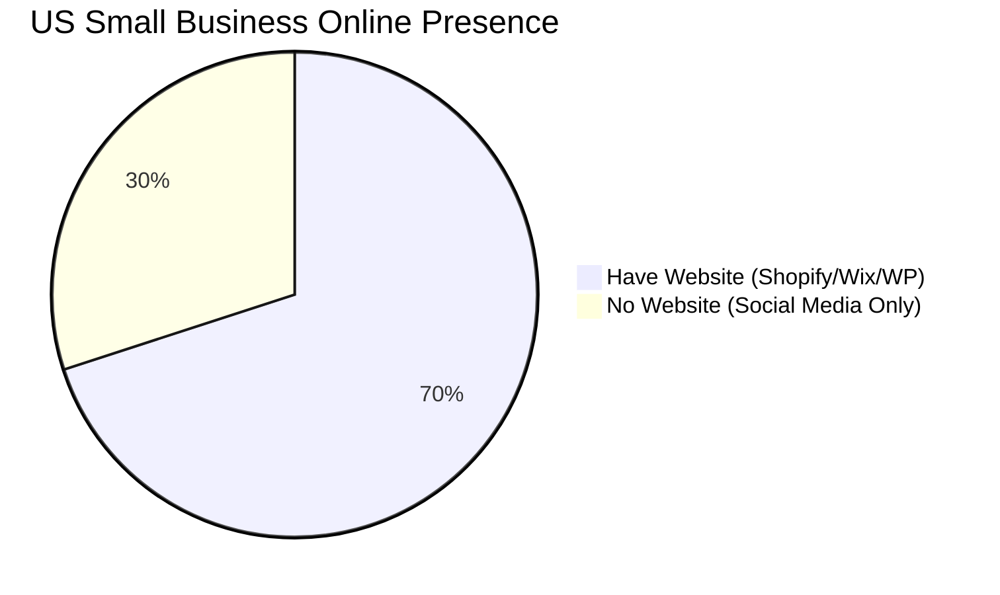

# [strategy] Market Sizing & Strategic Direction

## Total Addressable Market (TAM)
- **United States**: There are approximately 33.2 million small businesses in the US. Of these, over 27 million are non-employer businesses (solo entrepreneurs). (Source: US SBA).
- **Global**: The World Bank estimates over 400 million SMEs globally.
- **Unserved Segment**: It is estimated that 28-30% of US small businesses still do not have a functional website, relying entirely on social media (Facebook/Instagram) or word-of-mouth. Globally, this number exceeds 50%.

## Beachhead Market Strategy
**Target Persona First**: **Maya (The Social Seller / Solo Creator)**
- **Why?**: High density on platforms like Instagram and TikTok. High dissatisfaction with Shopify's complexity. They already have an audience but lack operational tools. Highest willingness to adopt mobile-first, AI-driven tools to save time.
- **LTV Potential**: High, if we capture them early and scale as they grow.

## Geographic Expansion
1. **Tier 1 (Launch)**: United States, Canada, UK, Australia (English speaking, high GDP per capita, established payment infrastructure like Stripe).
2. **Tier 2 (Fast Follow - 12 Months)**:
   - **LATAM (Spanish)**: Massive explosion of solo-entrepreneurs in Mexico, Brazil (Portuguese), and Colombia. High mobile penetration. Requires integration with Mercado Pago and PIX.
   - **India (Hindi/English)**: Huge TAM. Requires UPI payment integration. Highly price-sensitive, needs a robust freemium model.
3. **Localization Requirements**: Multi-lingual UI, local payment gateways, and localized AI models that understand cultural nuances in customer communication.

## Vertical Expansion
- **Initial Phase**: Horizontal (Serve all simple business types).
- **Secondary Phase**: Vertical depth for **Service/Appointments** (Carlos the Handyman, Leo the Tutor). Adding robust calendar, deposit payments, and automated SMS reminders.
- **Tertiary Phase**: Vertical depth for **Food/Local Pickup** (Fatima the Food Cart). Adding tipping, order status tracking, and thermal printer integration.

## Marketplace Opportunity
- **The Vision**: Once OHC powers 100,000 stores, launch "The OHC Market" — a centralized consumer app where buyers can shop across all OHC merchants.
- **Benefit**: Solves the #1 problem for SMBs (Traffic/Customer Acquisition). Transforms OHC from a SaaS tool into a growth engine (like Etsy, but the merchant owns their brand).

