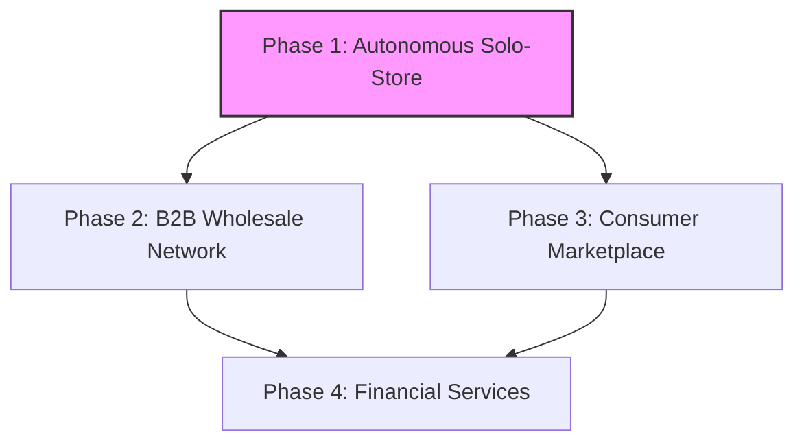

# [strategy]_ohc_ecosystem_expansion_playbook.md

## Introduction
While the initial go-to-market strategy focuses on providing a standalone platform for individual SMBs, the true long-term value of OneHumanCorp lies in building an interconnected ecosystem. This document outlines the 3-year expansion playbook.

## Phase 1: The Autonomous Solo-Store (Year 1)
- **Goal**: Perfect the single-player experience. Provide the fastest, easiest way for an individual to launch a business online using AI.
- **Key Metrics**: Time to Live Store (< 10 mins), Monthly Active Users (MAU), Gross Merchandise Volume (GMV).
- **Core Features**: 1-Tap Setup, AI Auto-Replies, Automated Social Media Posting.

## Phase 2: The B2B Network Effect (Year 2)
- **Goal**: Connect OHC merchants with each other to solve supply chain and wholesale problems.
- **The Concept**: "OHC Wholesale." Priya (the boutique owner) wants to sell Maya's (the baker) cookies in her store. Currently, this requires manual invoicing. In the OHC network, Priya can browse an internal directory of other OHC merchants, click "Stock This," and the inventory and payments are automatically synced between their two OHC dashboards.
- **Key Metrics**: Network Density (percentage of merchants buying/selling from each other).

## Phase 3: The Consumer Marketplace (Year 3)
- **Goal**: Launch a consumer-facing app ("Shop OHC") that aggregates all products from all OHC merchants into a single, localized shopping experience.
- **The Concept**: Solves the biggest problem for SMBs: Traffic. Consumers open the OHC app to discover local businesses, order food from Fatima's cart, book Carlos to fix a pipe, and buy a dress from Priya, all with a single unified checkout.
- **Key Metrics**: Consumer App Downloads, Multi-Merchant Checkout Rate.

## Phase 4: Financial Services (Year 4)
- **Goal**: Leverage the massive amount of transactional data to offer financial products tailored to SMBs.
- **The Concept**: "OHC Capital." Because OHC sees all revenue, inventory turnover, and customer satisfaction metrics, it can offer highly accurate, low-risk micro-loans to merchants for inventory expansion without requiring traditional credit checks.
- **Key Metrics**: Loan Origination Volume, Default Rate.

