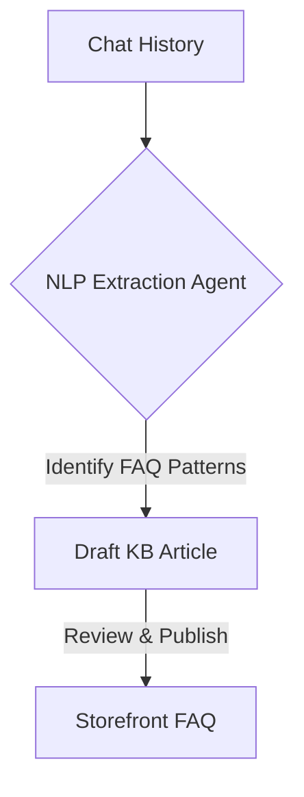

**Title**: Autonomous Knowledge Base Builder
**Problem Statement**: Creating a comprehensive FAQ or knowledge base requires significant time and effort.
**Research Report**: Customers prefer self-service options, but SMBs struggle to compile answers to frequent questions systematically.
**Design Doc**:
*   Architecture: Chat History -> NLP Extraction Agent -> Draft Knowledge Base Article.

**Implementation Prompt**: Create a background job that analyzes customer support chat histories to identify frequently asked questions, automatically draft responses, and suggest them as new entries for the business's public knowledge base.
**Priority**: P3
**Estimated Scope**: Medium
