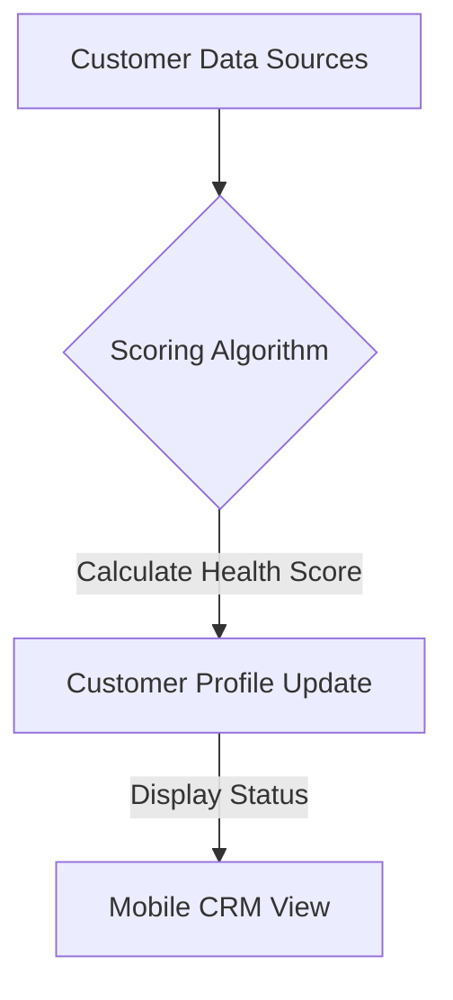

**Title**: Customer Health Scoring System
**Problem Statement**: Recognizing which customers are loyal and which are at risk of churning is difficult without complex analytics tools.
**Research Report**: Proactive retention strategies require an understanding of customer health, which is a composite metric of engagement, purchase history, and support interactions.
**Design Doc**:
*   Architecture: Data Aggregator -> Scoring Algorithm -> Customer Profile.

**Implementation Prompt**: Develop a comprehensive scoring algorithm that calculates a 'Customer Health Score' based on purchase frequency, support ticket sentiment, and engagement metrics, surfacing this score prominently in the CRM view.
**Priority**: P2
**Estimated Scope**: Medium
