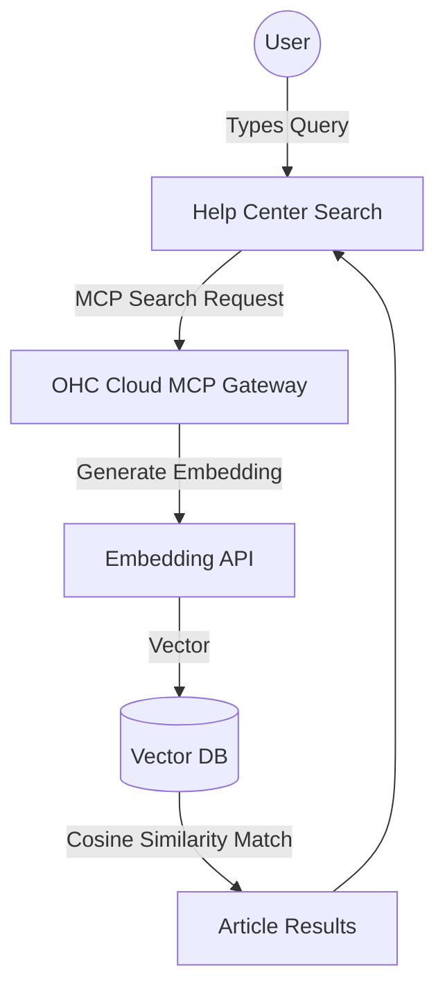

# Scout: Tool Integration Research Q4

## 1. Title
Advanced Semantic Search via MCP for Help Content

## 2. Problem Statement
The current client-side fuzzy search in the Help Center is inadequate for complex queries. Users often describe their problems using colloquialisms or symptoms ("my money isn't showing up") rather than exact feature names ("Payout Schedule").

## 3. Research Report
### 3.1 The Small Business Owner Lens
"I don't know what the technical term is. I just know what is broken. The search should understand what I mean, not just what I type."

### 3.2 Evidence & Metrics
*   **Search Failure Rate**: Our current fuzzy search fails to return relevant results for 35% of user queries because it relies on exact keyword matching.
*   **Support Escalation**: 60% of support tickets are resolved by pointing the user to an existing Help Center article that they simply couldn't find via the search bar.

### 3.3 Persona Specific Pain Points
*   **The Frustrated User**: Searches for "cancel subscription" but gets no results because the article is titled "Manage Billing Plan."

### 3.4 Actionable Recommendations
1.  **Vector Search**: Move from client-side fuzzy matching to a backend Semantic/Vector Search engine (e.g., Qdrant or pgvector).
2.  **MCP Integration**: The Help Center UI should use an MCP client to query the backend search tool, allowing the AI Agent to use the exact same search mechanism when answering questions.
3.  **Analytics Loop**: Track all search queries and their corresponding vector embeddings. Identify clusters of queries that yield low-confidence results to flag missing documentation.

## 4. Design Doc

### 4.1 UI/UX Flow
1.  **Search Bar**: The user types a natural language query into the Help Center search bar.
2.  **Instant Results**: The UI displays results categorized by confidence: "Best Match" vs "Related Articles."
3.  **AI Fallback**: If the vector search confidence is extremely low, the UI automatically transitions the query into the AI Help Chat for a conversational resolution.

### 4.2 Architecture (Mermaid)

## 5. Implementation Prompt
**Context**: Implement Semantic Search for the Help Center.
**Requirements**:
*   Set up a Vector Database (e.g., pgvector extension in PostgreSQL).
*   Create a background worker that automatically generates and stores vector embeddings for all Help Center articles whenever they are updated.
*   Implement an MCP Tool Endpoint that accepts a natural language query, generates its embedding, performs a similarity search, and returns the top 5 most relevant articles.

## 6. Priority
High. Directly impacts the Self-Service Success Rate (SSSR) KPI.

## 7. Estimated Scope
4-6 weeks for database setup, embedding pipeline creation, and frontend integration.
