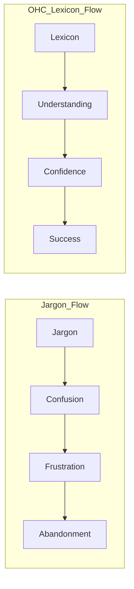

# The "No-Jargon" Lexicon: A Product Language Guide

## 1. Introduction: Language as an Inclusion Tool
One of the primary reasons SMB founders abandon platforms like Shopify is "Language Alienation." When a baker is asked for a "SKU" or a "Slug," they feel like they are in the wrong room. This document defines the OHC Lexicon—a radical shift in product terminology to ensure total inclusion.

---

## 2. Core Lexicon Shifts

### 2.1 The "Technical" to "Human" Mapping

| Legacy Term | OHC Term | Why? |
| :--- | :--- | :--- |
| **SKU (Stock Keeping Unit)** | **Item Code** | "SKU" is inventory jargon. "Item Code" is intuitive. |
| **Slug (URL)** | **Web Address Link** | "Slug" sounds like a bug. "Link" is what people use. |
| **Fulfillment** | **Getting the Order Ready** | "Fulfillment" is a corporate logisitics term. |
| **Conversion Rate** | **% of People Who Buy** | Focus on the action, not the mathematical concept. |
| **DNS / CNAME** | **Website Name Connection** | "DNS" is a technical protocol. |
| **API / Webhook** | **Automatic Connection** | "API" is developer-speak. |
| **Variant** | **Option (Size, Color, etc.)** | "Option" is the natural way humans shop. |
| **Lead** | **Potential Customer / Interest** | "Lead" treats people like sales objects. |
| **Dunning** | **Empathetic Payment Nudge** | "Dunning" is an archaic billing term. |
| **Bounce Rate** | **% of People Who Leave Quickly** | "Bounce" is abstract. "Leave" is clear. |

---

## 3. The Agent Naming Strategy
We avoid "AI Bot" or "Assistant." We use professional, human roles.

- **The Manager** (Not: "Inventory Automator")
- **The Promoter** (Not: "Social Media AI")
- **The Ambassador** (Not: "Chat Agent")
- **The Accountant** (Not: "Billing Service")
- **The Protector** (Not: "Legal Compliance Tool")
- **The Advisor** (Not: "Analytics Engine")

---

## 4. UI Copy Guidelines

### 4.1 "Talk to Me Like a Person"
- **Avoid**: "Your transaction has been processed successfully."
- **Use**: "Payment received! I've updated your sales report."

- **Avoid**: "Error: Invalid input in field 'price_cents'."
- **Use**: "Oops! The price doesn't look quite right. Try something like '$25.00'."

- **Avoid**: "Select a template to begin your storefront customization."
- **Use**: "Pick a look that feels like your brand."

---

## 5. Visual Terminology (Iconography)
Terms are often reinforced by icons. We prioritize **Real-World Metaphors**.
- **Inventory** -> 📦 (Box)
- **Settings** -> ⚙️ (Gear - universally understood, but consider 🛠️ for tradespeople)
- **Marketing** -> 📢 (Megaphone)
- **Help** -> 💡 (Idea/Lightbulb - proactive help)

---

## 6. Strategic Implementation: The "Jargon Filter"
Every new feature mission must pass a "Jargon Review." If a developer or researcher uses a term not found in the OHC Lexicon (or one that doesn't align with these principles), it must be flagged for translation.

---

## 7. The Emotional Impact of Language

