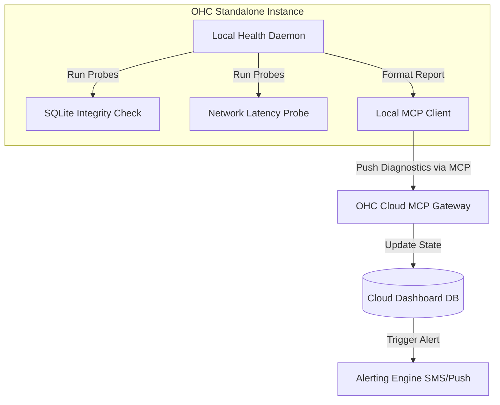

# Scout: Tool Integration Research Q4

## 1. Title
Proactive Health Diagnostics via MCP

## 2. Problem Statement
When a standalone OHC instance experiences issues (e.g., database corruption, network latency, misconfigured plugins), the user is often unaware until a critical failure occurs. Support agents then spend hours guiding the user through manual diagnostic steps. We need a system that proactively runs health checks and reports issues clearly.

## 3. Research Report
### 3.1 The Small Business Owner Lens
"My card reader stopped working during the lunch rush. I spent 45 minutes on the phone with support just to find out my internet router was blocking a specific port. The system should have warned me before I opened."

### 3.2 Evidence & Metrics
*   **Mean Time to Resolution (MTTR)**: Over 50% of MTTR for standalone clients is spent on initial triage and log gathering.
*   **Silent Failures**: Background task failures (like telemetry syncs or local backups) often go unnoticed for weeks, leading to massive data loss during hardware failures.

### 3.3 Persona Specific Pain Points
*   **The Multi-Location Manager**: Cannot be physically present at all stores every morning. Needs a centralized dashboard showing the "Health Score" of every store's local hardware and network before opening time.

### 3.4 Actionable Recommendations
1.  **Automated Health Probes**: The OHC Standalone binary must include built-in health probes that continuously check critical subsystems (Database integrity, MCP tunnel latency, local API availability).
2.  **Plain Language Triage**: Raw error logs (e.g., `EADDRINUSE`) must be translated into actionable, plain-language alerts (e.g., "Another program is using the port OHC needs. Please restart your computer.") via an on-device AI or predefined mapping.
3.  **MCP Reporting**: Health status is proactively pushed to the OHC Cloud via MCP, updating a central dashboard for both the user and OHC Support.

## 4. Design Doc

### 4.1 UI/UX Flow
1.  **The Traffic Light System**: The main dashboard features a clear Green/Yellow/Red indicator.
2.  **The Daily Preflight**: A "Preflight Check" runs automatically 30 minutes before the user's defined "Opening Time." If a check fails (e.g., local database is unreachable), the user receives an immediate push notification on their mobile device.

### 4.2 Architecture (Mermaid)

## 5. Implementation Prompt
**Context**: Implement the Local Health Daemon and MCP reporting logic.
**Requirements**:
*   Create a background thread in the Rust standalone binary that executes predefined health checks at configured intervals.
*   Format the results into a standardized JSON payload (including `subsystem`, `status`, and `plain_language_remediation`).
*   Implement an MCP tool endpoint on the Cloud Server (`report_diagnostics`) that accepts this payload and updates the user's health dashboard.

## 6. Priority
High. Crucial for reducing support costs and preventing catastrophic failures for enterprise/retail customers.

## 7. Estimated Scope
5-6 weeks for developing the local probe framework and the cloud reporting dashboard.
