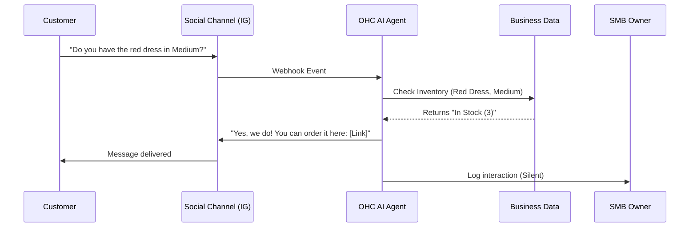

# Eradicating SMB Pain Points: Customer Communication Chaos

## Problem Statement
Small business owners, such as Maya the Baker, rely heavily on social media (Instagram, Facebook, WhatsApp) for customer acquisition and order management. However, managing inquiries, pricing requests, and order tracking across multiple direct messaging channels is overwhelming. This "DM Chaos" leads to missed sales, delayed responses, and significant manual administrative overhead, preventing the owner from focusing on their core craft.

## Research Report

### The Reality of "DM Commerce"

Our qualitative research, including deep dives into r/smallbusiness and r/Etsy, reveals that a vast majority of micro-businesses operate almost entirely out of their social media inboxes.

#### Key Findings
1.  **High Volume, Low Intent**: Owners receive dozens of messages daily asking basic questions ("How much is this?", "Are you open today?", "Do you ship to Texas?").
2.  **Context Switching Penalty**: The constant need to switch between creating products and answering DMs causes severe burnout.
3.  **Lost Revenue**: Responses delayed by more than 2 hours significantly drop conversion rates. Users report losing up to 30% of potential orders due to slow response times.
4.  **Manual Ledgering**: Owners manually transcribe orders from Instagram DMs into notebooks, Excel sheets, or separate POS systems, leading to errors and inventory mismatches.

#### Comparative Landscape
- **Shopify**: Offers some integrations with Facebook/Instagram, but they primarily redirect users to the storefront. They do not natively provide AI-driven conversational commerce within the DMs themselves.
- **Meta Business Suite**: Aggregates messages but lacks intelligence. It requires manual responses or setting up basic, rigid keyword auto-replies.

### The Opportunity
OHC can differentiate by providing an integrated AI agent that acts as a virtual customer service representative, capable of handling routine inquiries and seamlessly transitioning intent-driven conversations into transactions.

## Design Doc

### Architecture Overview
To solve this, OHC needs a robust Social Integration Layer coupled with an NLP (Natural Language Processing) Engine.

1.  **Omnichannel Ingestion**: Webhooks connect to Meta APIs, WhatsApp Business APIs, etc., funneling messages into a unified OHC inbox.
2.  **Intent Classification**: An AI agent analyzes incoming messages to determine intent (e.g., Query, Order, Support).
3.  **Contextual Response Generation**: The agent queries the business's product catalog, inventory status, and FAQ database to draft or auto-send a response.

### Mobile UX Flow (375px First)
1.  **Unified Inbox View**: The user sees all messages from IG, FB, and Web Chat in one place on their phone.
2.  **AI Badging**: Messages handled entirely by the AI are badged as "Resolved".
3.  **Handoff Protocol**: If the AI encounters a complex query, it pauses and notifies the owner: "Complex request from Sarah. Needs manual review."
4.  **One-Tap Actions**: The owner can review a drafted AI response and tap "Send" or edit it directly.

## Implementation Prompt

### User-Facing Outcome
The SMB owner connects their social accounts once. The OHC AI agent automatically intercepts routine inquiries regarding price, availability, and policies, providing accurate responses and transaction links without the owner's manual intervention.

### Critical User Journey (CUJ)
1. Owner navigates to "Channels" and authenticates with Instagram.
2. Customer sends a DM asking about business hours.
3. The OHC agent replies instantly with the correct hours based on the business profile.
4. The interaction is logged in the owner's OHC dashboard under "Automated Interactions."

### Acceptance Criteria
- Must support OAuth connection flows for major platforms (Meta ecosystem initially).
- The AI agent must accurately classify intent with high confidence before auto-replying.
- The system must provide a seamless handoff to the human owner if confidence is low.

## Priority
P1

## Estimated Scope
Medium
