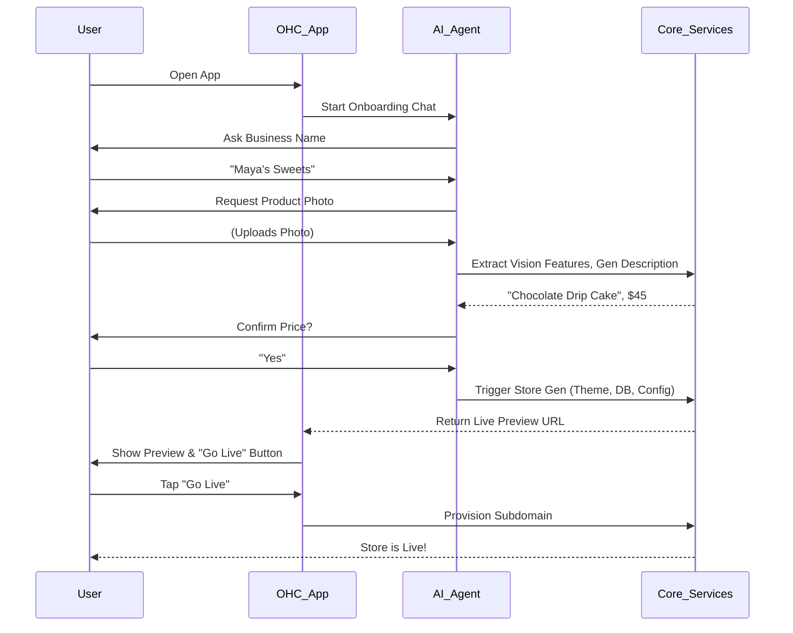

# [ux_flow]_zero_config_ai_store_setup.md

## Introduction
The current onboarding process for e-commerce platforms is highly manual and configuration-heavy. This document outlines the user experience (UX) flow for a "Zero-Config AI Store Setup," ensuring that a user can launch a fully functional store in under 5 minutes using only a mobile phone.

## The Goal
Reduce the "Time to Live Store" from days (Shopify) or hours (Wix) to under 10 minutes.

## The Flow (Mobile 375px First)

### Step 1: The AI Intake Conversation
- **Trigger**: User opens the OHC app for the first time.
- **UI Element**: A chat-like interface (similar to an SMS thread), but heavily assisted by Quick Replies (chips) to minimize typing.
- **Interaction**:
  - **AI**: "Hi! I'm your OHC agent. What's the name of your business?"
  - **User**: (Types "Maya's Sweets")
  - **AI**: "Great name! What kind of business is Maya's Sweets?"
  - **User**: (Selects from generated chips based on context: "Bakery", "Desserts", "Cafe", or types custom). Selects "Bakery".
  - **AI**: "Awesome. Take a quick photo of your best product."
  - **User**: (Takes photo of a cake).
  - **AI**: "Looks delicious! I think this is a 'Custom Chocolate Drip Cake'. Does $45 sound like a fair starting price?"
  - **User**: (Adjusts slider to $50).

### Step 2: Background Generation & Illusion of Work
- **Trigger**: The moment the user confirms the price.
- **UI Element**: A loading screen that explicitly states what the AI is doing, providing the "Illusion of Work" to build trust.
- **Interaction**:
  - "✨ Generating your store design..." (2s)
  - "✨ Writing product descriptions based on your photo..." (3s)
  - "✨ Configuring local tax settings for [User's City]..." (2s)
  - "✨ Setting up a default local shipping zone..." (1s)
  - "✨ Ready!"

### Step 3: The Big Reveal
- **Trigger**: Generation complete.
- **UI Element**: The app transitions to a live preview of the generated mobile storefront.
- **Interaction**: The user sees their cake, a professionally written description, a "Buy Now" button, and their business name beautifully styled.

### Step 4: The 1-Tap Launch
- **Trigger**: User reviews the preview.
- **UI Element**: A sticky button at the bottom: "Looks Good! Let's Go Live."
- **Interaction**:
  - User taps the button.
  - The system automatically provisions a subdomain (e.g., `mayas-sweets.ohc.store`).
  - The store is instantly live.
  - A modal appears: "Your store is live! Want me to connect your Instagram so I can auto-reply to DMs?" (Leads into the Auto-Reply feature).

## Why This Works
1. **No Blank Canvas**: The user never has to stare at a blank page or a grid of templates.
2. **Minimal Typing**: The use of the camera and smart quick replies reduces friction.
3. **Implicit Configuration**: Tax and shipping are configured silently based on location, rather than explicitly requested.

