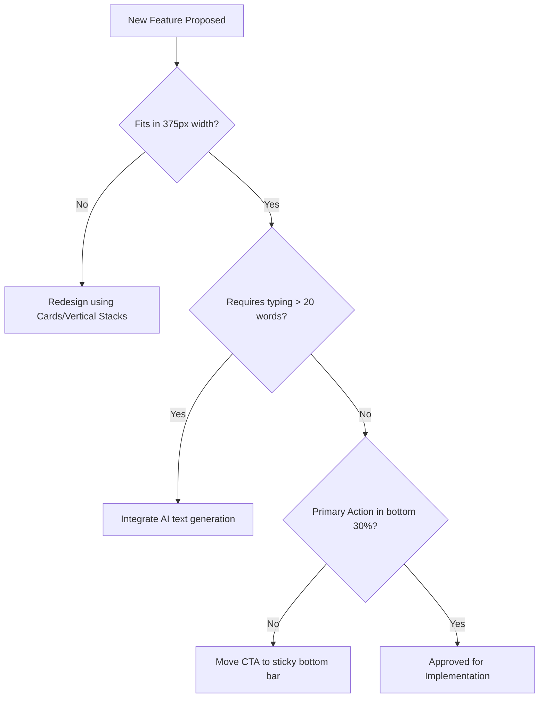

# [ux_research] The 375px Mandate: Mobile-First Constraints

## The Reality of the SMB User
Our research shows that the target personas (Maya, Carlos, Priya, Leo, Fatima) do not sit at a desk with a 27-inch monitor. They manage their businesses while standing in a kitchen, driving between jobs, or walking the floor of a retail shop.

If a feature cannot be executed comfortably on a 375px wide screen (the viewport of an iPhone SE / standard older Android device) using one hand, the feature is fundamentally broken for our audience.

## The 375px Mandate Core Principles

### 1. No Horizontal Scrolling, Ever
- **The Rule**: Data tables must be eliminated or radically transformed on mobile.
- **The Implementation**: Instead of a traditional table for "Orders" (Order ID, Date, Customer, Status, Total), use a Stacked Card pattern.
  - Top line: Customer Name (Bold) + Total ($)
  - Second line: Order Status Badge + Date
  - Tap card to expand full details.

### 2. Thumb-Zone Optimization
- **The Rule**: All primary actions must be in the bottom 30% of the screen.
- **The Implementation**:
  - Save buttons must be sticky at the bottom of the viewport.
  - Destructive actions (Delete) should be placed intentionally further away from the natural thumb arc to prevent accidental taps.
  - Navigation must use a bottom tab bar, not a hidden hamburger menu at the top left.

### 3. High Contrast & Legibility
- **The Rule**: Users will view this app in direct sunlight or poorly lit environments.
- **The Implementation**:
  - Minimum font size for body text: 16px (prevents iOS auto-zoom on inputs).
  - WCAG 2.1 AA compliant contrast ratios for all text.
  - Avoid light gray text on white backgrounds.

### 4. Input Minimization
- **The Rule**: Typing on a mobile keyboard is error-prone and slow. Reduce text inputs by 80%.
- **The Implementation**:
  - Use smart defaults (e.g., auto-filling standard tax rates based on location).
  - Replace text inputs with prominent segmented controls or large tap targets (buttons) for selections.
  - Rely heavily on AI generation (e.g., taking a photo instead of typing a product description).

### 5. Instant Visual Feedback
- **The Rule**: Mobile connections can be slow or drop completely. The UI must react instantly, even if the backend is processing.
- **The Implementation**:
  - Use optimistic UI updates. When a user approves an AI action, update the UI to "Done" immediately while dispatching the background task.
  - Provide clear loading states (skeletons) rather than full-page spinners.

## Audit Criteria for All Future PRs
Before any front-end UI change is submitted, the implementer must verify:
1. Does this fit without horizontal scrolling at 375px?
2. Is the primary call-to-action easily reachable by a right-handed thumb?
3. Have text inputs been minimized through smart defaults or AI?

