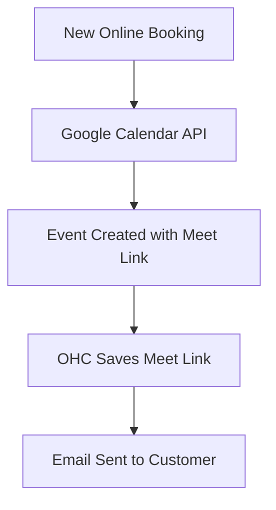

# Video Conferencing: Google Meet

## Problem Statement
Coaches, tutors, and consultants need to generate unique video links for their remote sessions. Manually creating meetings and copying links into calendar invites is tedious and prone to human error (e.g., sending the wrong link).

### Persona-Specific Pain Point Summary
- **Tutor (Sarah):** "I accidentally sent the same Zoom link to two different students, and they joined the same call."
- **Consultant (Carlos):** "I waste 5 minutes before every meeting trying to find where I pasted the link."

## Research Report
**Tool:** Google Meet (via Google Calendar API)
**Ease of Use:** Ubiquitous. Most users already have a Google account. The integration is seamless once OAuth is completed.
**Pricing:** Free for standard use.
**Reputation:** Extremely reliable, widely accepted by consumers.
**Cloud/Standalone:** Requires OAuth 2.0. In Cloud, OHC can handle the OAuth app. In Standalone, users might need to provide their own client credentials or use a centralized OHC proxy.

### Comparative Table
| Feature | Google Meet | Zoom | OHC Fit |
|---|---|---|---|
| Free Limits | 60 mins | 40 mins | Essential |
| No App Needed | Yes (Browser) | Mostly App | Good |
| Integration | via GCal API | via Zoom API | Good |

## Design Doc
### Architecture

### UX Flow
1. User authenticates Google Calendar.
2. User creates a new "Online Consultation" service type.
3. When booked, OHC automatically attaches a unique Google Meet link to the appointment details.

## Implementation Prompt
Integrate Google Meet link generation. When a user creates an appointment marked as "Online", use the connected Google Calendar API to create an event and inject a `conferenceData` request to generate a Google Meet link. Display this "Join Meeting" link prominently on the appointment detail view in the OHC dashboard.

## Priority
P2

## Scope
Medium
