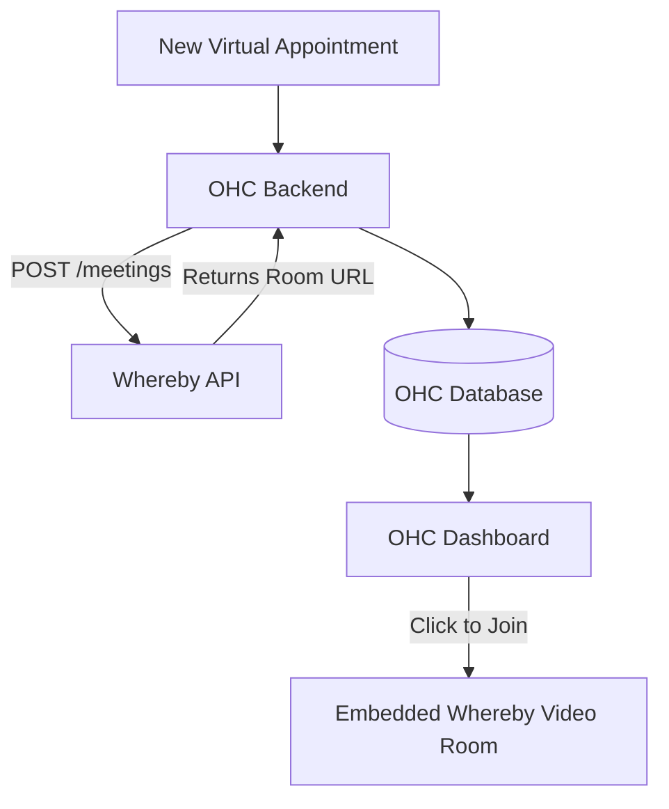

# Research: Video Conferencing Integration with Whereby

## Title
Integrate Whereby for Frictionless Embedded Video Consultations

## Problem Statement
Coaches, tutors, and telehealth providers need to conduct online sessions with clients. Requiring clients to download thick applications like Zoom or Microsoft Teams creates technical barriers, delays meetings, and frustrates non-technical users. They need a simple, one-click video solution that runs directly in the browser.

## Research Report
Whereby is a privacy-first video meetings platform that focuses on ease of use. It offers both standalone meetings and an "Embedded" API product.
- **Ease of Use**: Whereby's primary advantage is that it requires absolutely no downloads or logins for guests. Meetings run entirely in the browser (WebRTC). The interface is minimalistic and highly reliable.
- **Pricing**: For API/Embedded use, Whereby offers a free tier (2,000 participant minutes/mo), and a "Build" plan starting at $9.99/mo with pay-as-you-go minutes. This makes it very affordable for small businesses conducting occasional 1-on-1 sessions.
- **Reputation**: Highly respected in Europe for its strict GDPR compliance and privacy-by-design approach. It is known for excellent developer experience and reliable WebRTC performance.
- **Environment Support**: As a cloud-hosted WebRTC service, it is perfect for Cloud deployments. The OHC Standalone client can generate meeting links via the API and embed the Whereby iframe directly into the local desktop UI.

## Design Doc
The integration will use Whereby Embedded to generate and host video rooms within OHC.
1.  **Room Generation**: When a virtual appointment is booked (e.g., via the SavvyCal integration), the OHC backend calls the Whereby API to create a unique, secure room URL.
2.  **Link Distribution**: OHC saves this URL to the appointment record and sends it to the customer via SMS/Email.
3.  **Hosting**: At the time of the meeting, the business owner can click "Join Session" in their OHC dashboard, which opens the Whereby room in a clean, branded iframe or a new tab.

## Implementation Prompt
Integrate the Whereby API to enable one-click video consultations. Create a background service that automatically provisions a new Whereby room URL whenever a virtual appointment is scheduled. Add a "Start Video Session" button to the OHC daily dashboard that appears 5 minutes before a scheduled meeting. When clicked, this button should open the Whereby room directly within the OHC interface using Whereby's embedded iframe, keeping the user inside the OHC ecosystem. Ensure the room URLs are securely managed and expire after the meeting ends.

## Priority
P2

## Estimated Scope
Small
