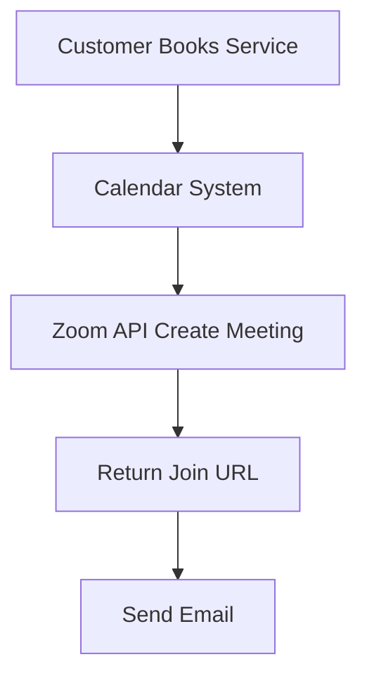

## [Video] Issue Brief: Zoom Meeting Auto-Generation

**Title**: Scout 🔍: Zoom API for Automatic Meeting Links
**Problem Statement**:
Consultants need meeting links generated automatically upon booking.
**Research Report**:
- **Tool**: Zoom API.
- **Evaluation**: Zoom is the ubiquitous standard for video calls.
- **Ease of Use**: Standard OAuth flow to connect Zoom.
- **Pricing**: Free API usage.
- **Cloud vs. Standalone**: Works securely in both setups.
**Design Doc**:
- "Sales" -> "Integrations" -> "Video".
- User connects Zoom.
- When a booking occurs, OHC creates a Zoom meeting.

**Implementation Prompt**:
Integrate the Zoom API using OAuth. Modify the booking engine to generate a unique meeting link when an online service is booked.
**Priority**: P1
**Estimated Scope**: Medium
