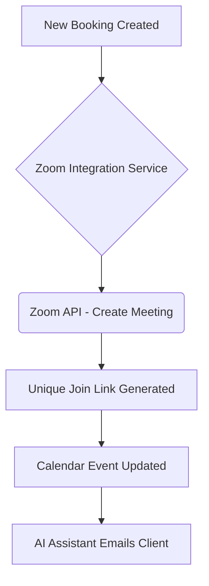

## [Video] Issue Brief: Zoom Integration for Online Consultations

**Title**: Scout 🔍: Integrate Zoom API for Auto-Generated Meeting Links
**Problem Statement**:
Small business owners like Sarah (Freelance Consultant) offer online coaching or consultations. Manually creating a Zoom meeting, copying the link, and emailing it to the client for every booking is tedious and prone to human error (e.g., sending the wrong link). They need meetings to be generated and shared automatically when an appointment is booked.
**Research Report**:
- **Tool**: Zoom API (Server-to-Server OAuth or User Managed App)
- **Evaluation**: Zoom is the ubiquitous standard for video conferencing. The API allows creating, updating, and deleting meetings programmatically, as well as retrieving recordings.
- **Ease of Use**: Users must authorize the OHC app via OAuth. Once connected, it's invisible and automatic.
- **Pricing**: Free tier allows API access, but meetings are limited to 40 minutes for multiple participants. Paid plans remove limits.
- **Cloud vs. Standalone**: Works well in Cloud (OHC App). Standalone users would need a Server-to-Server OAuth app, which is technically demanding.
**Design Doc**:

- A client books a consultation via the scheduling system.
- OHC makes an API call to Zoom to create a unique meeting for that specific time.
- Zoom returns the join URL and password.
- OHC embeds the URL into the calendar invite and the automated confirmation email.
**Implementation Prompt**:
Integrate the Zoom API to automatically provision video meetings. Build an OAuth flow for users to connect their Zoom accounts to OHC. Modify the scheduling workflow to detect when an online meeting is booked, trigger the Zoom API to generate a unique link, and attach that link to the calendar event and customer notifications.
**Priority**: P2
**Estimated Scope**: Medium
