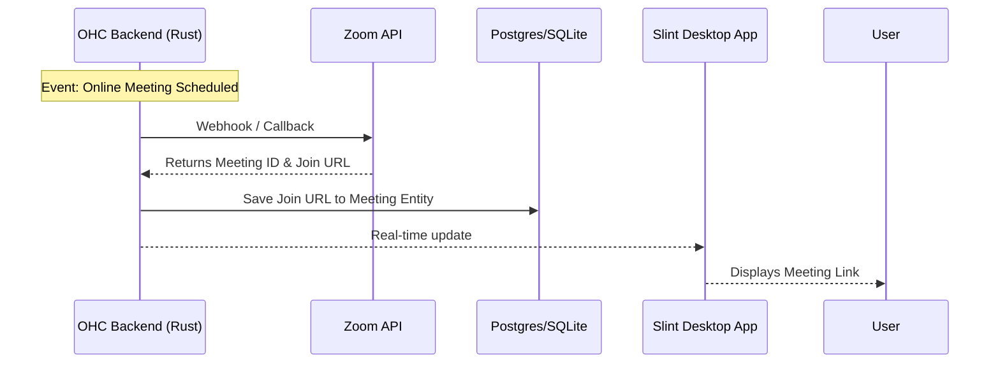

# Zoom Integration

## Problem Statement
Manually creating and sharing video meeting links for online consultations is tedious and error-prone.

## Research Report
The Zoom API allows for programmatic creation of meetings and retrieval of join links.
* **Problem Addressed**: Automates the creation of virtual meeting spaces for scheduled appointments.
* **User Benefit**: "Auto-generation of Zoom meeting links when an appointment is booked via OHC, immediately shared with your client."
* **Ease of Use (for non-technical users)**: The user needs to authorize OHC via Zoom's OAuth flow. Once connected, the process is entirely invisible to the user.
* **Risks & Trade-offs**: Getting an app approved in the Zoom App Marketplace can be a lengthy process if we aim for a public OHC integration.
* **Pricing Estimate**: Free tier available (40-min limit); Pro plan at $14.99/month.
* **Compatibility**: Cloud & Standalone.

## Design Doc
The integration will use the Zoom API to create meetings when an online appointment is scheduled in OHC.

## Implementation Prompt
**Outcome**: Implement the Zoom integration to auto-generate meeting links for scheduled online consultations.
**Acceptance Criteria**:
1. Users must be able to authenticate with Zoom via OAuth.
2. When a Meeting entity is created in OHC (and marked as 'virtual'), the backend must automatically call the Zoom API to create a corresponding meeting.
3. The resulting Zoom join URL must be saved to the Meeting entity and displayed in the UI.
4. If a Meeting is canceled in OHC, the corresponding Zoom meeting should be deleted via the API.

## Priority
P2 (Medium)

## Estimated Scope
Medium
