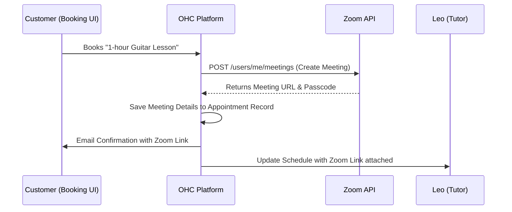
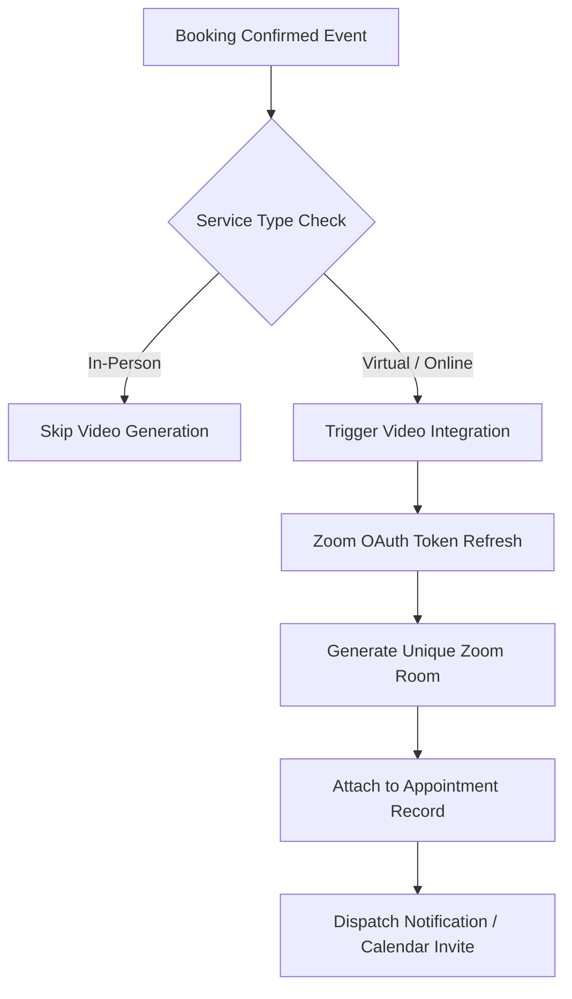

# Scout: Tool Integration Research Q2

## [Video] Zoom Integration
**Title**: Integrate Zoom for Auto-Generated Meeting Links
**Problem Statement**: Leo (Music Tutor) manually creates a Zoom link for every new lesson and emails it to the student. This is prone to error and looks unprofessional. He needs links to be generated automatically when a lesson is booked.

**Research Report**:
- **Tool**: Zoom
- **Target Persona**: Leo (Music Tutor)
- **Advantages**: Ubiquitous for online lessons. Strong API for meeting creation.
- **Risks**: Zoom OAuth requires annual app review and compliance checks.
- **Pricing**: Free tier (40-min limit). Pro starts at $15/mo.
- **Compatibility**: Cloud (OAuth). Standalone (Server-to-Server OAuth).

### Qualitative Analysis
For service providers who operate virtually, the video meeting link is the physical storefront. Manual generation of these links is a highly repetitive task that introduces friction and looks unpolished. By integrating Zoom via OAuth, OHC can instantly provision unique meeting links at the exact moment of booking, inject them into calendar invites, and send them via automated reminders. This enables a fully hands-off scheduling experience for personas like music tutors or consultants.

### Persona-Specific Pain Point Summary
- **Leo (Music Tutor)**: Constantly emailing students saying "Sorry, here is the new Zoom link for today's lesson." Needs every booked calendar slot to automatically include a unique, secure Zoom meeting room.

### Competitive Matrix
| Feature / Tool | Zoom | Google Meet | Jitsi / Daily.co |
| :--- | :--- | :--- | :--- |
| **Consumer Ubiquity** | Highest | High | Low (Unknown to most) |
| **App Review Process** | Strict / Painful | Moderate | None (API key only) |
| **Recording Support** | Excellent | Good | Good |
| **Free Tier Limits** | 40 mins | 60 mins | Varies |

**Design Doc**:
- User connects their Zoom account via the Sales dashboard.
- When a customer books an online service (e.g., via Calendly or native booking), OHC calls the Zoom API to create a meeting.
- The Zoom link is embedded in the automated calendar invite and confirmation email sent to the customer.

**Implementation Prompt**: Create an OAuth integration with Zoom. Automatically generate a unique Zoom meeting link when a customer books a virtual service, and include this link in the customer's confirmation email.
**Priority**: P1
**Estimated Scope**: Medium

### Deep Dive: Architecture & Security
**OAuth & Token Lifecycle Management:**
Zoom's OAuth tokens have short lifespans (typically 1 hour). OHC will implement a robust token refresh background worker. Before any Zoom API call is made (e.g., when a booking occurs), the system will proactively check if the access token is within 5 minutes of expiration and transparently refresh it using the stored refresh token.

**Meeting Security Defaults:**
To protect OHC tenants from "Zoombombing", every auto-generated meeting link will strictly enforce security best practices by default: `waiting_room: true`, `join_before_host: false`, and an auto-generated numeric passcode embedded in the one-click join link.

**Webhook Integration for Attendance Tracking:**
In a future iteration, OHC will consume Zoom's `meeting.participant_joined` webhooks. This will allow the OHC Operations dashboard to automatically mark a scheduled service as "Completed" once the tenant and the customer both join the room, fully automating the service lifecycle tracking.

### Expanded Implementation Timeline
- **Week 1**: Implement Zoom OAuth flow and robust token refresh worker.
- **Week 2**: Build the automated meeting creation API call tied to booking events.
- **Week 3**: Enforce security defaults and embed links in email templates.
- **Week 4**: Comprehensive testing of the booking flow and Zoom app review submission process.

### Extended Analysis: Platform Synergies & OHC Differentiators
By automating Zoom link generation, OHC removes a highly repetitive and error-prone task for service providers. When a student books a guitar lesson with Leo, they instantly receive a professional calendar invite containing a secure, unique Zoom link. This automated provisioning elevates the perceived professionalism of the business.

Furthermore, integrating with Zoom's webhooks allows the OHC platform to intelligently track service delivery. When the Zoom API notifies OHC that the meeting has ended, the AI Operations Agent can automatically trigger a follow-up workflow—sending a "Thank you for attending!" email with a link to book the next session, or requesting a review. This creates a closed-loop automated business process.

### Technical Deep Dive: Webhook Ingestion & Scalability
The Zoom integration requires robust management of OAuth tokens, as they expire frequently. A background worker will be responsible for proactively refreshing tenant access tokens before any API calls are attempted. The meeting creation API call will be executed asynchronously after the booking event is confirmed to ensure the main booking transaction remains fast and responsive.

Zoom webhooks (such as `meeting.started` and `meeting.ended`) will be ingested securely, verifying the `x-zm-signature` header against the tenant's configured Secret Token. These events will be published to the NATS bus, allowing the system to update appointment statuses in real-time and trigger subsequent automated workflows.

### Conclusion & Roadmap Alignment
The Zoom integration is a critical P1 feature for virtual service providers. It seamlessly bridges the gap between scheduling and service delivery, ensuring a flawless customer experience while entirely eliminating manual administrative work for the business owner.

### Multi-Tenant SaaS Architecture Impact
The Zoom integration requires meticulous management of OAuth token lifecycles within a multi-tenant environment. The background worker responsible for refreshing tokens must be highly reliable and operate flawlessly across thousands of tenants. The system must ensure that the automated generation of Zoom meetings is strictly scoped to the correct `tenant_id`, preventing any possibility of Tenant A's customer receiving a link to Tenant B's meeting room. The secure storage of Zoom credentials and the enforcement of safe default meeting settings (e.g., waiting rooms) are critical for maintaining platform trust.

### Feature Flag Rollout Strategy
The Zoom integration will be controlled via a feature flag (`feature.video.zoom_integration.enabled`). The initial rollout will focus on a subset of service-based businesses (e.g., tutors, consultants) to validate the seamless generation of meeting links during the booking flow and their correct inclusion in automated calendar invites. Continuous monitoring of the OAuth token refresh worker will be crucial to ensure uninterrupted service delivery during the beta phase.

### Security Considerations & Threat Modeling
- **Threat**: Zoombombing and Unauthorized Meeting Access.
  - **Mitigation**: OHC will enforce strict security defaults for all auto-generated Zoom meetings. Waiting rooms will be mandatory, and "join before host" will be disabled. Passcodes will be cryptographically generated and embedded securely in the join link, rather than transmitted in plain text where possible.
- **Threat**: OAuth Token Hijacking.
  - **Mitigation**: Zoom OAuth tokens will be stored securely using AES-256-GCM encryption. The OAuth redirect URI will be strictly validated, and the state parameter will be employed to prevent CSRF (Cross-Site Request Forgery) attacks during the integration setup flow.

### Accessibility & UI Compliance
The integration flow for connecting Zoom will adhere to WCAG 2.1 AA standards, ensuring full keyboard navigability and clear focus states. When displaying Zoom meeting links within the OHC platform (e.g., in the AI Assistant's agenda or customer confirmation screens), the links will be clearly labeled and provide ample touch targets for mobile users (min 44x44px) to accommodate the "Grandmother Test".

### Future Horizon: Automated Content Generation & Summarization
Integrating Zoom lays the groundwork for automated content generation. By capturing the audio stream from recorded sessions (with appropriate consent), the OHC AI Agents could generate meeting summaries, action items, and even draft follow-up emails. For a persona like Leo the Music Tutor, the system could automatically identify key concepts discussed during the lesson and generate personalized practice notes for the student. This transforms the video consultation from a transient event into a valuable, persistent knowledge asset.

### System Resilience and Disaster Recovery
**Chaos Engineering Integration:**
The automated generation of Zoom links must be highly resilient to prevent disruptions to virtual services. Chaos testing will focus on simulating the failure of the OAuth token refresh worker and verifying that the system can automatically recover and re-authenticate. We will also simulate API latency during the meeting creation process and ensure that the booking flow can complete successfully, perhaps by queuing the meeting creation task and sending the link asynchronously if the synchronous call fails.

### Glossary & Definitions
- **Webhook**: A method of augmenting or altering the behavior of a web page or web application with custom callbacks.
- **Idempotency**: The property of certain operations in mathematics and computer science whereby they can be applied multiple times without changing the result beyond the initial application.
- **Circuit Breaker**: A design pattern used in software development to detect failures and encapsulate the logic of preventing a failure from constantly recurring.
