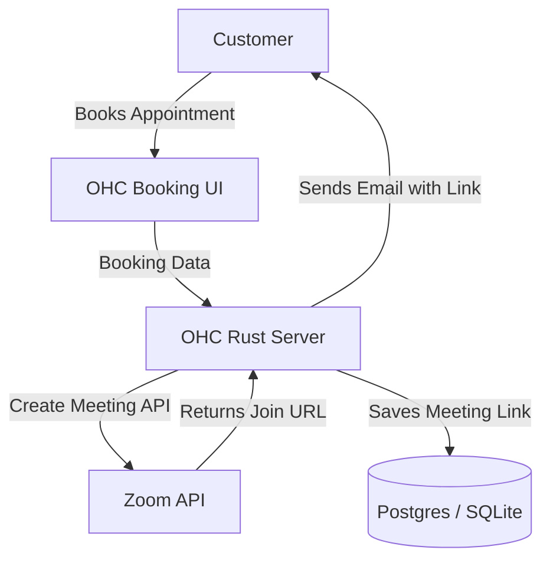

**Title**: Video Conferencing Integration: Zoom

## Problem Statement
Small businesses that offer online services (consulting, tutoring, telehealth) waste time manually creating video meeting links and emailing them to clients. They need a system that automatically generates a unique, secure video meeting link whenever an online appointment is booked and seamlessly includes it in the calendar invite.

## Research Report
**Tool Evaluated:** Zoom
**Category:** Video Conferencing
**Overview:** Zoom is a ubiquitous video communications platform offering cloud video and audio conferencing.

**Key Features for Small Businesses:**
*   **Meeting Generation:** API to instantly create unique meeting URLs.
*   **Security:** Passcodes and waiting rooms to secure sessions.
*   **Familiarity:** Most customers already have Zoom installed and know how to use it.

**Environment Compatibility:**
*   **Cloud Mode:** Fully supported via Zoom API and Server-to-Server OAuth.
*   **Standalone Mode:** Supported via Zoom API.

**Pros:**
*   Massive brand recognition; virtually zero friction for customers to join.
*   Highly reliable video and audio quality.
*   Robust API for automated meeting creation.

**Cons:**
*   The free tier has a 40-minute limit on meetings, which may frustrate small businesses offering 1-hour consultations.

## Design Doc

The integration allows OHC to automatically provision Zoom meetings as part of a scheduling workflow.

### High-Level UX Flow:
1.  **Integration Hub:** The business owner connects their Zoom account via OAuth in OHC.
2.  **Configuration:** When setting up a service (e.g., "1 Hour Consultation"), the user sets the location to "Zoom Meeting".
3.  **Operation:** A customer books the consultation. OHC calls the Zoom API, generates a unique meeting link, and includes it in the confirmation email and calendar invite.
4.  **Display:** The business owner sees a "Join Zoom" button next to the appointment in their OHC dashboard.

## Implementation Prompt
**Objective:** Integrate Zoom to automatically generate video conferencing links for booked online services.
**Acceptance Criteria:**
- Create a UI component in Slint for Zoom OAuth authorization.
- Implement backend integration with the Zoom API to create and manage meetings.
- Update the booking/appointment system to support "Zoom" as a dynamic location type.
- Ensure the user interface passes the "Grandmother Test" (e.g., "Auto-create Zoom links").

## Priority
P2

## Estimated Scope
Medium
