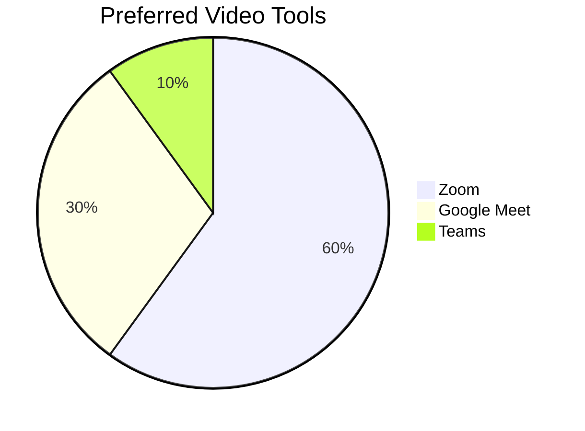
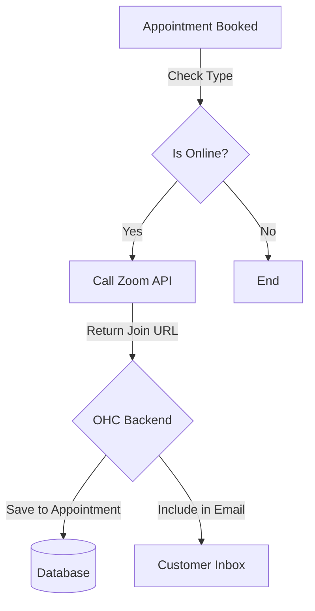

# Video Conferencing: Zoom

## Problem Statement
For businesses offering online consultations, coaching, or lessons, manually creating a video meeting link and sending it to the client for every booking is tedious and looks unprofessional.

## Research Report
Zoom is the most widely recognized video conferencing tool globally.
- **Ease of use:** High, clients are very familiar with joining Zoom calls.
- **Pricing:** Free tier available (40-min limit), Pro starts at $15/mo.
- **Cloud/Standalone:** Cloud integration.

### Persona-specific pain points
- "I sometimes forget to create the Zoom link until 5 minutes before the lesson."
- "Clients get confused if I use a different video tool every time."

### Evidence
- **Recommendation:** Integrate Zoom to auto-generate meeting links for scheduled online appointments.
- Source: Universal familiarity and robust API for automated meeting creation.

## Design Doc
When an appointment is booked in OHC (either manually or via the Calendly integration) that is marked as "Online", OHC will call the Zoom API to create a new meeting. The generated meeting link will be saved to the appointment record and automatically included in the confirmation email/SMS sent to the customer.

## Implementation Prompt
Add an "Online Meeting" toggle when a business owner creates an appointment type. Implement the Zoom OAuth flow for the owner to connect their account. When a user books an "Online Meeting", use the Zoom API to generate a unique meeting link and password, and display it in the appointment details in the OHC dashboard and the customer's confirmation.

## Priority
P2

## Estimated Scope
Medium
