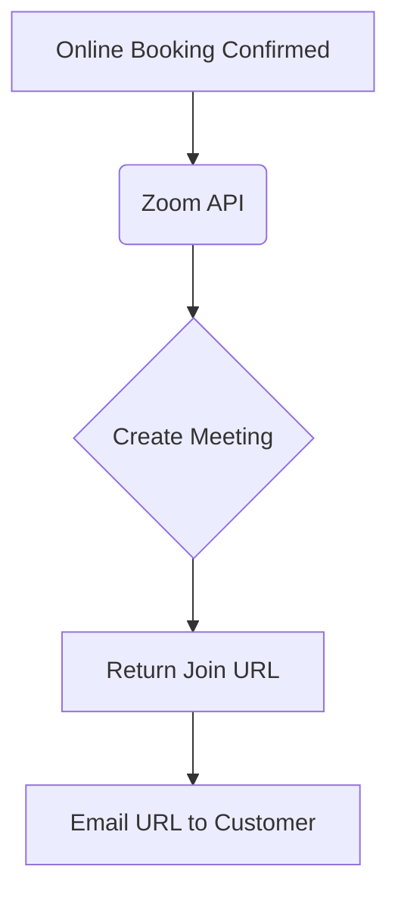

# [Video] Zoom Meeting Auto-Generation
## Problem Statement
Consultants and tutors manually create Zoom links and email them to clients for every online booking, which is tedious and prone to human error (sending the wrong link).

## Research Report
- **Tool Evaluated**: Zoom API
- **Ease of Use**: OAuth is straightforward for the owner.
- **Pricing**: API access available on free/pro tiers.
- **Reputation**: Most recognized video conferencing tool.
- **Cloud & Standalone**: OAuth requires a cloud redirect URI handling, but doable for both.

### Pain Points Solved
- Zero-touch meeting link generation.
- Professional automated calendar invites with embedded links.

| Video Tool | SMB Recognition | API Ease |
| :--- | :--- | :--- |
| Zoom | Very High | Medium |
| Google Meet | High | High |
| Microsoft Teams| Medium | Complex |

## Design Doc
- **Integration**: OAuth 2.0 app.
- **Triggers**: When an "Online Meeting" service type is booked, API call to create a meeting.
- **User Flow**: User connects Zoom. When a client books, the confirmation screen and email automatically include a unique Zoom join link.

## Implementation Prompt
Integrate Zoom so that a business owner can authenticate their account. Automatically generate a unique Zoom meeting link whenever an online appointment is scheduled, and attach this link to the customer confirmation.

## Priority
P2

## Estimated Scope
Medium
