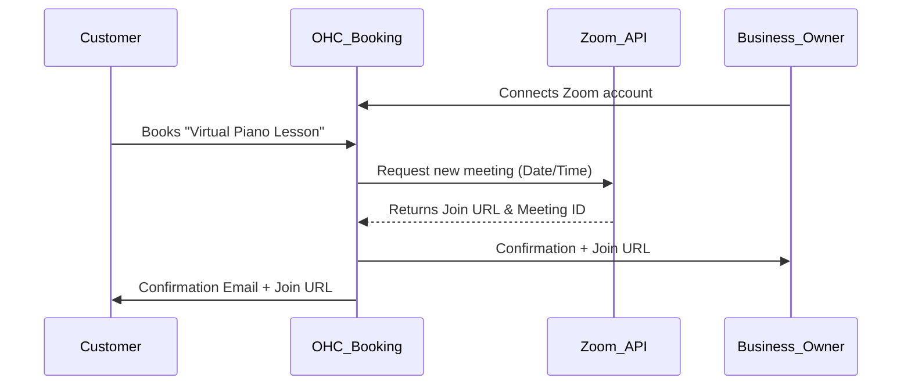

# Native Zoom Link Generation

## Problem Statement
Leo (Music Tutor) currently manually creates a Zoom meeting for every new student booking and emails them the link. This process is prone to error (forgetting to send the link) and feels unprofessional. He needs unique meeting links to be generated automatically when a lesson is booked natively through OHC.

## Research Report
- **Strategy**: Native OAuth integration with the Zoom API.
- **Target Persona**: Tutors, consultants, therapists, and any remote service providers.
- **Advantages**: Standard OAuth connection is highly intuitive for users. Removes a major point of friction in the service booking workflow.
- **Risks**: Zoom OAuth requires a strict annual app review and compliance process by Zoom.
- **Pricing**: API usage is free, but the merchant must maintain their own Zoom account (Free or Pro).
- **Compatibility**:
  - Cloud: Centralized OAuth integration.
  - Standalone: Server-to-Server OAuth.

## Design Doc
- **User Experience Flow**:
  1. Business owner navigates to "Services" and creates a new offering (e.g., "Virtual Piano Lesson").
  2. For Location, they select "Online Meeting" and click "Connect Zoom".
  3. They complete the Zoom OAuth flow.
  4. When a customer books the service, OHC automatically calls the Zoom API to generate a unique meeting link.
  5. The link is embedded in the customer's confirmation email and calendar invite.
- **AI Integration**: The Customer Success Agent follows up 1 hour after the Zoom meeting ends to ask the customer for a review or to suggest booking their next session.

### Mobile UX Flow
| Screen | Description |
|---|---|
| Service Location Setup | Dropdown for Location type. Selecting "Video Call" reveals a "Connect Zoom" button. |
| Customer Booking Success | Big bold button: "Add to Calendar (includes Zoom link)". |
| Upcoming Appointments | List view of appointments for the day, each with a prominent "Join Call" button. |

## Implementation Prompt
Build a Zoom integration that automatically creates unique meeting links for online service bookings. Users should be able to authenticate their Zoom account via OAuth. When a customer books a virtual service, dynamically generate the Zoom link, store it with the booking record, and surface it in the UI and confirmation emails for both parties.

- **Acceptance Criteria**: Merchant connects Zoom. Customer books online service. Unique Zoom link is generated via API and distributed to both parties.
- **Priority**: P2
- **Estimated Scope**: Medium
