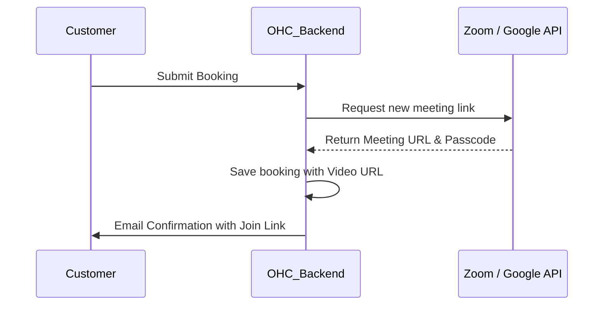

# [Video] Auto-Generated Meeting Links

## Title
Automatic Zoom and Google Meet Link Generation for Bookings

## Problem Statement
As a small business owner offering online consultations, tutoring, or coaching, every time a client books a session, I have to manually go into Zoom, create a meeting, copy the link, and email it to the client. Sometimes I forget or I copy the wrong link, and we waste the first 10 minutes of the session trying to connect. I need a unique video link to be generated automatically the second someone books, and I want it to be right there on my calendar and their calendar.

## Research Report
**Tools Evaluated:** Zoom API, Google Meet (via Google Calendar API), Whereby.

- **Google Meet:**
  - *Ease of Use:* Practically invisible if tied to the Google Calendar sync. It auto-generates a link when an event is created.
  - *Pricing:* Free for basic use.
  - *Cloud vs Standalone:* Works seamlessly in both via standard OAuth/API requests.
- **Zoom API:**
  - *Ease of Use:* High familiarity for users. Requires an OAuth connection to Zoom.
  - *Pricing:* Requires a Pro Zoom account to avoid the 40-minute limit.
  - *Cloud vs Standalone:* Fully supported in both modes via user-level OAuth.
- **Whereby:**
  - *Ease of Use:* Great embedded API, but less brand recognition for the end client compared to Zoom.
  - *Cloud vs Standalone:* Supported in both modes.
- **Recommendation:** If the user connects their Google Calendar (see Calendar Sync issue), automatically attach a Google Meet link. As an additive feature, allow them to connect their Zoom account via OAuth so that OHC automatically creates a Zoom meeting for every new booking.

## Design Doc
A location dropdown in the new Scheduling/Booking setup.
- **Trigger:** A customer completes a booking on the OHC Scheduling page.
- **Action:** If the owner has selected "Zoom" or "Google Meet" as the location, OHC calls the respective API to generate a unique meeting room.
- **User View:** The owner sees a "Location: Online" setting in their Service setup. When booked, the customer's confirmation email and calendar invite automatically contain a big "Join Meeting" button with the correct, unique link.

## Implementation Prompt
Enhance the Scheduling feature to support online locations. Add OAuth integrations for Zoom. When a user creates a Service, they should be able to set the location to "Zoom" or "Google Meet". Upon a successful booking, the system must call the selected provider's API to generate a unique meeting link, inject that link into the calendar event, and include it prominently in the customer's confirmation email.

## Priority
P2

## Estimated Scope
Medium
