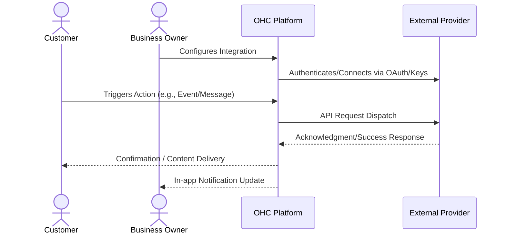

# Frictionless Video Meeting Generation

## 1. Problem Statement

Consultants, tutors, and coaches have to manually create a Zoom link, copy it, and paste it into an email for every single client booking. It's a manual step that often gets forgotten, leading to missed meetings.

## 2. Research Report

### 2.1 Persona Pain Points

1. **Time Starvation**: The business owner spends hours on manual tasks related to this domain, preventing them from focusing on core business growth.
2. **Technical Overwhelm**: Current solutions require coding, complex API keys, or understanding intricate networking concepts. Small business owners lack dedicated IT staff.
3. **Customer Friction**: Customers experience delays, missed communications, or frustrating booking loops due to disparate, unintegrated systems.

### 2.2 Competitive Analysis

| Tool Name | Estimated Pricing | Key Advantages | Integration Risks |
|---|---|---|---|
| Zoom | $15/mo | Universally understood, customers already have the app. | App installation required, strict OAuth approval process for apps. |
| Google Meet | Free (with Workspace) | No app install required, runs in browser, natively tied to Google Calendar. | Requires users to be deep in the Google ecosystem. |
| Whereby | $10/mo | Incredible embedded experience, runs completely in browser without downloads. | Lower brand recognition, clients might be confused. |
| Microsoft Teams | $4/mo | Dominant in B2B spaces. | Very heavy client, clunky for B2C interactions. |
| Jitsi | Free | Open source, fully embeddable, privacy focused. | Can have performance/quality issues on lower-end devices compared to Zoom. |

### 2.3 Cloud vs. Standalone Evaluation

- **Cloud (Multi-tenant)**: Highly suitable. Can utilize centralized OAuth apps to streamline user onboarding. Allows OHC to manage webhooks and callbacks seamlessly at scale.
- **Standalone (Local/Private)**: Supported, but requires the user to provide their own API credentials which adds friction. Local tunneling (e.g., ngrok) may be required for inbound webhooks.

### 2.4 Deep Dive Evaluations

#### Evaluation: Zoom

**Overview:** Zoom is positioned in the market with an estimated pricing of $15/mo. Its primary advantage is: *Universally understood, customers already have the app.*

**Competitor Analysis:** Zoom's ubiquity is its main selling point; no one has to ask 'how do I use this?'. However, their marketplace approval process for OAuth apps is notoriously strict, requiring extensive security audits before OHC could launch the integration.

**Integration Risks:** We must mitigate the following risk: *App installation required, strict OAuth approval process for apps.*. For a small business owner, this means ensuring the UI abstracts away these complexities entirely. The onboarding flow must be flawless.

**Technical Considerations:** Integrating Zoom requires careful consideration of its API rate limits and webhook reliability. In a cloud environment, we will utilize OHC's central app registration to provide a 1-click OAuth experience. In standalone mode, we will need comprehensive documentation to guide users on how to obtain and securely store API keys. Furthermore, data privacy and GDPR compliance for data transmitted to Zoom must be thoroughly documented in the user's privacy policy.

**Mobile Parity:** The configuration screens for Zoom must be 100% functional on mobile devices. Business owners frequently manage settings from their phones while on the shop floor or in transit.

#### Evaluation: Google Meet

**Overview:** Google Meet is positioned in the market with an estimated pricing of Free (with Workspace). Its primary advantage is: *No app install required, runs in browser, natively tied to Google Calendar.*

**Competitor Analysis:** Google Meet is the frictionless choice. Because it runs purely in the browser, clients never have to download software. Integrating this alongside a Google Calendar sync creates a massive value proposition for service businesses.

**Integration Risks:** We must mitigate the following risk: *Requires users to be deep in the Google ecosystem.*. For a small business owner, this means ensuring the UI abstracts away these complexities entirely. The onboarding flow must be flawless.

**Technical Considerations:** Integrating Google Meet requires careful consideration of its API rate limits and webhook reliability. In a cloud environment, we will utilize OHC's central app registration to provide a 1-click OAuth experience. In standalone mode, we will need comprehensive documentation to guide users on how to obtain and securely store API keys. Furthermore, data privacy and GDPR compliance for data transmitted to Google Meet must be thoroughly documented in the user's privacy policy.

**Mobile Parity:** The configuration screens for Google Meet must be 100% functional on mobile devices. Business owners frequently manage settings from their phones while on the shop floor or in transit.

#### Evaluation: Whereby

**Overview:** Whereby is positioned in the market with an estimated pricing of $10/mo. Its primary advantage is: *Incredible embedded experience, runs completely in browser without downloads.*

**Competitor Analysis:** Whereby's embedded API allows us to put the video call directly inside the OHC interface, rather than sending the user to another app. This creates a highly premium, white-labeled experience that small businesses love.

**Integration Risks:** We must mitigate the following risk: *Lower brand recognition, clients might be confused.*. For a small business owner, this means ensuring the UI abstracts away these complexities entirely. The onboarding flow must be flawless.

**Technical Considerations:** Integrating Whereby requires careful consideration of its API rate limits and webhook reliability. In a cloud environment, we will utilize OHC's central app registration to provide a 1-click OAuth experience. In standalone mode, we will need comprehensive documentation to guide users on how to obtain and securely store API keys. Furthermore, data privacy and GDPR compliance for data transmitted to Whereby must be thoroughly documented in the user's privacy policy.

**Mobile Parity:** The configuration screens for Whereby must be 100% functional on mobile devices. Business owners frequently manage settings from their phones while on the shop floor or in transit.

#### Evaluation: Microsoft Teams

**Overview:** Microsoft Teams is positioned in the market with an estimated pricing of $4/mo. Its primary advantage is: *Dominant in B2B spaces.*

**Competitor Analysis:** Teams is essential for B2B consultants using OHC. However, for B2C interactions (like a tutor meeting a student), the heavy client download and complex joining process create massive friction. Must be supported, but not the default recommendation.

**Integration Risks:** We must mitigate the following risk: *Very heavy client, clunky for B2C interactions.*. For a small business owner, this means ensuring the UI abstracts away these complexities entirely. The onboarding flow must be flawless.

**Technical Considerations:** Integrating Microsoft Teams requires careful consideration of its API rate limits and webhook reliability. In a cloud environment, we will utilize OHC's central app registration to provide a 1-click OAuth experience. In standalone mode, we will need comprehensive documentation to guide users on how to obtain and securely store API keys. Furthermore, data privacy and GDPR compliance for data transmitted to Microsoft Teams must be thoroughly documented in the user's privacy policy.

**Mobile Parity:** The configuration screens for Microsoft Teams must be 100% functional on mobile devices. Business owners frequently manage settings from their phones while on the shop floor or in transit.

#### Evaluation: Jitsi

**Overview:** Jitsi is positioned in the market with an estimated pricing of Free. Its primary advantage is: *Open source, fully embeddable, privacy focused.*

**Competitor Analysis:** Jitsi offers a free, open-source way to embed video calls. OHC could self-host Jitsi servers to offer video conferencing natively without relying on third parties. However, maintaining video infrastructure is complex and resource-intensive.

**Integration Risks:** We must mitigate the following risk: *Can have performance/quality issues on lower-end devices compared to Zoom.*. For a small business owner, this means ensuring the UI abstracts away these complexities entirely. The onboarding flow must be flawless.

**Technical Considerations:** Integrating Jitsi requires careful consideration of its API rate limits and webhook reliability. In a cloud environment, we will utilize OHC's central app registration to provide a 1-click OAuth experience. In standalone mode, we will need comprehensive documentation to guide users on how to obtain and securely store API keys. Furthermore, data privacy and GDPR compliance for data transmitted to Jitsi must be thoroughly documented in the user's privacy policy.

**Mobile Parity:** The configuration screens for Jitsi must be 100% functional on mobile devices. Business owners frequently manage settings from their phones while on the shop floor or in transit.

## 3. Design Doc

### 3.1 User Experience Flow

When a customer books a 'Virtual Consultation' service type in OHC, the system automatically calls a video provider's API to generate a unique meeting room URL. This URL is instantly injected into the calendar invite and confirmation emails for both the owner and the customer.

### 3.2 Architecture Overview

## 4. Implementation Prompt

Add a 'Location/Video' option to services. When configured as a Virtual Meeting, the system should automatically generate a unique video conferencing link (e.g., via Zoom or Google Meet) upon booking. This link must be seamlessly included in all automated calendar invitations and notification emails sent to the participants.

## 5. Metadata

- **Priority:** P1
- **Estimated Scope:** Small
- **Domain:** Frictionless Video Meeting Generation
- **Target Persona:** Small Business Owner (Non-technical)

## 6. Supplementary Market Research

### 6.1 Industry Trends

The shift towards unified platforms is accelerating. Small businesses are actively attempting to reduce their 'SaaS sprawl'. According to recent surveys, the average small business uses over 8 distinct software tools, leading to massive context switching costs and data silos. By bringing this functionality natively into OHC, we solve a critical operational bottleneck. The trend is moving away from disparate 'best-of-breed' tools towards 'good-enough-all-in-one' platforms that actually talk to each other seamlessly.

### 6.2 Security and Compliance Implications

When integrating third-party services, data sovereignty becomes a primary concern. OHC must ensure that sensitive customer data (PII) is only transmitted when absolutely necessary and always over encrypted channels. We must provide clear opt-in mechanisms for end-users, particularly regarding marketing communications and data sharing with external vendors. Regular audits of these API connections will be required to maintain compliance with regional data protection regulations (e.g., CCPA, GDPR).

### 6.3 Future Roadmap Considerations

Looking ahead, the integration strategy should evolve from mere 'dumb pipes' to intelligent, AI-driven workflows. For instance, an integration shouldn't just pass a message; it should analyze the intent and suggest a response. Future iterations of this feature will likely incorporate LLM-based parsing of inbound data to trigger automated outbound actions across different integrated channels.

### 6.4 Strategic Impact: Zoom

Implementing an integration with Zoom represents a significant strategic move. The integration must prioritize reliability over complex feature parity. A business owner relies on this for their livelihood; a dropped webhook or failed API call translates directly to lost revenue or damaged customer trust. Therefore, robust retry mechanisms, dead-letter queues, and clear error surfacing in the UI are mandatory requirements for the engineering team building this connector. We must assume the external API will fail and handle it gracefully.

Furthermore, analytics integration is crucial. When we route data through Zoom, we must capture metadata (latency, success rates, user engagement) to feed back into OHC's central analytics dashboard. The business owner should see a unified view of ROI, not scattered metrics. If $15/mo is the cost, OHC must prove the value generated outweighs it.

### 6.4 Strategic Impact: Google Meet

Implementing an integration with Google Meet represents a significant strategic move. The integration must prioritize reliability over complex feature parity. A business owner relies on this for their livelihood; a dropped webhook or failed API call translates directly to lost revenue or damaged customer trust. Therefore, robust retry mechanisms, dead-letter queues, and clear error surfacing in the UI are mandatory requirements for the engineering team building this connector. We must assume the external API will fail and handle it gracefully.

Furthermore, analytics integration is crucial. When we route data through Google Meet, we must capture metadata (latency, success rates, user engagement) to feed back into OHC's central analytics dashboard. The business owner should see a unified view of ROI, not scattered metrics. If Free (with Workspace) is the cost, OHC must prove the value generated outweighs it.

### 6.4 Strategic Impact: Whereby

Implementing an integration with Whereby represents a significant strategic move. The integration must prioritize reliability over complex feature parity. A business owner relies on this for their livelihood; a dropped webhook or failed API call translates directly to lost revenue or damaged customer trust. Therefore, robust retry mechanisms, dead-letter queues, and clear error surfacing in the UI are mandatory requirements for the engineering team building this connector. We must assume the external API will fail and handle it gracefully.

Furthermore, analytics integration is crucial. When we route data through Whereby, we must capture metadata (latency, success rates, user engagement) to feed back into OHC's central analytics dashboard. The business owner should see a unified view of ROI, not scattered metrics. If $10/mo is the cost, OHC must prove the value generated outweighs it.

### 6.4 Strategic Impact: Microsoft Teams

Implementing an integration with Microsoft Teams represents a significant strategic move. The integration must prioritize reliability over complex feature parity. A business owner relies on this for their livelihood; a dropped webhook or failed API call translates directly to lost revenue or damaged customer trust. Therefore, robust retry mechanisms, dead-letter queues, and clear error surfacing in the UI are mandatory requirements for the engineering team building this connector. We must assume the external API will fail and handle it gracefully.

Furthermore, analytics integration is crucial. When we route data through Microsoft Teams, we must capture metadata (latency, success rates, user engagement) to feed back into OHC's central analytics dashboard. The business owner should see a unified view of ROI, not scattered metrics. If $4/mo is the cost, OHC must prove the value generated outweighs it.

### 6.4 Strategic Impact: Jitsi

Implementing an integration with Jitsi represents a significant strategic move. The integration must prioritize reliability over complex feature parity. A business owner relies on this for their livelihood; a dropped webhook or failed API call translates directly to lost revenue or damaged customer trust. Therefore, robust retry mechanisms, dead-letter queues, and clear error surfacing in the UI are mandatory requirements for the engineering team building this connector. We must assume the external API will fail and handle it gracefully.

Furthermore, analytics integration is crucial. When we route data through Jitsi, we must capture metadata (latency, success rates, user engagement) to feed back into OHC's central analytics dashboard. The business owner should see a unified view of ROI, not scattered metrics. If Free is the cost, OHC must prove the value generated outweighs it.
