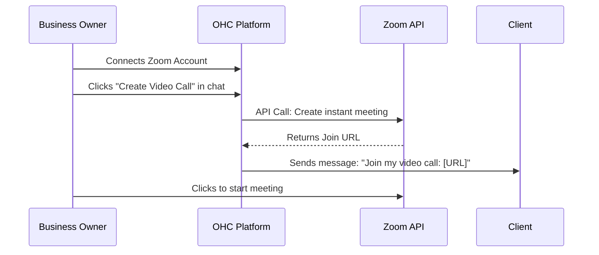

## Video Conferencing: Zoom

**Title**: Implement Zoom Integration for Auto-Generated Meeting Links

**Problem Statement**: Tutors, consultants, and therapists need to quickly send video meeting links to clients. Creating a meeting in the Zoom app, copying the link, and pasting it back into a customer chat is a clunky, multi-step process that slows down communication.

**Research Report**: Zoom remains the most popular dedicated video conferencing tool for small businesses.
* *Ease of Use*: High. Ubiquitous adoption means clients rarely struggle to join a Zoom meeting.
* *Pricing*: Free tier allows 40-minute meetings. Pro tier ($15.99/mo) removes the time limit and adds features.
* *Reputation*: Industry leader, synonymous with video calls.
* *Mode Compatibility*: Requires OAuth app approval, functioning well in both Cloud and Standalone (with appropriate redirect URI handling).

**Design Doc**:

**Implementation Prompt**: Build a Zoom integration that allows business owners to instantly generate meeting links from within a chat. Add a "Start Video Call" button near the chat input. When clicked, OHC should request a new meeting via the Zoom API and automatically insert the join link into the chat box for the owner to send. The setup screen should guide the user through a simple "Connect my Zoom" OAuth flow.

**Priority**: P2

**Estimated Scope**: Small
