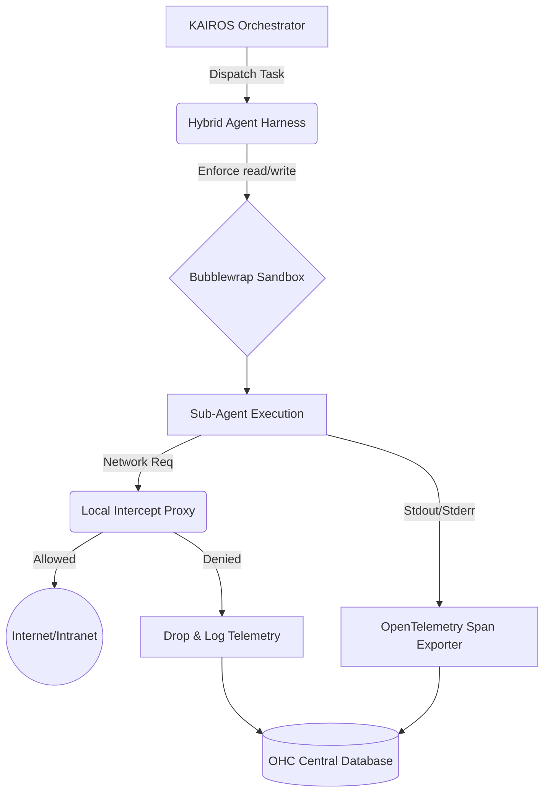

# OHC Agent Harness: Competitive Research Analysis

## Overview

As OHC aims to dominate the Agentic OS market with the KAIROS Orchestrator, it is essential that our internal Agent Harness—the secure sandbox environment where remote AI agents execute code and interact with resources—is best-in-class.

We conducted a deep technical audit of industry-leading models and sandboxing tools, specifically focusing on the internal architecture of the recently leaked Claude Code codebase, to identify gaps in our current harness implementation.

## Market Reality: Claude Code's Harness Architecture

Our extraction and analysis of `claude-code(2_1_88)` revealed a sophisticated implementation of their sandboxing engine (`@anthropic-ai/sandbox-runtime`). Key components include:

1. **Bubblewrap (`bwrap`) Integration:** On Linux environments, Claude Code heavily relies on `bwrap` to spawn tightly restricted child processes. This tool allows for fine-grained unprivileged filesystem mounting, ensuring agents cannot mutate sensitive host files.
2. **Seccomp Filters:** They employ dynamically generated `seccomp` (Secure Computing mode) Berkeley Packet Filters (BPF) to restrict the system calls an agent's process can invoke, heavily mitigating the impact of potential RCEs or escaping attacks.
3. **Network Telemetry and Proxying:** The harness sets up localized custom HTTP/SOCKS proxy servers. The agent's environment variables (like `HTTP_PROXY`) are forced through these. The proxy has an explicit evaluation mechanism: `allowedDomains`, `deniedDomains`, and a runtime `askCallback` to halt and ask the user for permission when an unknown network boundary is crossed.
4. **Symlink and File Bypass Protections:** The codebase includes explicit protections (e.g., `findSymlinkInPath`) to prevent agents from exploiting symlinks or confusing the worktree paths, and denies access to dangerous directories like `.git` and dangerous files like `.bashrc`.

## Architecture Synthesis & Gap Analysis

| Feature | OHC Current State | Industry Leader (Claude Code) | Gap Action |
| --- | --- | --- | --- |
| **Filesystem Sandboxing** | Standard `os/exec` wrappers, limited chroot. | Deep `bwrap` integration with immutable mounts. | 🔴 Critical |
| **Network Isolation** | Native network interfaces. | Local HTTP/SOCKS MITM proxy with dynamic allowlists. | 🔴 Critical |
| **System Call Blocking** | None / Default container runtime limits. | Dynamically generated `seccomp-bpf` filters. | 🟡 High |
| **Observability** | Basic stdout/stderr logs. | Annotates stderr with sandbox failures natively. | 🟡 High |

### Actionable Roadmap for KAIROS

To achieve absolute autonomy and secure swarm execution, OHC must implement a **Hybrid Agent Harness** in Go (`srcs/backend/harness`). This harness will act as the native execution wrapper for all sub-agents.

1. **Implement `bwrap` Execution Wrapper:** Build a Go package that seamlessly interfaces with Bubblewrap on Linux platforms to enforce `ReadPaths` and `WritePaths`.
2. **Implement Network Interception Proxy:** Embed a local proxy server in the Go harness that intercepts network requests, checks them against our OHC Central Database policies, and drops unauthorized traffic.
3. **Integrate OpenTelemetry:** Every execution within the harness must generate OTel spans and Prometheus metrics (e.g., `ohc_harness_executions_total`, `ohc_harness_network_blocks`) to satisfy the Full-Spectrum Observability core value.

  <h3>Premium Design Aesthetic Check</h3>
  
The OHC Hybrid Harness will integrate cleanly with our UI via KAIROS, allowing human operators to view realtime proxy intercepts and bwrap metric visualizations on our glassmorphism dashboards.

---
*Generated by Principal Product Researcher & Oracle (L7)*
