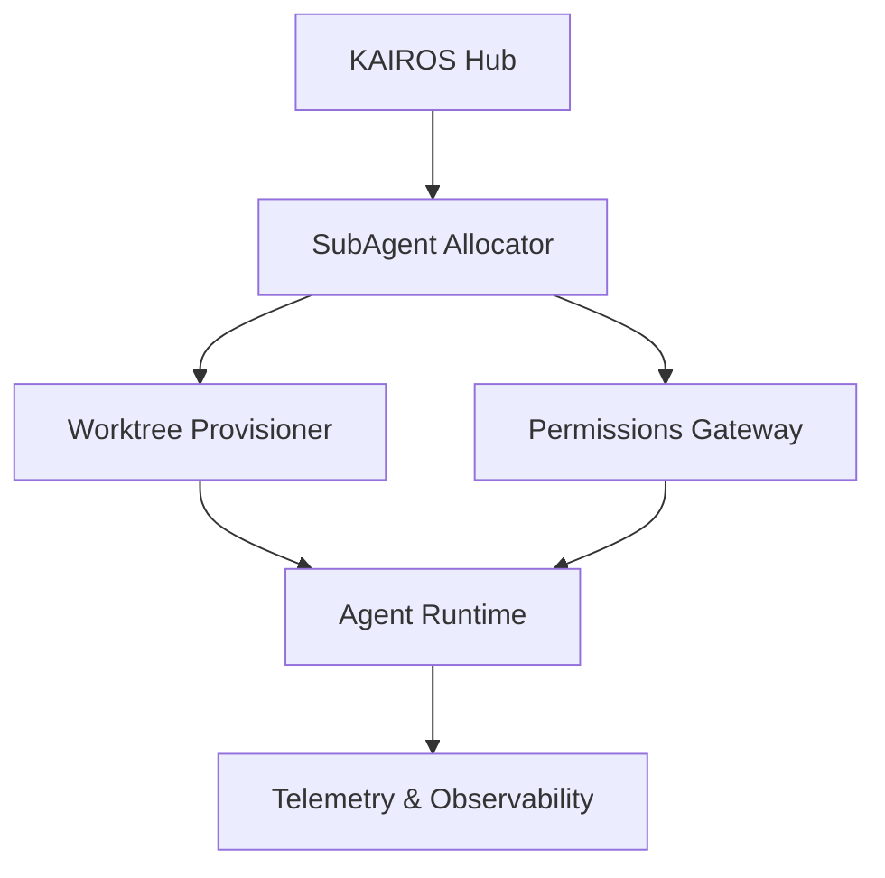

# OHC Agent Harness vs Claude-Class Infrastructure Analysis

## 1. Architectural Findings
Our deep dive into the Claude Code implementation reveals a highly robust sub-process handling architecture (The Agent Harness). Its key features include:
- **Teammate Mesh / Forking:** Capable of spawning isolated subprocess agents with explicit inheritance of conversation context or fresh context via `subagent_type`.
- **Git Worktree Isolation:** Safe experimental changes utilizing temporary git worktrees (`isolation: "worktree"`).
- **Background Orchestration:** Support for `run_in_background`, enabling asynchronous subagent orchestration independent of the main UI thread.
- **Robust Tool Access Control:** Detailed prompt instructions validating command safety, read-only permissions, and destructive command warnings via specific TS abstractions (e.g., `bashPermissions.ts`, `commandSemantics.ts`).

## 2. Comparative Matrix

| Feature | OHC Current State (`srcs/server/agents/provider.go`) | Claude-Class State | Gap |
|---------|------------------------------------------------------|-------------------|-----|
| Sandboxing | In-memory Provider abstractions | Isolated Subprocesses, Remote CCR | Critical |
| Branch Safety | Manual Git execution | `isolation: "worktree"` automated | High |
| Execution Telemetry | Standard HTTP metrics | Rich command semantics & path validation | Medium |

## 3. Recommended Upgrades for OHC

