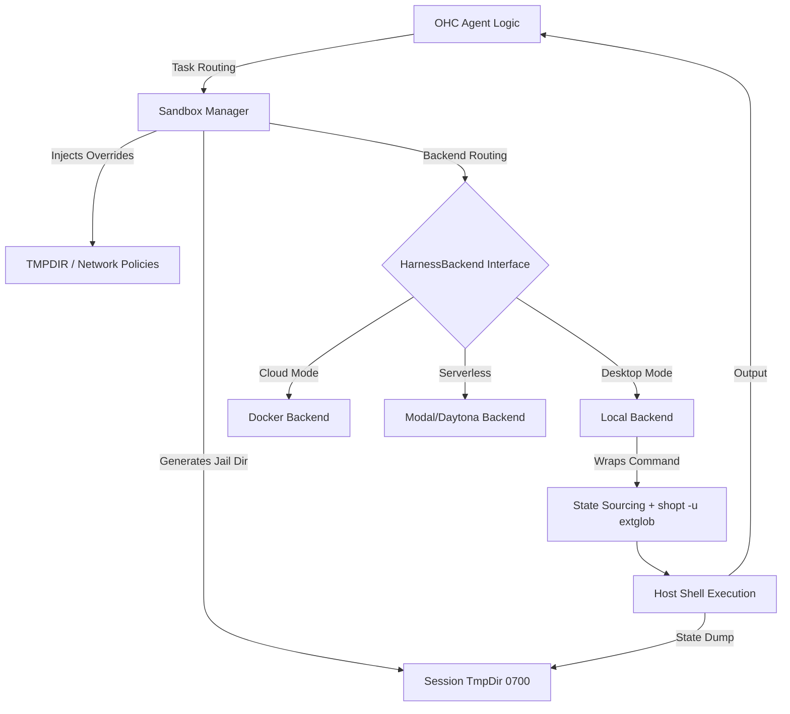

# 🔬 OHC Oracle Research Report: Agent Harness & Execution Isolation

**Date:** 2026-04-16
**Targets Analyzed:** Claude Code (v2.1.88), OpenClaw, Hermes Agent
**Focus Area:** Agent Harness Environment, Sandboxing, Shell Execution Lifecycle, Backends

## 1. Executive Summary
This research investigates the operational harnesses of *Claude Code*, *OpenClaw*, and *Hermes Agent* to identify structural gaps in OHC's local and hybrid execution models. The defining characteristic of next-generation agent swarms is their **Agent Harness**: the sandboxed, observable execution boundary. OHC's current direct-execution model lacks the robust OS-level isolation, network telemetry, and execution backend flexibility observed in competitors.

## 2. Competitive Architectural Analysis

### 2.1 Claude Code Sandbox Adapter
Claude Code utilizes a sophisticated **Sandbox Adapter** wrapping an external `@anthropic-ai/sandbox-runtime` package.
- **Shell Provider Strategies (Bash & PowerShell Isolation):** Instead of raw `exec` calls, Claude Code constructs intricate wrapper commands. For Bash, they enforce security by disabling extended globbing (`shopt -u extglob`) to prevent post-validation expansion attacks.
- **Stateful REPL Simulation:** Agents require context (working directory, environment variables) to persist across command invocations. Claude Code solves this by writing environment snapshots (`declare -p`) and path snapshots (`pwd -P`) to temporary files, and `source`ing them before subsequent commands.
- **TMPDIR Jailing:** Every spawned shell process has its `TMPDIR`, `CLAUDE_CODE_TMPDIR`, and `TMPPREFIX` (for zsh heredocs) overridden to point to a strictly permissioned (`0700`) temporary directory specific to that session.
- **Network & File Restrictions:** The sandbox utilizes a `sandboxAskCallback` to intercept unapproved network requests, allowing for graceful UI prompting ("Sandbox Violations") rather than raw crashes.

### 2.2 OpenClaw Multi-Tiered Isolation
OpenClaw takes a different approach, utilizing a flexible, multi-harness registry pattern (`pi-embedded-runner`).
- **Isolation Strategy:** Supports multiple `AgentHarness` plugins. Forces isolated Docker containers per-session unless explicitly granted host access (e.g. `agents.defaults.sandbox.mode: "non-main"`).

### 2.3 Hermes Agent Execution Backends
Hermes Agent achieves high deployment flexibility by abstracting the execution layer.
- **Execution Backends:** It supports 6 diverse terminal backends (local, Docker, SSH, Daytona, Singularity, Modal).
- **Serverless Persistence:** Daytona and Modal offer serverless persistence, allowing the agent's environment to hibernate when idle and wake on demand.

## 3. OHC vs. Market Reality (Comparative Chart)

| Feature Area | OHC (Current State) | Market Standard (Claude/Claw/Hermes) | Gap Assessment |
|--------------|---------------------|---------------------------------------|----------------|
| **Execution Sandboxing** | Raw `exec.Command` | `bwrap` OS sandboxes / Docker | 🚨 Critical (Security/Stability) |
| **State Persistence** | Stateless per command | Snapshot/Restore (`source` + `pwd`) | 🚨 Critical (Agent UX) |
| **Execution Backends** | Fixed local execution | Pluggable backends (Docker, Modal, SSH) | 🚨 Critical |
| **TMPDIR Isolation** | Host Default (`/tmp`) | Session-isolated `0700` Jail | 🟡 Medium (Security) |
| **Network Interception**| Allowed (Host Network)| Hooked via proxies & ACLs | 🟡 High (Control) |

## 4. Architectural Flow & Recommended Design

## 5. Actionable Roadmap (Missions Injected)

The following missions have been created via OHC-GTP to close these gaps:

1. **[backend] Implement Sandboxed Execution Environment for Agent Harness (#5551)**
   - Introduces the `SandboxManager` to handle `TMPDIR` jailing, `0700` permissions, and security flags (`shopt -u extglob`) for Bash/PowerShell execution within the Go backend.
2. **[backend] Implement Shell Environment Snapshot & Restore for Agents (#5552)**
   - Introduces stateful REPL simulation by reading/writing `env_snapshot.sh` and `cwd_snapshot.txt` between command invocations.
3. **[research] Hermes Agent Harness Analysis & Backends Implementation Plan (#5545)**
   - Abstract the existing execution into a `HarnessBackend` interface, supporting multiple backends (Local, Docker, Serverless like Modal/Daytona) to lower the cost of idle agents.
4. **[research] Architect Claude-Class Agent Harness & Sandbox Telemetry (#5542)**
   - Merge granular AST-level command validation with a flexible harness registry. Implement OS-Native sandboxing (using `bwrap`) and a proxy telemetry layer.

